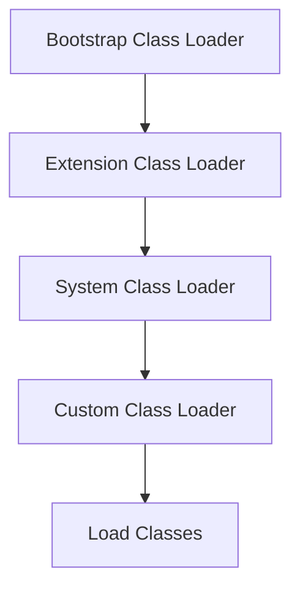

# JVM Internals & Class Loading

## Overview

The Java Virtual Machine (JVM) is the runtime environment that executes Java bytecode. Class loading is the process by which the JVM loads, links, and initializes classes at runtime. Understanding JVM internals and class loading is crucial for performance tuning, debugging, and advanced Java development.

## Detailed Explanation

### JVM Architecture

- **Class Loader Subsystem**: Loads classes.
- **Runtime Data Areas**: Heap, Stack, Method Area, PC Registers, Native Method Stack.
- **Execution Engine**: Interprets or JIT-compiles bytecode.
- **JNI & Native Libraries**: Interface with native code.

### Class Loading Process

1. **Loading**: Find and load class files.
2. **Linking**: Verification, Preparation, Resolution.
3. **Initialization**: Execute static initializers.

### Class Loaders

- **Bootstrap Class Loader**: Loads core Java classes.
- **Extension Class Loader**: Loads extension classes.
- **System/Application Class Loader**: Loads application classes.
- **Custom Class Loaders**: User-defined for special loading.



## Real-world Examples & Use Cases

- **Web Servers**: Dynamic loading of servlets.
- **Plugin Systems**: Loading plugins at runtime.
- **OSGi Frameworks**: Modular class loading.
- **HotSwap**: Reloading classes in debuggers.

## Code Examples

### Custom Class Loader

```java
import java.io.FileInputStream;
import java.io.IOException;
public class CustomClassLoader extends ClassLoader {
    @Override
    public Class<?> findClass(String name) throws ClassNotFoundException {
        try {
            byte[] b = loadClassData(name);
            return defineClass(name, b, 0, b.length);
        } catch (IOException e) {
            throw new ClassNotFoundException(name);
        }
    }
    private byte[] loadClassData(String name) throws IOException {
        FileInputStream fis = new FileInputStream("/path/to/" + name + ".class");
        byte[] data = new byte[fis.available()];
        fis.read(data);
        fis.close();
        return data;
    }
}
```

### Class Loading Example

```java
public class ClassLoadingDemo {
    public static void main(String[] args) {
        try {
            Class<?> clazz = Class.forName("java.lang.String");
            System.out.println("Class loaded: " + clazz.getName());
        } catch (ClassNotFoundException e) {
            e.printStackTrace();
        }
    }
}
```

## References

- [Oracle JVM Architecture](https://docs.oracle.com/javase/specs/jvms/se21/html/jvms-2.html)
- [Baeldung Class Loading](https://www.baeldung.com/java-classloaders)
- [Java Class Loading Mechanism](https://www.geeksforgeeks.org/class-loading-and-static-blocks-execution-using-static-modifier-in-java/)

## Github-README Links & Related Topics

- [java-fundamentals](../java-fundamentals/)
- [garbage-collection-algorithms](../garbage-collection-algorithms/)
- [java-memory-management](../java-memory-management/)
- [jvm-performance-tuning](../jvm-performance-tuning/)
