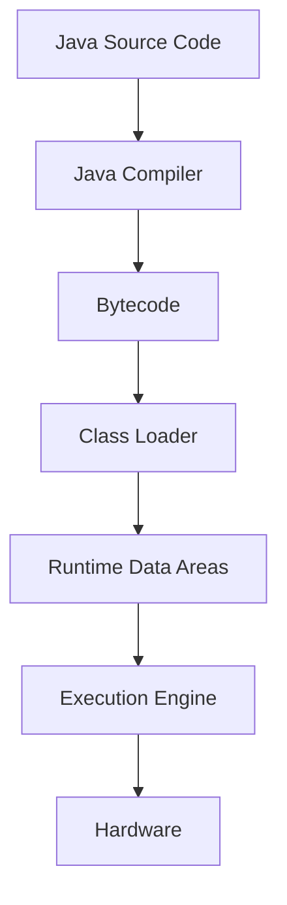
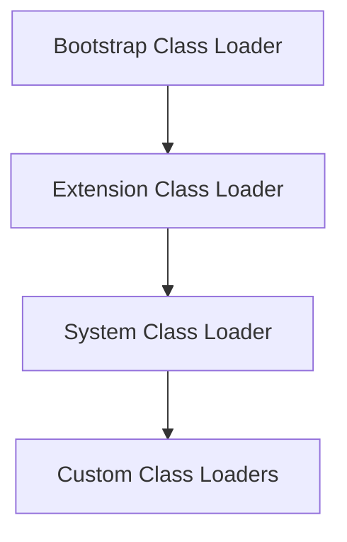

# JVM Internals & Class Loading

## Overview

The Java Virtual Machine (JVM) is the runtime environment that executes Java bytecode. Understanding JVM internals and the class loading mechanism is crucial for Java developers to write efficient, secure, and optimized applications. This topic covers the JVM architecture, memory model, class loading process, and related concepts.

## Detailed Explanation

### JVM Architecture

The JVM consists of several key components:

1. **Class Loader Subsystem**: Loads class files into memory
2. **Runtime Data Areas**: Memory areas used during program execution
3. **Execution Engine**: Executes the bytecode
4. **Native Method Interface**: Interacts with native libraries
5. **Native Method Libraries**: Platform-specific libraries



### Class Loading Mechanism

Class loading is the process of loading class files into the JVM memory. It involves three main steps:

1. **Loading**: Finding and importing the binary data for a type
2. **Linking**: Performing verification, preparation, and resolution
3. **Initialization**: Executing static initializers and initializing static fields

#### Types of Class Loaders

- **Bootstrap Class Loader**: Loads core Java classes from rt.jar
- **Extension Class Loader**: Loads classes from jre/lib/ext
- **System/Application Class Loader**: Loads classes from classpath



### Runtime Data Areas

1. **Method Area**: Stores class-level data (class name, methods, fields)
2. **Heap**: Stores objects and instance variables
3. **Stack**: Stores method calls and local variables
4. **PC Register**: Stores the address of the current instruction
5. **Native Method Stack**: Stores native method calls

### Memory Model

The JVM memory model defines how threads interact through memory. Key concepts include:

- **Happens-Before Relationship**: Defines the order of operations
- **Volatile Variables**: Ensure visibility across threads
- **Synchronized Blocks**: Provide mutual exclusion

## Real-world Examples & Use Cases

1. **Web Applications**: Understanding class loading helps in deploying applications in application servers
2. **Plugin Systems**: Custom class loaders enable dynamic loading of plugins
3. **Microservices**: JVM tuning based on memory requirements
4. **Performance Optimization**: Analyzing heap dumps for memory leaks

## Code Examples

### Custom Class Loader

```java
public class CustomClassLoader extends ClassLoader {
    @Override
    public Class<?> findClass(String name) throws ClassNotFoundException {
        byte[] b = loadClassFromFile(name);
        return defineClass(name, b, 0, b.length);
    }

    private byte[] loadClassFromFile(String fileName) {
        // Implementation to load class bytes from file
        return new byte[0];
    }
}
```

### Memory Management Example

```java
public class MemoryExample {
    public static void main(String[] args) {
        // Stack memory
        int localVar = 10;
        
        // Heap memory
        String heapVar = new String("Hello World");
        
        // Method area
        System.out.println(MemoryExample.class.getName());
    }
}
```

### Volatile Variable Usage

```java
public class VolatileExample {
    private volatile boolean flag = false;
    
    public void writer() {
        flag = true;
    }
    
    public void reader() {
        if (flag) {
            System.out.println("Flag is true");
        }
    }
}
```

## Common Pitfalls & Edge Cases

1. **ClassNotFoundException**: Occurs when class loader cannot find the class
2. **NoClassDefFoundError**: Happens when class was available at compile time but not at runtime
3. **ClassCastException**: Due to incompatible class loaders
4. **Memory Leaks**: Improper object references in custom class loaders
5. **PermGen/Metaspace OutOfMemoryError**: Excessive class loading

## Tools & Libraries

- **VisualVM**: JVM monitoring and profiling tool
- **JConsole**: JMX-based monitoring tool
- **MAT (Memory Analyzer Tool)**: Heap dump analysis
- **JProfiler**: Commercial profiling tool
- **YourKit**: Java profiler

## References

- [Oracle JVM Documentation](https://docs.oracle.com/javase/8/docs/technotes/guides/vm/)
- [Java Language Specification - Chapter 12](https://docs.oracle.com/javase/specs/jls/se8/html/jls-12.html)
- [Understanding the JVM Internals](https://www.oracle.com/technetwork/java/javase/tech/index-jsp-140228.html)

## Github-README Links & Related Topics

- [Garbage Collection Algorithms](garbage-collection-algorithms/)
- [Multithreading & Concurrency in Java](multithreading-concurrency-in-java/)
- [JVM Memory Model](jvm-memory-model/)
- [Java Reflection](java-reflection/)
