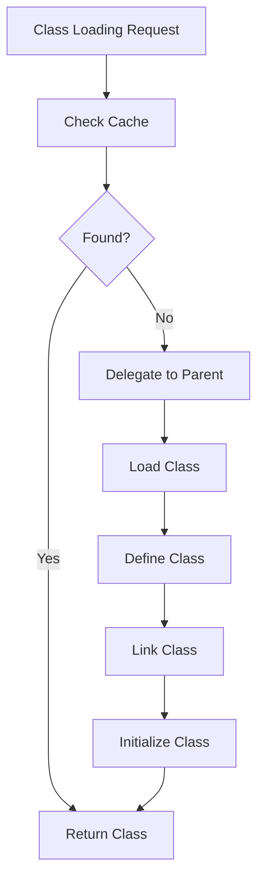

# JVM Internals & Class Loading

## Overview

JVM (Java Virtual Machine) internals encompass the runtime environment for Java programs, including class loading mechanisms, memory management, and execution engine.

## Detailed Explanation

### Class Loading Process

1. **Loading**: Finding and importing the binary data for a class.

2. **Linking**: Verifying, preparing, and resolving symbolic references.

3. **Initialization**: Executing static initializers and assigning initial values.

### Class Loaders

- **Bootstrap Class Loader**: Loads core Java classes.

- **Extension Class Loader**: Loads extension classes.

- **System/Application Class Loader**: Loads application classes.



## Real-world Examples & Use Cases

Custom class loaders for dynamic loading in application servers, plugin systems, and hot-swapping code.

## Code Examples

```java
public class CustomClassLoader extends ClassLoader {
    @Override
    public Class<?> findClass(String name) throws ClassNotFoundException {
        // Custom loading logic
        return super.findClass(name);
    }
}
```

## References

- [JVM Specification](https://docs.oracle.com/javase/specs/jvms/se21/html/)

## Github-README Links & Related Topics

- [Garbage Collection Algorithms](../garbage-collection-algorithms/)
- [Java Memory Management](../java-memory-management/)
