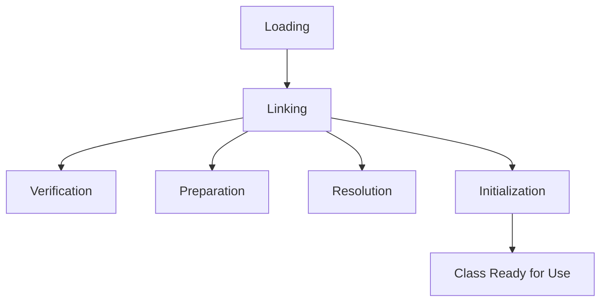
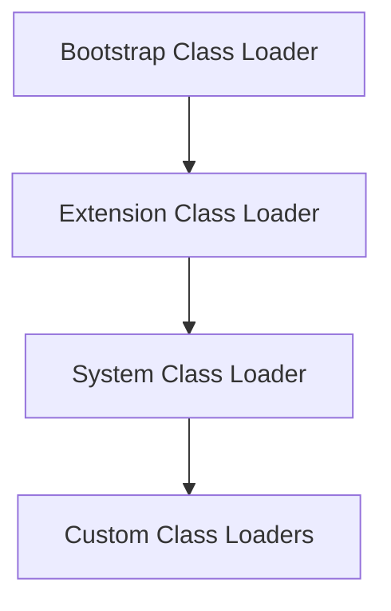

# JVM Internals & Class Loading

## Overview

The Java Virtual Machine (JVM) is the runtime environment that executes Java bytecode. Understanding JVM internals, particularly the class loading mechanism, is crucial for Java developers to optimize performance, troubleshoot issues, and write efficient code.

## Detailed Explanation

### JVM Architecture

The JVM consists of several key components:

- **Class Loader Subsystem**: Loads class files
- **Runtime Data Areas**: Method area, heap, stack, PC registers, native method stacks
- **Execution Engine**: Interprets or JIT-compiles bytecode
- **Native Interface**: Interacts with native libraries

### Class Loading Process

Class loading is the process of loading class files into JVM memory. It follows these steps:

1. **Loading**: Find and load the class file
2. **Linking**: Verify, prepare, and resolve
3. **Initialization**: Execute static initializers



### Class Loaders

Java uses a hierarchical class loading system:

- **Bootstrap Class Loader**: Loads core Java classes (rt.jar)
- **Extension Class Loader**: Loads extension classes (jre/lib/ext)
- **System/Application Class Loader**: Loads application classes



### Bytecode and JIT Compilation

- **Bytecode**: Platform-independent code generated by javac
- **Interpreter**: Executes bytecode line by line
- **JIT Compiler**: Compiles hot spots to native code for performance

## Real-world Examples & Use Cases

- **Plugin Systems**: Custom class loaders for dynamic loading
- **Application Servers**: Isolated class loading for web apps
- **Performance Tuning**: Understanding JIT for optimization

## Code Examples

### Custom Class Loader

```java
public class CustomClassLoader extends ClassLoader {
    @Override
    public Class<?> findClass(String name) throws ClassNotFoundException {
        byte[] b = loadClassFromFile(name);
        return defineClass(name, b, 0, b.length);
    }
    
    private byte[] loadClassFromFile(String fileName) {
        // Implementation to load class bytes from file
        return new byte[0];
    }
}
```

### Class Loading Example

```java
public class ClassLoadingDemo {
    public static void main(String[] args) {
        try {
            Class<?> clazz = Class.forName("java.lang.String");
            System.out.println("Class loaded: " + clazz.getName());
        } catch (ClassNotFoundException e) {
            e.printStackTrace();
        }
    }
}
```

## Common Pitfalls & Edge Cases

- **ClassNotFoundException**: When class loader can't find the class
- **NoClassDefFoundError**: When class was available at compile time but not runtime
- **Class loading delegation**: Understanding the hierarchy to avoid conflicts

## References

- [JVM Specification](https://docs.oracle.com/javase/specs/jvms/se21/html/index.html)
- [Oracle Java Tutorials: The Java Class Loader](https://docs.oracle.com/javase/tutorial/ext/basics/load.html)

## Github-README Links & Related Topics

- [Garbage Collection Algorithms](../garbage-collection-algorithms/)
- [JVM Memory Management](../java-memory-management/)
- [Java Reflection](../java-reflection/)
