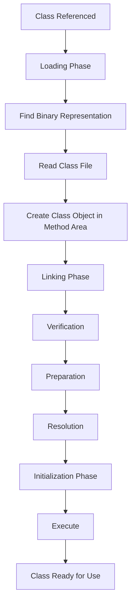

# JVM Internals & Class Loading

## Overview

The Java Virtual Machine (JVM) is the runtime environment that executes Java bytecode. JVM internals encompass the architecture and mechanisms that manage memory, threads, and class execution. A critical component is the **class loading mechanism**, which dynamically loads, links, and initializes classes and interfaces at runtime. This process ensures type safety, security, and flexibility in Java applications.

Class loading involves three main phases: **Loading**, **Linking** (comprising Verification, Preparation, and Resolution), and **Initialization**. Understanding these internals is essential for performance tuning, debugging, and advanced Java development.

## Detailed Explanation

### JVM Architecture Overview

The JVM consists of several key components:
- **Class Loader Subsystem**: Handles loading classes from various sources.
- **Runtime Data Areas**: Including the Method Area (for class metadata), Heap (for objects), Stack (for method execution), and PC Register.
- **Execution Engine**: Interprets or JIT-compiles bytecode.
- **Native Interface**: Interacts with native libraries.

Class loading is managed by the Class Loader Subsystem, which uses a hierarchical model of class loaders.

### Class Loading Phases

Class loading occurs in three phases, as defined in the JVM Specification (Chapter 5):

1. **Loading**: Finding and reading the binary representation of a class or interface.
2. **Linking**: Combining the class into the runtime state, subdivided into:
   - **Verification**: Ensuring the bytecode is structurally correct and adheres to JVM constraints.
   - **Preparation**: Allocating memory for static fields and initializing them to default values.
   - **Resolution**: Dynamically determining concrete values for symbolic references.
3. **Initialization**: Executing the class initialization method (`<clinit>`) to run static initializers.

#### Class Loaders Hierarchy

The JVM uses a delegation model with three built-in class loaders:

| Class Loader | Description | Responsibility |
|--------------|-------------|----------------|
| Bootstrap Class Loader | Written in native code | Loads core Java classes (e.g., `java.lang.*`) from `rt.jar` |
| Extension Class Loader | Loads extension classes | From `jre/lib/ext` or system property `java.ext.dirs` |
| Application Class Loader | Loads application classes | From the classpath |

Custom class loaders can extend `java.lang.ClassLoader` for specialized loading (e.g., from networks or encrypted files).

### Key Concepts

- **Defining vs. Initiating Loader**: The defining loader creates the class in the method area; the initiating loader starts the loading process.
- **Loading Constraints**: Ensure type safety across loaders by enforcing consistent type representations.
- **Run-Time Packages**: Classes are grouped by binary name and defining loader for access control.

## Journey / Sequence

The class loading sequence follows a strict order to maintain JVM integrity:



1. A class is referenced (e.g., via `new`, `getstatic`).
2. The initiating loader delegates to parent loaders.
3. If not found, the loader locates the binary (e.g., `.class` file).
4. The JVM derives the class from the binary.
5. Linking ensures correctness and resolves references.
6. Initialization runs static code.

## Real-world Examples & Use Cases

- **Plugin Systems**: Frameworks like OSGi or Eclipse use custom class loaders to load plugins dynamically without restarting the application.
- **Hot Deployment**: Application servers (e.g., Tomcat) employ custom loaders for redeploying web applications.
- **Security**: Sandboxing untrusted code via custom loaders that restrict access.
- **Modular Applications**: Java 9+ modules leverage class loaders for encapsulation and dependency management.

## Code Examples

### Basic Custom Class Loader

Here's a simple custom class loader that loads classes from a specific directory:

```java
import java.io.File;
import java.io.FileInputStream;
import java.io.IOException;

public class CustomClassLoader extends ClassLoader {
    private String classPath;

    public CustomClassLoader(String classPath) {
        this.classPath = classPath;
    }

    @Override
    protected Class<?> findClass(String name) throws ClassNotFoundException {
        try {
            byte[] classData = loadClassData(name);
            return defineClass(name, classData, 0, classData.length);
        } catch (IOException e) {
            throw new ClassNotFoundException(name, e);
        }
    }

    private byte[] loadClassData(String name) throws IOException {
        String fileName = classPath + File.separator + name.replace('.', File.separatorChar) + ".class";
        try (FileInputStream fis = new FileInputStream(fileName)) {
            return fis.readAllBytes();
        }
    }
}
```

Usage:
```java
CustomClassLoader loader = new CustomClassLoader("/path/to/classes");
Class<?> clazz = loader.loadClass("com.example.MyClass");
Object instance = clazz.getDeclaredConstructor().newInstance();
```

### Demonstrating Class Loading Phases

```java
public class ClassLoadingDemo {
    static {
        System.out.println("Static initializer executed (Initialization phase)");
    }

    public static void main(String[] args) {
        System.out.println("Main method executed");
    }
}
```

When run, the output shows initialization after loading and linking.

## Common Pitfalls & Edge Cases

- **ClassNotFoundException**: Thrown when a class cannot be located.
- **NoClassDefFoundError**: Occurs if a class was available at compile-time but not at runtime.
- **LinkageError**: Due to incompatible changes or loader conflicts.
- **Circular Dependencies**: Handled via synchronization in initialization.
- **Custom Loader Pitfalls**: Failing to delegate properly can lead to `ClassCastException` across loaders.

## Tools & Libraries

- **JVM Tools**: `jcmd`, `jmap` for inspecting loaded classes.
- **Profilers**: VisualVM or JProfiler to monitor class loading.
- **Libraries**: Apache Commons ClassLoader for utilities.

## References

- [JVM Specification: Chapter 5 - Loading, Linking, and Initializing](https://docs.oracle.com/javase/specs/jvms/se21/html/jvms-5.html)
- [Oracle Java Tutorials: Understanding Class Loading](https://docs.oracle.com/javase/tutorial/ext/basics/load.html)
- [Baeldung: Class Loaders in Java](https://www.baeldung.com/java-classloaders)

## Github-README Links & Related Topics

- [Java Class Loaders](../java-class-loaders/)
- [JVM Performance Tuning](../java/advanced-java-concepts/jvm-performance-tuning/)
- [Java Memory Model](../java/java-memory-model-and-concurrency/)
- [Garbage Collection Algorithms](../garbage-collection-algorithms/)
