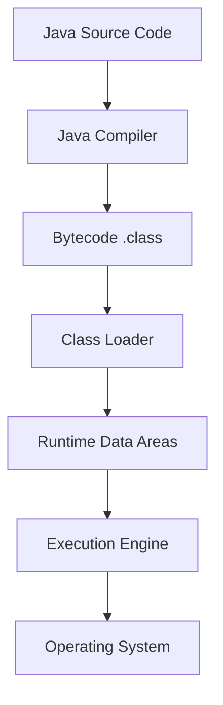
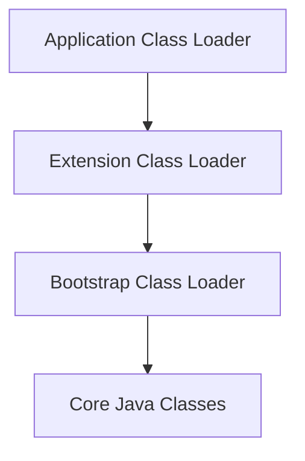

# Overview

JVM Internals & Class Loading delves into the core architecture of the Java Virtual Machine, focusing on how classes are loaded, linked, and initialized. Understanding these internals is crucial for optimizing performance, debugging issues, and writing efficient Java applications.

# Detailed Explanation

## JVM Architecture

The JVM consists of several key components that work together to execute Java bytecode:

- **Class Loader Subsystem**: Loads class files into memory
- **Runtime Data Areas**: Memory areas for storing class data, objects, and method execution
- **Execution Engine**: Interprets or compiles bytecode for execution
- **Native Interface**: Allows interaction with native libraries



## Class Loading Process

Class loading is the process of finding and loading class definitions into the JVM. It follows a three-phase process:

### 1. Loading
- **Bootstrap Class Loader**: Loads core Java classes (rt.jar, etc.)
- **Extension Class Loader**: Loads extension classes from jre/lib/ext
- **Application Class Loader**: Loads application classes from classpath

```java
// Example of custom class loader
class CustomClassLoader extends ClassLoader {
    @Override
    public Class<?> findClass(String name) throws ClassNotFoundException {
        // Custom loading logic
        return super.findClass(name);
    }
}
```

### 2. Linking
- **Verification**: Ensures bytecode is valid and safe
- **Preparation**: Allocates memory for static variables
- **Resolution**: Resolves symbolic references to actual references

### 3. Initialization
- Executes static initializers and assigns initial values to static variables

## Runtime Data Areas

### Method Area
- Stores class-level information (class name, methods, field info)
- Shared among all threads
- Contains constant pool

### Heap
- Stores object instances and arrays
- Garbage collected
- Divided into generations in most GC implementations

### Java Stack
- Thread-specific
- Stores method frames, local variables, operand stack
- Each method call creates a new frame

### Program Counter (PC) Register
- Points to current instruction being executed
- Thread-specific

### Native Method Stack
- Supports native method execution
- Platform-dependent

## Class Loading Delegation Model

The class loading follows a hierarchical delegation model:

1. **Delegation**: Request delegated to parent class loader
2. **Visibility**: Child class loaders can see classes loaded by parents
3. **Uniqueness**: Classes loaded by parent not reloaded by child



## Common Pitfalls & Edge Cases

- **ClassNotFoundException**: Class not found in classpath
- **NoClassDefFoundError**: Class found at compile time but not runtime
- **ClassCastException**: Invalid type casting
- **LinkageError**: Incompatible class changes
- **StackOverflowError**: Deep recursion exceeding stack size

# Real-world Examples & Use Cases

- **Plugin Systems**: Dynamic loading of plugins at runtime
- **Application Servers**: Hot deployment of web applications
- **OSGi Frameworks**: Modular class loading
- **Custom Security Managers**: Controlling class loading for security

# Code Examples

### Custom Class Loader

```java
import java.io.ByteArrayOutputStream;
import java.io.IOException;
import java.io.InputStream;

public class CustomClassLoader extends ClassLoader {
    @Override
    protected Class<?> findClass(String name) throws ClassNotFoundException {
        try {
            byte[] bytes = loadClassData(name);
            return defineClass(name, bytes, 0, bytes.length);
        } catch (IOException e) {
            throw new ClassNotFoundException(name, e);
        }
    }

    private byte[] loadClassData(String name) throws IOException {
        String path = name.replace('.', '/') + ".class";
        try (InputStream in = getClass().getClassLoader().getResourceAsStream(path);
             ByteArrayOutputStream out = new ByteArrayOutputStream()) {
            if (in == null) {
                throw new IOException("Class not found: " + name);
            }
            byte[] buffer = new byte[1024];
            int len;
            while ((len = in.read(buffer)) != -1) {
                out.write(buffer, 0, len);
            }
            return out.toByteArray();
        }
    }
}
```

### Class Loading Example

```java
public class ClassLoadingDemo {
    public static void main(String[] args) throws Exception {
        CustomClassLoader loader = new CustomClassLoader();
        
        // Load a class dynamically
        Class<?> clazz = loader.loadClass("com.example.MyClass");
        
        // Create instance
        Object instance = clazz.getDeclaredConstructor().newInstance();
        
        // Invoke method
        clazz.getMethod("sayHello").invoke(instance);
    }
}
```

### JVM Memory Monitoring

```java
public class JVMMemoryDemo {
    public static void main(String[] args) {
        Runtime runtime = Runtime.getRuntime();
        
        System.out.println("Max Memory: " + runtime.maxMemory() / 1024 / 1024 + " MB");
        System.out.println("Total Memory: " + runtime.totalMemory() / 1024 / 1024 + " MB");
        System.out.println("Free Memory: " + runtime.freeMemory() / 1024 / 1024 + " MB");
        
        // Force GC
        System.gc();
        
        System.out.println("After GC - Free Memory: " + runtime.freeMemory() / 1024 / 1024 + " MB");
    }
}
```

# Journey / Sequence

1. **Class Loading Request**: JVM encounters a class reference
2. **Delegation**: Request passed up the class loader hierarchy
3. **Loading**: Class loader finds and loads the class file
4. **Verification**: Bytecode verified for safety and correctness
5. **Preparation**: Memory allocated for class structures
6. **Resolution**: Symbolic references resolved to actual references
7. **Initialization**: Static initializers executed
8. **Usage**: Class ready for instantiation and method calls

# Tools & Libraries

- **JVM Tools**: jps, jstat, jmap, jstack for monitoring
- **VisualVM**: GUI tool for JVM monitoring and profiling
- **JConsole**: JMX-based monitoring tool
- **YourKit**: Commercial profiler for memory and performance analysis

# References

- [Oracle JVM Specification](https://docs.oracle.com/javase/specs/jvms/se21/html/index.html)
- [Java Class Loading](https://www.oracle.com/technetwork/java/javase/classload-139465.html)
- [Baeldung Class Loaders](https://www.baeldung.com/java-classloaders)

# Github-README Links & Related Topics

- [Java Fundamentals](../java-fundamentals/README.md)
- [Garbage Collection Algorithms](../garbage-collection-algorithms/README.md)
- [JVM Performance Tuning](../jvm-performance-tuning/README.md)
