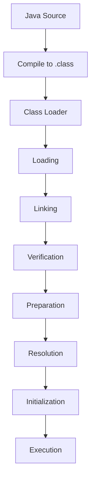

# JVM Internals & Class Loading

## Overview

The Java Virtual Machine (JVM) is the runtime environment that executes Java bytecode. Class loading is the process by which the JVM loads, links, and initializes classes at runtime.

## Detailed Explanation

### JVM Architecture

- Class Loader Subsystem
- Runtime Data Areas (Heap, Stack, Method Area, etc.)
- Execution Engine (Interpreter, JIT Compiler)
- JNI and Native Method Libraries

### Class Loading Process

1. Loading: Finding and importing the binary data
2. Linking: Verification, Preparation, Resolution
3. Initialization: Executing static initializers



## Real-world Examples & Use Cases

- Dynamic loading of plugins in applications
- Hot swapping in development tools
- Custom class loaders for security or modularity

## Code Examples

### Custom Class Loader

```java
public class CustomClassLoader extends ClassLoader {
    @Override
    public Class<?> findClass(String name) throws ClassNotFoundException {
        // Custom loading logic
        return super.findClass(name);
    }
}
```

## References

- [JVM Specification](https://docs.oracle.com/javase/specs/jvms/se21/html/)
- [Oracle JVM Internals](https://docs.oracle.com/javase/8/docs/technotes/guides/vm/)

## Github-README Links & Related Topics

- [Java Fundamentals](../java-fundamentals/README.md)
- [Garbage Collection Algorithms](../garbage-collection-algorithms/README.md)
