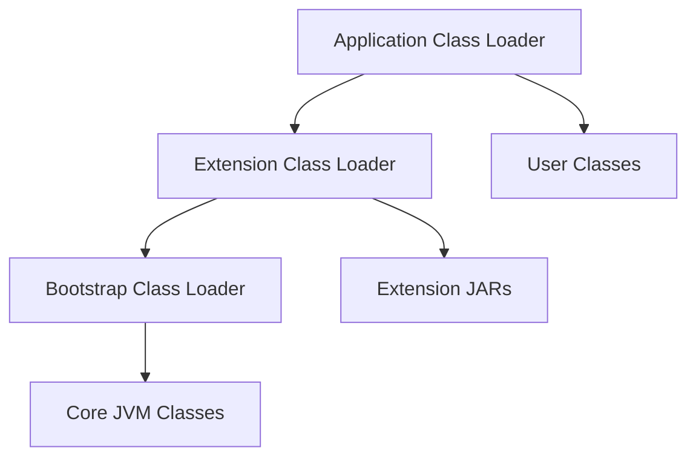

# JVM Internals & Class Loading

## Overview

The Java Virtual Machine (JVM) is responsible for executing Java bytecode. A key aspect of JVM internals is the class loading mechanism, which dynamically loads classes into memory at runtime. This process ensures that classes are loaded on-demand, supporting features like dynamic linking, security through namespace isolation, and extensibility via custom class loaders. Class loading involves three main phases: Loading, Linking (Verification, Preparation, Resolution), and Initialization. Understanding this mechanism is crucial for debugging issues like `ClassNotFoundException`, optimizing startup times, and implementing advanced features such as hot-swapping or plugin architectures.

## Detailed Explanation

### Class Loading Process

Class loading follows a delegation model where each class loader has a parent. The process occurs in three phases:

1. **Loading**: The JVM finds and reads the binary representation of a class from a source (e.g., file system, network) and creates a `Class` object in the heap. This is handled by the `loadClass` method in `ClassLoader`.

2. **Linking**:
   - **Verification**: Ensures the bytecode is structurally correct and adheres to JVM specifications to prevent malicious code execution.
   - **Preparation**: Allocates memory for static fields and initializes them to default values.
   - **Resolution**: Replaces symbolic references (e.g., method names) with direct references in the runtime constant pool.

3. **Initialization**: Executes static initializers and assigns initial values to static fields. This is done lazily, triggered by the first active use of the class.

The delegation hierarchy ensures security: a class loader delegates to its parent before attempting to load itself, preventing lower-level loaders from overriding core classes.



### Class Loaders Hierarchy

The JVM uses a hierarchical class loader system:

- **Bootstrap Class Loader**: Loads core JVM classes (e.g., from `rt.jar`). Implemented in native code, it has no parent.
- **Extension Class Loader**: Loads classes from the `lib/ext` directory or system extensions.
- **System/Application Class Loader**: Loads classes from the classpath (e.g., via `-cp` or `CLASSPATH`).

Custom class loaders can extend `ClassLoader` or `URLClassLoader` for specialized needs, such as loading classes from databases or encrypted sources.

### JVM Internals Related to Class Loading

- **Method Area**: Stores class metadata, including the runtime constant pool, field/method info, and bytecode.
- **Heap**: Holds `Class` instances and static fields.
- **Class Loading Timing**: Classes are loaded when first referenced, except for some optimizations in modern JVMs (e.g., ahead-of-time compilation in GraalVM).

## Real-world Examples & Use Cases

1. **Plugin Systems**: Frameworks like Eclipse or IntelliJ IDEA use custom class loaders to load plugins dynamically without restarting the application, enabling modular architectures.

2. **Web Servers and Servlet Containers**: Tomcat uses class loaders to isolate web applications, preventing classpath conflicts and allowing hot deployment of WAR files.

3. **Application Servers**: JBoss or WebLogic employ hierarchical class loaders to manage enterprise applications, ensuring that shared libraries are loaded once while application-specific classes remain isolated.

4. **Hot Swapping in Development**: Tools like JRebel use custom class loaders to reload modified classes at runtime, speeding up development cycles.

5. **Security Sandboxes**: Applet class loaders (deprecated but historically relevant) restricted access to sensitive APIs by loading untrusted code in isolated namespaces.

## Code Examples

### Basic Custom Class Loader

```java
import java.io.ByteArrayOutputStream;
import java.io.IOException;
import java.io.InputStream;
import java.net.URL;
import java.net.URLClassLoader;

public class CustomClassLoader extends URLClassLoader {
    public CustomClassLoader(URL[] urls) {
        super(urls);
    }

    @Override
    protected Class<?> findClass(String name) throws ClassNotFoundException {
        try {
            // Load class from a custom source, e.g., database or network
            byte[] classData = loadClassData(name);
            return defineClass(name, classData, 0, classData.length);
        } catch (IOException e) {
            throw new ClassNotFoundException(name);
        }
    }

    private byte[] loadClassData(String name) throws IOException {
        // Simulate loading from a custom source
        InputStream is = getResourceAsStream(name.replace('.', '/') + ".class");
        ByteArrayOutputStream baos = new ByteArrayOutputStream();
        int b;
        while ((b = is.read()) != -1) {
            baos.write(b);
        }
        return baos.toByteArray();
    }
}
```

### Using the Custom Class Loader

```java
public class Main {
    public static void main(String[] args) throws Exception {
        URL[] urls = {new URL("file:///path/to/classes/")};
        CustomClassLoader loader = new CustomClassLoader(urls);
        Class<?> clazz = loader.loadClass("com.example.MyClass");
        Object instance = clazz.getDeclaredConstructor().newInstance();
        // Use the instance
    }
}
```

## References

- [Oracle Java Tutorials: Understanding Extension Class Loading](https://docs.oracle.com/javase/tutorial/ext/basics/load.html)
- [Oracle Java Tutorials: The JarClassLoader Class](https://docs.oracle.com/javase/tutorial/deployment/jar/jarclassloader.html)
- [JVM Specification: Chapter 5 - Loading, Linking, and Initializing](https://docs.oracle.com/javase/specs/jvms/se21/html/jvms5.html)
- [Baeldung: Java Class Loaders](https://www.baeldung.com/java-classloaders)

## Github-README Links & Related Topics

- [java-class-loaders](../java-class-loaders/)
- [class-loading-mechanism](../class-loading-mechanism/)
- [java-multithreading-and-concurrency](../java-multithreading-and-concurrency/) (for concurrency aspects in class loading)
- [java-memory-management](../java-memory-management/) (ties into method area and heap usage)

## Common Pitfalls & Edge Cases

- **ClassNotFoundException vs. NoClassDefFoundError**: The former occurs during loading; the latter during linking if a dependency is missing post-loading.
- **Class Loader Leaks**: In long-running applications (e.g., servers), failing to release references to custom class loaders can cause memory leaks, as classes remain loaded.
- **Visibility Issues**: Classes loaded by different class loaders cannot access each other's private members, even if they have the same name.
- **Security Risks**: Custom loaders must validate bytecode to prevent injection of malicious code.
- **Performance**: Excessive class loading can slow startup; use lazy loading and caching where possible.

## Tools & Libraries

- **JVM Tools**: `jcmd` for inspecting loaded classes; `jmap` for heap analysis.
- **Libraries**: Apache Commons ClassLoader for utilities; OSGi for modular class loading.
- **Profiling**: VisualVM or JProfiler to monitor class loading performance.
