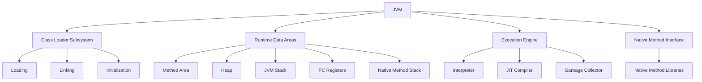

# JVM Internals & Class Loading

## Overview

The Java Virtual Machine (JVM) is the runtime environment that executes Java bytecode. Understanding JVM internals and the class loading mechanism is crucial for Java developers to optimize performance, troubleshoot issues, and write efficient code. This topic covers the JVM architecture, class loading process, and related concepts.

## Detailed Explanation

### JVM Architecture

The JVM consists of several key components:

- **Class Loader Subsystem:** Loads class files into memory.
- **Runtime Data Areas:** Memory areas used during program execution.
- **Execution Engine:** Executes the bytecode.
- **Native Method Interface:** Allows interaction with native libraries.
- **Native Method Libraries:** Platform-specific libraries.



### Class Loading Process

Class loading is the process of loading class files into the JVM memory. It occurs in three phases:

1. **Loading:** The class loader reads the .class file and creates a Class object.
2. **Linking:** 
   - Verification: Ensures the bytecode is valid.
   - Preparation: Allocates memory for static variables.
   - Resolution: Replaces symbolic references with direct references.
3. **Initialization:** Executes static initializers and assigns initial values to static variables.

### Types of Class Loaders

- **Bootstrap Class Loader:** Loads core Java classes (rt.jar). Implemented in native code.
- **Extension Class Loader:** Loads classes from the extension directory (jre/lib/ext).
- **System/Application Class Loader:** Loads classes from the classpath.

Class loaders follow the delegation model: A class loader delegates the loading to its parent before attempting to load itself.

### Runtime Data Areas

- **Method Area:** Stores class-level information, static variables, method data.
- **Heap:** Stores objects and instance variables.
- **JVM Stack:** Stores local variables and method calls (one stack per thread).
- **PC Registers:** Holds the address of the current instruction (one per thread).
- **Native Method Stack:** Supports native methods.

## Real-world Examples & Use Cases

- **Custom Class Loading:** Implementing custom class loaders for dynamic loading of plugins.
- **Memory Optimization:** Understanding heap and stack to avoid OutOfMemoryError.
- **Performance Tuning:** Using JIT compilation knowledge to optimize hot code paths.
- **Security:** Class loader delegation prevents malicious code from overriding system classes.

## Code Examples

### Simple Class Loading Example

```java
public class ClassLoadingExample {
    public static void main(String[] args) {
        try {
            // Load a class dynamically
            Class<?> clazz = Class.forName("java.lang.String");
            System.out.println("Class loaded: " + clazz.getName());
            
            // Get class loader
            ClassLoader classLoader = clazz.getClassLoader();
            System.out.println("Class Loader: " + classLoader);
        } catch (ClassNotFoundException e) {
            e.printStackTrace();
        }
    }
}
```

### Custom Class Loader

```java
import java.io.ByteArrayOutputStream;
import java.io.IOException;
import java.io.InputStream;

public class CustomClassLoader extends ClassLoader {
    @Override
    public Class<?> findClass(String name) throws ClassNotFoundException {
        byte[] bytes = loadClassData(name);
        return defineClass(name, bytes, 0, bytes.length);
    }

    private byte[] loadClassData(String name) throws ClassNotFoundException {
        try (InputStream is = getClass().getClassLoader().getResourceAsStream(name.replace('.', '/') + ".class");
             ByteArrayOutputStream baos = new ByteArrayOutputStream()) {
            int b;
            while ((b = is.read()) != -1) {
                baos.write(b);
            }
            return baos.toByteArray();
        } catch (IOException e) {
            throw new ClassNotFoundException(name);
        }
    }
}

// Usage
CustomClassLoader loader = new CustomClassLoader();
Class<?> clazz = loader.loadClass("com.example.MyClass");
```

## Common Pitfalls & Edge Cases

- **ClassNotFoundException:** Occurs when the class loader cannot find the class.
- **NoClassDefFoundError:** Happens when a class was available at compile time but not at runtime.
- **ClassCastException:** Due to incompatible class loaders loading the same class.
- **Memory leaks:** Improper use of class loaders can cause permgen/metaspace leaks.

## References

- [Oracle JVM Documentation](https://docs.oracle.com/javase/specs/jvms/se21/html/index.html)
- [Baeldung: JVM Internals](https://www.baeldung.com/jvm)
- [GeeksforGeeks: JVM Class Loading](https://www.geeksforgeeks.org/class-loading-and-static-blocks-execution-using-static-modifier-in-java/)

## Github-README Links & Related Topics

- [Garbage Collection Algorithms](../garbage-collection-algorithms)
- [JVM Performance Tuning](../jvm-performance-tuning)
- [Java Memory Management](../java-memory-management)
