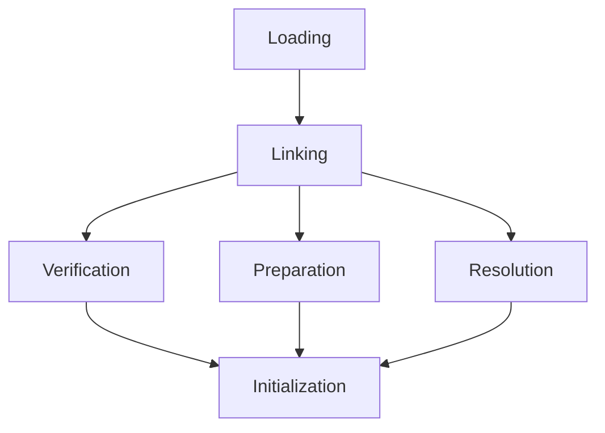

# JVM Internals & Class Loading

## Overview

The Java Virtual Machine (JVM) is the runtime environment for Java applications. It handles memory management, bytecode execution, and class loading. Class loading is the process of loading class files into memory, verifying them, and preparing them for execution.

## Detailed Explanation

### JVM Architecture

The JVM consists of several key components:

- **Class Loader Subsystem**: Loads class files into memory.
- **Runtime Data Areas**: Includes Heap, Stack, Method Area, Program Counter, and Native Method Stack.
- **Execution Engine**: Interprets or compiles bytecode. Includes Interpreter and JIT Compiler.
- **JNI (Java Native Interface)**: Allows interaction with native libraries.

### Class Loading Process

Class loading occurs in three phases:

1. **Loading**: The class loader finds the class file and loads it into memory.
2. **Linking**: 
   - Verification: Ensures the bytecode is valid.
   - Preparation: Allocates memory for static variables.
   - Resolution: Resolves symbolic references.
3. **Initialization**: Executes static initializers and assigns initial values.

**Types of Class Loaders:**
- Bootstrap Class Loader: Loads core Java classes.
- Extension Class Loader: Loads extension classes.
- System/Application Class Loader: Loads application classes.



## Real-world Examples & Use Cases

- **Performance Tuning**: Understanding JVM internals helps optimize memory usage and garbage collection.
- **Custom Class Loaders**: Used in application servers for hot deployment or plugin systems.
- **Security**: Class loading verification prevents malicious code execution.

## Code Examples

### Custom Class Loader

```java
public class CustomClassLoader extends ClassLoader {
    @Override
    protected Class<?> findClass(String name) throws ClassNotFoundException {
        // Implement custom loading logic
        byte[] classData = loadClassData(name);
        if (classData == null) {
            throw new ClassNotFoundException();
        }
        return defineClass(name, classData, 0, classData.length);
    }

    private byte[] loadClassData(String name) {
        // Load class data from file, network, etc.
        return new byte[0]; // Placeholder
    }
}
```

### Using Class Loader

```java
public class Main {
    public static void main(String[] args) throws Exception {
        CustomClassLoader loader = new CustomClassLoader();
        Class<?> clazz = loader.loadClass("com.example.MyClass");
        Object instance = clazz.newInstance();
    }
}
```

## References

- [JVM Specification](https://docs.oracle.com/javase/specs/jvms/se21/html/index.html)
- [Oracle Class Loading Tutorial](https://docs.oracle.com/javase/tutorial/ext/basics/load.html)
- [Baeldung - JVM Internals](https://www.baeldung.com/jvm)

## Github-README Links & Related Topics

- [Java Class Loaders](../java-class-loaders/README.md)
- [Garbage Collection Algorithms](../garbage-collection-algorithms/README.md)
- [JVM Memory Model](../jvm-memory-model/README.md)