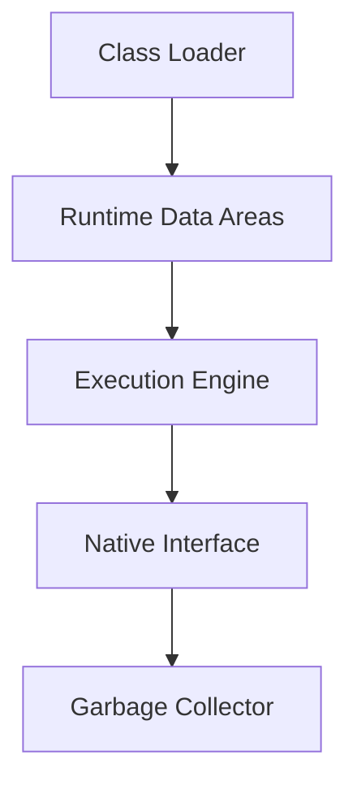
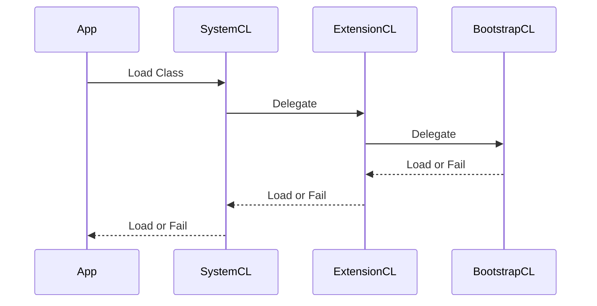

---

title: JVM Internals & Class Loading

aliases: [Java Virtual Machine, JVM Class Loading]

tags: [#java, #jvm]

created: 2023-10-01

updated: 2025-09-26

---

# JVM Internals & Class Loading

## Overview

The Java Virtual Machine (JVM) is the runtime environment that executes Java bytecode. JVM internals encompass its architecture, memory management, execution engine, and garbage collection. Class loading is the process by which the JVM loads, links, and initializes classes at runtime, enabling dynamic code execution and modularity.

Key components include the Class Loader subsystem, Runtime Data Areas (Heap, Stack, Method Area), Execution Engine (Interpreter and JIT Compiler), and Garbage Collector.

## Detailed Explanation

### JVM Architecture

The JVM architecture consists of several subsystems:

- **Class Loader Subsystem**: Loads class files into memory.
- **Runtime Data Areas**: Includes Method Area, Heap, Java Stacks, PC Registers, and Native Method Stacks.
- **Execution Engine**: Interprets or compiles bytecode into machine code.
- **Native Interface**: Interacts with native libraries.



### Class Loading Process

Class loading involves three main phases:

1. **Loading**: Finding and importing the binary data of a class.
2. **Linking**: Verifying, preparing, and resolving symbolic references.
3. **Initialization**: Executing static initializers and assigning default values.

### Runtime Data Areas

- **Method Area**: Stores class-level data like static variables and method bytecode.
- **Heap**: Shared memory for object instances.
- **Java Stack**: Thread-specific stack for method calls and local variables.
- **PC Register**: Holds the address of the current instruction.
- **Native Method Stack**: For native method calls.

## Journey / Sequence for Class Loading Process

The class loading sequence follows a delegation model:

1. Application requests a class.
2. System Class Loader delegates to Extension Class Loader.
3. Extension Class Loader delegates to Bootstrap Class Loader.
4. Bootstrap Class Loader loads core classes; if not found, delegates back.
5. If not loaded, the requesting loader attempts to load.



## Data Models for Class File Structure

A Java class file is a binary format with the following structure:

| Component | Description |
|-----------|-------------|
| Magic Number | 0xCAFEBABE |
| Minor Version | Minor version number |
| Major Version | Major version number |
| Constant Pool | Pool of constants (strings, numbers, references) |
| Access Flags | Class modifiers (public, final, etc.) |
| This Class | Index to this class in constant pool |
| Super Class | Index to superclass |
| Interfaces | List of implemented interfaces |
| Fields | Field declarations |
| Methods | Method declarations |
| Attributes | Additional metadata |

## Real-world Examples & Use Cases

- **Plugin Systems**: Custom class loaders load plugins dynamically without restarting the application, e.g., in IDEs like Eclipse.
- **Application Servers**: Tomcat uses custom class loaders to isolate web applications, preventing classpath conflicts.
- **Hot Swapping**: JVM allows reloading classes in development tools like JRebel for faster iteration.
- **Security**: Class loaders enforce sandboxing in applets or restricted environments.

## Code Examples

### Basic Class Loading

```java
public class SimpleClassLoader extends ClassLoader {
    @Override
    public Class<?> findClass(String name) throws ClassNotFoundException {
        // Custom loading logic
        return super.findClass(name);
    }
}
```

### Using a Custom Class Loader

```java
public class Main {
    public static void main(String[] args) throws Exception {
        SimpleClassLoader loader = new SimpleClassLoader();
        Class<?> clazz = loader.loadClass("com.example.MyClass");
        Object instance = clazz.newInstance();
    }
}
```

### Inspecting Class Loaders

```java
public class ClassLoaderExample {
    public static void main(String[] args) {
        ClassLoader cl = ClassLoaderExample.class.getClassLoader();
        System.out.println("Class Loader: " + cl);
        System.out.println("Parent: " + cl.getParent());
    }
}
```

## References

- [The Java Virtual Machine Specification](https://docs.oracle.com/javase/specs/jvms/se21/html/index.html)
- [Oracle JVM Documentation](https://docs.oracle.com/en/java/javase/21/)
- [Understanding the JVM Internals](https://www.oracle.com/technetwork/java/javase/tech/index-jsp-140228.html)

## Github-README Links & Related Topics

- [Class Loading Mechanism](./class-loading-mechanism/README.md)
- [Java Class Loaders](./java-class-loaders/README.md)
- [Java Memory Management](./java-memory-management/README.md)
- [JVM Garbage Collection](./garbage-collection-algorithms/README.md)
- [Java Multithreading and Concurrency](./java-multithreading-and-concurrency/README.md)