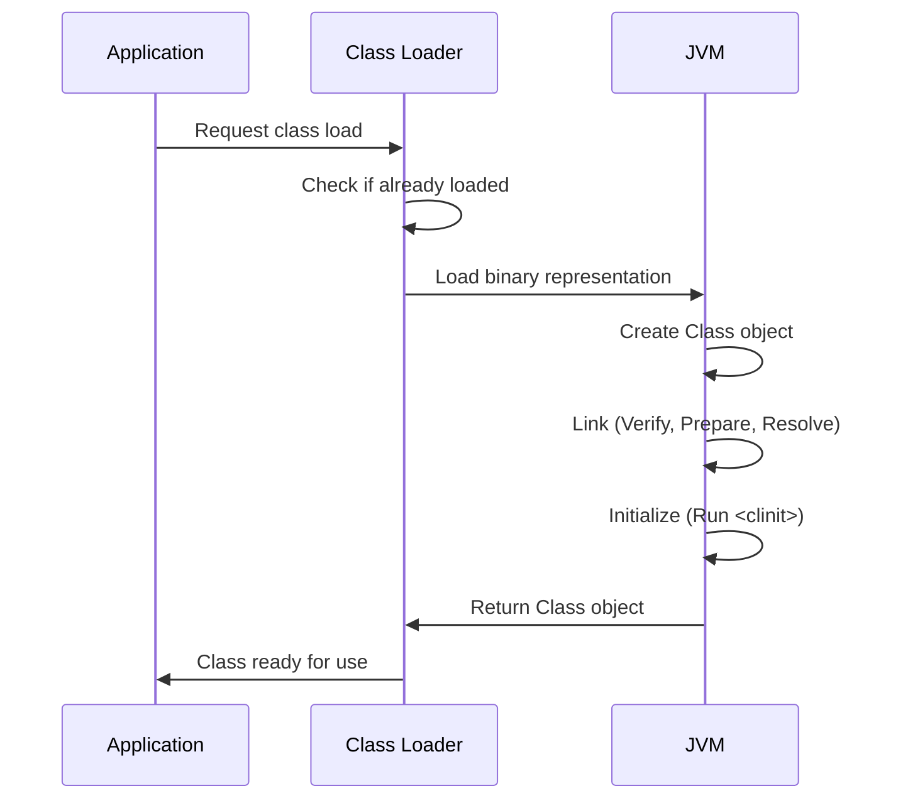

# JVM Internals & Class Loading

## Overview

The Java Virtual Machine (JVM) is the runtime environment that executes Java bytecode. JVM internals encompass the architecture, memory management, execution engine, and subsystems like class loading, garbage collection, and threading. Class loading is a critical phase where Java classes are dynamically loaded, linked, and initialized at runtime, enabling features like dynamic linking and modularity.

This topic covers JVM architecture, the class loading mechanism, bytecode verification, and related internals, providing a foundation for understanding JVM behavior in interviews and development.

## Detailed Explanation

### JVM Architecture

The JVM is an abstract machine with a stack-based architecture. It consists of several key components:

- **Class Loader Subsystem**: Loads, links, and initializes classes and interfaces.
- **Runtime Data Areas**: Include the heap, method area, JVM stacks, PC registers, and native method stacks.
- **Execution Engine**: Interprets or compiles bytecode into native code.
- **Native Interface**: Allows interaction with native libraries via JNI.
- **Garbage Collector**: Manages memory automatically.

Here's a high-level diagram of the JVM architecture:

```mermaid
graph TD
    A[Java Source Code] --> B[Java Compiler]
    B --> C[Bytecode (.class files)]
    C --> D[Class Loader Subsystem]
    D --> E[Runtime Data Areas]
    E --> F[Execution Engine]
    F --> G[Operating System]
    
    subgraph Runtime Data Areas
        H[Method Area]
        I[Heap]
        J[JVM Stacks]
        K[PC Registers]
        L[Native Method Stacks]
    end
    
    subgraph Execution Engine
        M[Interpreter]
        N[JIT Compiler]
        O[Garbage Collector]
    end
```

#### Runtime Data Areas

- **Method Area**: Stores class metadata, constant pools, and method code. Shared across threads.
- **Heap**: Runtime data area for object allocation. Divided into young (Eden, Survivor spaces) and old generations.
- **JVM Stacks**: Per-thread stacks for method execution, holding frames with local variables, operand stacks, and frame data.
- **PC Registers**: Per-thread program counters pointing to the current bytecode instruction.
- **Native Method Stacks**: Stacks for native method execution.

### Class Loading Mechanism

Class loading is the process of finding, loading, and making classes available for execution. It occurs in three phases: **Loading**, **Linking**, and **Initialization**.

#### Loading Phase

- The JVM finds the binary representation (usually a .class file) of a class.
- Creates a `Class` object in the method area.
- Uses class loaders: Bootstrap (loads core classes like `java.lang.Object`), Extension (loads extension classes), and System/Application (loads application classes).

#### Linking Phase

- **Verification**: Ensures bytecode is structurally correct and type-safe. Checks for format errors, stack overflows, and type mismatches.
- **Preparation**: Allocates memory for static fields and initializes them to default values.
- **Resolution**: Resolves symbolic references to concrete references (e.g., method calls to actual methods).

#### Initialization Phase

- Executes static initializers and assigns initial values to static fields.
- Ensures superclass initialization first.
- Thread-safe via synchronization.

#### Class Loader Delegation Hierarchy

Class loaders follow a delegation model:

| Class Loader | Description | Example Classes |
|--------------|-------------|-----------------|
| Bootstrap | Loads core JVM classes | `java.lang.*`, `java.util.*` |
| Extension | Loads extension classes | Classes in `lib/ext` |
| System/Application | Loads application classes | User-defined classes |

Delegation ensures security and avoids duplicate loading.

#### Class Loading Sequence

The class loading process follows a specific sequence:



### Bytecode Verification and Execution

- **Verification**: Ensures bytecode adheres to JVM spec. Prevents malicious code.
- **Execution**: Interpreter executes bytecode; JIT compiler optimizes hot code paths.
- **Garbage Collection**: Automatic memory management using algorithms like G1, CMS, or Parallel GC.

### JVM Internals: Key Concepts

- **Threads**: JVM supports multithreading with native OS threads. Uses monitors for synchronization.
- **JNI**: Allows Java code to call native methods.
- **Safepoints**: Points where all threads pause for GC or VM operations.
- **Adaptive Optimization**: Interpreter profiles code; JIT compiles frequently executed methods.

## Real-world Examples & Use Cases

- **Dynamic Loading**: Frameworks like Spring use custom class loaders for plugin architectures.
- **Modularity**: Java 9+ modules rely on class loading for encapsulation.
- **HotSpot Optimization**: JVM adapts to application behavior, e.g., compiling loops in performance-critical code.
- **Security**: Class loaders isolate code; applets use custom loaders to prevent access to sensitive APIs.
- **Microservices**: Class loading enables dynamic deployment without restarts.

Common interview scenarios:
- Explaining why `ClassNotFoundException` occurs.
- Differences between `Class.forName()` and `ClassLoader.loadClass()`.
- How JVM handles circular dependencies in class loading.

## Code Examples

### Basic Class Loading Example

```java
public class ClassLoadingExample {
    public static void main(String[] args) {
        try {
            // Loads class dynamically
            Class<?> clazz = Class.forName("java.util.ArrayList");
            System.out.println("Class loaded: " + clazz.getName());
            
            // Creates instance
            Object instance = clazz.getDeclaredConstructor().newInstance();
            System.out.println("Instance created: " + instance.getClass().getName());
        } catch (Exception e) {
            e.printStackTrace();
        }
    }
}
```

### Custom Class Loader

```java
public class CustomClassLoader extends ClassLoader {
    @Override
    public Class<?> findClass(String name) throws ClassNotFoundException {
        // Custom loading logic, e.g., from network or encrypted files
        byte[] bytes = loadClassData(name);
        return defineClass(name, bytes, 0, bytes.length);
    }
    
    private byte[] loadClassData(String name) {
        // Simulate loading bytecode
        return new byte[0]; // Replace with actual loading
    }
}
```

### Demonstrating Class Loading Phases

```java
class Parent {
    static {
        System.out.println("Parent static block");
    }
}

class Child extends Parent {
    static {
        System.out.println("Child static block");
    }
}

public class InitializationOrder {
    public static void main(String[] args) {
        System.out.println("Before loading Child");
        Child child = new Child(); // Triggers loading, linking, initialization
        System.out.println("After loading Child");
    }
}
// Output:
// Before loading Child
// Parent static block
// Child static block
// After loading Child
```

## References

- [Java Virtual Machine Specification, Chapter 5: Loading, Linking, and Initializing](https://docs.oracle.com/javase/specs/jvms/se21/html/jvms-5.html)
- [Java Virtual Machine Specification, Chapter 2: The Structure of the Java Virtual Machine](https://docs.oracle.com/javase/specs/jvms/se21/html/jvms-2.html)
- [Java HotSpot VM Options](https://www.oracle.com/java/technologies/javase/vmoptions-jsp.html)
- [HotSpot Runtime Overview](https://openjdk.org/groups/hotspot/docs/RuntimeOverview.html)
- [Dynamic Class Loading in the Java Virtual Machine](https://www.bracha.org/classloaders.ps) by Sheng Liang and Gilad Bracha
- [Troubleshooting Guide for Java SE](https://docs.oracle.com/en/java/javase/21/troubleshoot/troubleshooting-guide.pdf)

## Github-README Links & Related Topics

- [Java Fundamentals](../java-fundamentals/)
- [Java Class Loaders](../java-class-loaders/)
- [JVM Memory Management](../garbage-collection-algorithms/)
- [Java Multithreading and Concurrency](../java-multithreading-and-concurrency/)
- [API Design Principles](../api-design-principles/)
- [Design Patterns in Java](../design-patterns-in-java/)
- [Java Annotations and Reflection](../java-annotations-and-reflection/)
- [Java Modules](../java-modules/)