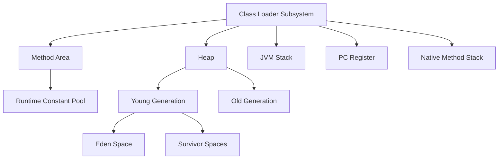
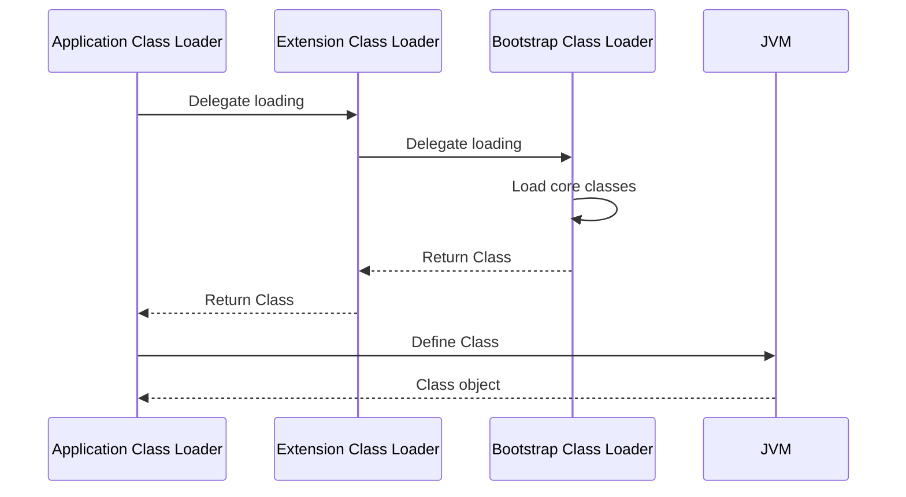

# JVM Internals & Class Loading

## Overview

The Java Virtual Machine (JVM) is the runtime environment that executes Java bytecode. JVM internals encompass the architecture, memory management, and execution model, while class loading is the process by which Java classes are loaded, linked, and initialized at runtime. Understanding these concepts is crucial for optimizing performance, debugging issues, and designing robust Java applications.

## Detailed Explanation

### JVM Architecture

The JVM is an abstract machine that provides a platform-independent execution environment. It consists of several key components:



#### Run-Time Data Areas

1. **Method Area**: Stores class-level information, including the runtime constant pool, field and method data, and code for methods and constructors. Shared among all threads.

2. **Heap**: The runtime data area from which memory for all class instances and arrays is allocated. Divided into young generation (Eden, Survivor spaces) and old generation for garbage collection.

3. **JVM Stack**: Each thread has a private JVM stack created simultaneously with the thread. Stores frames for method invocations.

4. **PC Register**: Contains the address of the currently executing JVM instruction. Each thread has its own PC register.

5. **Native Method Stack**: Supports native methods written in languages other than Java.

#### Frames

A frame is used to store data and partial results, perform dynamic linking, return values, and dispatch exceptions. Each frame contains:

- Local variables array
- Operand stack
- Reference to the runtime constant pool

### Class Loading Mechanism

Class loading is the process of finding the binary representation of a class and creating a Class object from it. The JVM uses a hierarchical class loader system:



#### Class Loaders Hierarchy

1. **Bootstrap Class Loader**: Loads core Java classes from `rt.jar` and other bootstrap classpath. Implemented in native code.

2. **Extension Class Loader**: Loads classes from the extension directory (`jre/lib/ext`).

3. **Application Class Loader**: Loads classes from the application classpath.

#### Loading Process

1. **Loading**: The class loader locates the binary representation (usually a `.class` file) and creates a Class object.

2. **Linking**: 
   - **Verification**: Ensures the class file is structurally correct and follows JVM specifications.
   - **Preparation**: Allocates memory for static fields and initializes them to default values.
   - **Resolution**: Replaces symbolic references with direct references.

3. **Initialization**: Executes the class initialization method (`<clinit>`) to run static initializers.

#### Loading Constraints

The JVM enforces loading constraints to ensure type safety. For example, if two class loaders load the same class name, they must refer to the same Class object.

## Real-world Examples & Use Cases

### Dynamic Plugin Loading

Web servers like Tomcat use custom class loaders to load web applications dynamically without restarting the server.

### HotSwap in Development

IDEs use JVM's class loading capabilities to reload modified classes during development without restarting the application.

### OSGi Framework

OSGi uses custom class loaders to provide modularization, allowing bundles to be installed, started, stopped, and uninstalled without restarting the JVM.

### Application Startup Optimization

Understanding class loading helps in optimizing startup time by minimizing the number of classes loaded initially and using lazy loading where appropriate.

## Code Examples

### Custom Class Loader

```java
public class CustomClassLoader extends ClassLoader {
    @Override
    public Class<?> findClass(String name) throws ClassNotFoundException {
        byte[] b = loadClassFromFile(name);
        return defineClass(name, b, 0, b.length);
    }

    private byte[] loadClassFromFile(String fileName) {
        // Implementation to load class bytes from file
        // This is a simplified example
        try (InputStream inputStream = getClass().getClassLoader()
                .getResourceAsStream(fileName.replace('.', File.separatorChar) + ".class")) {
            ByteArrayOutputStream buffer = new ByteArrayOutputStream();
            int data = inputStream.read();
            while (data != -1) {
                buffer.write(data);
                data = inputStream.read();
            }
            return buffer.toByteArray();
        } catch (IOException e) {
            throw new RuntimeException(e);
        }
    }
}
```

### Checking Class Loader Hierarchy

```java
public class ClassLoaderExample {
    public static void main(String[] args) {
        ClassLoader classLoader = ClassLoaderExample.class.getClassLoader();
        while (classLoader != null) {
            System.out.println(classLoader);
            classLoader = classLoader.getParent();
        }
    }
}
```

## Common Pitfalls & Edge Cases

### ClassNotFoundException vs NoClassDefFoundError

- `ClassNotFoundException`: Thrown when a class cannot be loaded by a class loader.
- `NoClassDefFoundError`: Thrown when a class was available at compile time but not at runtime.

### Class Loader Leaks

In application servers, not properly releasing references to class loaders can cause memory leaks, as the entire class loader hierarchy may be retained.

### Static Initialization Order

The order of static initialization can lead to unexpected behavior if classes have circular dependencies.

### PermGen/Metaspace Issues

In older JVM versions, excessive class loading could fill the permanent generation space, leading to `OutOfMemoryError`.

## Tools & Libraries

### JVM Diagnostic Tools

- **jcmd**: Send diagnostic commands to a running JVM.
- **jmap**: Print memory usage statistics.
- **jstack**: Print stack traces of threads.

### Profiling Tools

- **VisualVM**: All-in-one Java troubleshooting tool.
- **JProfiler**: Java profiler for performance analysis.

### Class Loading Libraries

- **OSGi Core**: Framework for modular Java applications.
- **Spring Boot ClassLoader**: Custom class loading for Spring applications.

## References

- [The Java Virtual Machine Specification, Java SE 21 Edition](https://docs.oracle.com/javase/specs/jvms/se21/html/jvms-2.html) - Chapter 2: The Structure of the Java Virtual Machine
- [The Java Virtual Machine Specification, Java SE 21 Edition](https://docs.oracle.com/javase/specs/jvms/se21/html/jvms-5.html) - Chapter 5: Loading, Linking, and Initializing
- [JVM Architecture](https://www.oracle.com/java/technologies/javase/jvm-architecture.html) - Oracle's overview of JVM architecture
- [Understanding Class Loading in Java](https://www.baeldung.com/java-classloaders) - Baeldung article on class loaders

## Github-README Links & Related Topics

- [Java Class Loaders](../java-class-loaders/README.md)
- [JVM Memory Model](../jvm-memory-model/README.md)
- [Garbage Collection Algorithms](../garbage-collection-algorithms/README.md)
- [Java Memory Management](../java-memory-management/README.md)
- [Class Loading Mechanism](../class-loading-mechanism/README.md)
