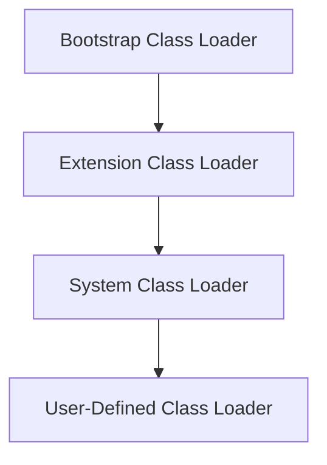

# JVM Internals & Class Loading

## Overview

The Java Virtual Machine (JVM) is the runtime environment that executes Java bytecode. Understanding JVM internals, including memory management and class loading, is essential for optimizing performance, troubleshooting issues, and developing robust Java applications.

## Detailed Explanation

### JVM Architecture

The JVM comprises several key components:

- **Class Loader Subsystem**: Responsible for loading class files.
- **Runtime Data Areas**: Includes Heap (for objects), Stack (for method calls), Method Area (for class metadata), Program Counter, and Native Method Stack.
- **Execution Engine**: Interprets bytecode or uses JIT compilation.
- **Java Native Interface (JNI)**: Allows interaction with native libraries.

### Class Loading Mechanism

Class loading occurs in three main phases:

1. **Loading**: The class loader finds the class file and loads it into memory, creating a Class object.
2. **Linking**: 
   - Verification: Ensures the bytecode is valid.
   - Preparation: Allocates memory for static variables.
   - Resolution: Resolves symbolic references to actual references.
3. **Initialization**: Executes static blocks and initializes static variables.

#### Types of Class Loaders

- **Bootstrap Class Loader**: Loads core Java classes from rt.jar.
- **Extension Class Loader**: Loads classes from jre/lib/ext.
- **System/Application Class Loader**: Loads classes from the classpath.



### Delegation Model

Class loaders follow a delegation hierarchy: a class loader delegates the loading to its parent before attempting to load itself.

## Real-world Examples & Use Cases

- **Web Applications**: Application servers use custom class loaders to isolate different web apps.
- **Plugin Architectures**: Dynamically load plugins without restarting the application.
- **Hot Deployment**: Reload modified classes in development tools.

## Code Examples

### Simple Class Loader Check

```java
public class ClassLoaderDemo {
    public static void main(String[] args) {
        System.out.println("String class loader: " + String.class.getClassLoader());  // null
        System.out.println("Demo class loader: " + ClassLoaderDemo.class.getClassLoader().getClass().getName());
    }
}
```

### Custom Class Loader Example

```java
import java.io.IOException;
import java.nio.file.Files;
import java.nio.file.Paths;

public class CustomClassLoader extends ClassLoader {
    private String classPath;

    public CustomClassLoader(String classPath) {
        this.classPath = classPath;
    }

    @Override
    protected Class<?> findClass(String name) throws ClassNotFoundException {
        try {
            byte[] bytes = Files.readAllBytes(Paths.get(classPath + "/" + name.replace('.', '/') + ".class"));
            return defineClass(name, bytes, 0, bytes.length);
        } catch (IOException e) {
            throw new ClassNotFoundException(name, e);
        }
    }
}
```

## References

- [Oracle JVM Specification](https://docs.oracle.com/javase/specs/jvms/se21/html/jvms-5.html)
- [GeeksforGeeks: JVM and its architecture](https://www.geeksforgeeks.org/jvm-works/)
- [Baeldung: Class Loaders in Java](https://www.baeldung.com/java-classloaders)

## Github-README Links & Related Topics

- [Java Fundamentals](../java-fundamentals/README.md)
- [OOP Principles in Java](../oop-principles-in-java/README.md)
- [Garbage Collection Algorithms](../garbage-collection-algorithms/README.md)
