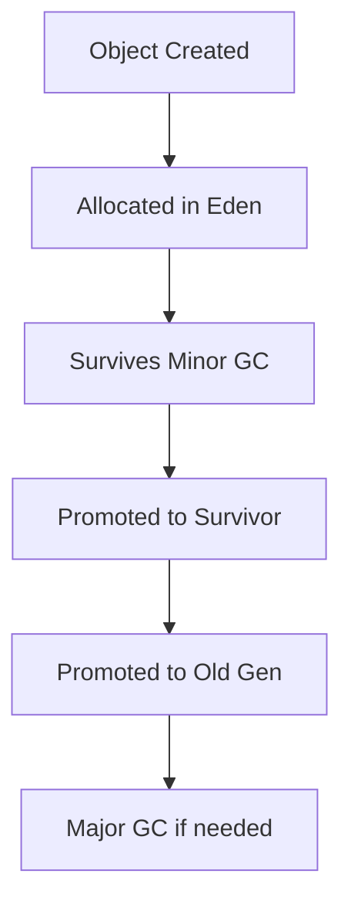

# JVM Memory Management

## Overview

JVM Memory Management involves the allocation, usage, and reclamation of memory in the Java Virtual Machine. It includes heap and stack management, garbage collection, and memory tuning for optimal performance.

## Detailed Explanation

The JVM divides memory into several areas: Heap, Stack, Method Area, and others. Memory management ensures efficient allocation and prevents memory leaks.

### Memory Areas

- **Heap**: Stores objects and arrays, divided into Young and Old generations.
- **Stack**: Stores method calls and local variables.
- **Method Area**: Stores class metadata, constants, and static variables.
- **Program Counter**: Tracks current instruction execution.

### Garbage Collection

GC automatically reclaims memory from unreachable objects. Common algorithms include Serial, Parallel, CMS, G1, and ZGC.



## Real-world Examples & Use Cases

1. **Application Tuning**: Adjusting heap sizes for web servers.
2. **Memory Leak Detection**: Using tools like VisualVM to identify leaks.
3. **Microservices**: Optimizing memory for containerized applications.

## Code Examples

### Memory Monitoring

```java
Runtime runtime = Runtime.getRuntime();
long totalMemory = runtime.totalMemory();
long freeMemory = runtime.freeMemory();
long usedMemory = totalMemory - freeMemory;
System.out.println("Used Memory: " + usedMemory / 1024 / 1024 + " MB");
```

### Weak References

```java
import java.lang.ref.WeakReference;

public class WeakRefExample {
    public static void main(String[] args) {
        Object obj = new Object();
        WeakReference<Object> weakRef = new WeakReference<>(obj);
        obj = null; // Now only weak reference exists
        System.gc(); // Suggest GC
        System.out.println("Object still alive: " + (weakRef.get() != null));
    }
}
```

## Common Pitfalls & Edge Cases

- **OutOfMemoryError**: Heap exhaustion or metaspace issues.
- **Memory Leaks**: Holding references unnecessarily.
- **GC Pauses**: Long pauses in high-throughput applications.

## Tools & Libraries

- **VisualVM**: For memory profiling.
- **JConsole**: Built-in JVM monitoring.
- **Eclipse Memory Analyzer**: For heap dump analysis.

## References

- [Oracle JVM Memory Management](https://docs.oracle.com/javase/8/docs/technotes/guides/vm/gctuning/)
- [Java Memory Model Specification](https://docs.oracle.com/javase/specs/jls/se8/html/jls-17.html)

## Github-README Links & Related Topics

- [jvm-memory](https://github.com/topics/jvm-memory)
- Related: [Garbage Collection Algorithms](../garbage-collection-algorithms/README.md)
- Related: [JVM Performance Tuning](../jvm-performance-tuning/README.md)
