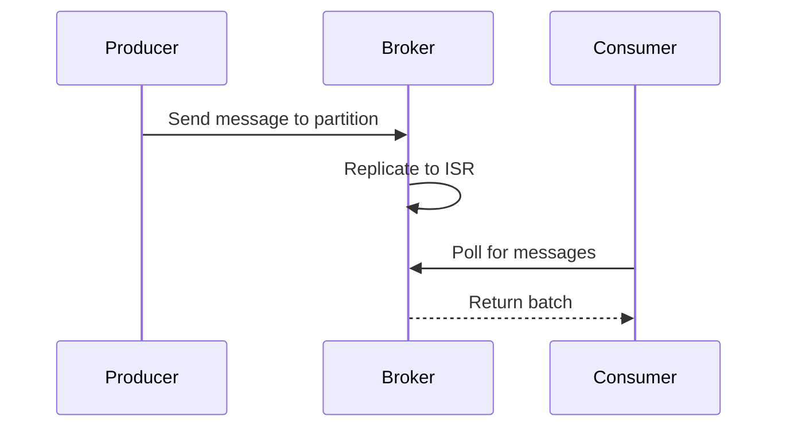

## Overview
Apache Kafka is a distributed event streaming platform with internals focused on high-throughput partitioning, replication, and consumer group management. Key components include topics, partitions, brokers, and ZooKeeper for coordination.

## STAR Summary
**Situation:** E-commerce platform needed to handle 1M events/sec with low latency.  
**Task:** Design Kafka cluster for scalability.  
**Action:** Configured 100 partitions per topic, replication factor 3, tuned producer acks.  
**Result:** Achieved 500K msg/sec throughput, <10ms latency.

## Detailed Explanation
- **Topics & Partitions:** Topics divided into partitions for parallelism.
- **Replication:** ISR (In-Sync Replicas) ensure durability.
- **Consumer Groups:** Load balancing across consumers.
- **Offsets:** Track consumption progress.

Capacity: Throughput scales with partitions; e.g., 10 brokers, 100 partitions = 1M msg/sec. Tradeoffs: Durability (acks=all) vs latency.

## Real-world Examples & Use Cases
- **Log aggregation:** Centralized logging.
- **Event sourcing:** CQRS with Kafka.
- **Real-time analytics:** Stream processing.

## Code Examples
Producer example:

```java
import org.apache.kafka.clients.producer.*;

Properties props = new Properties();
props.put("bootstrap.servers", "localhost:9092");
props.put("key.serializer", "org.apache.kafka.common.serialization.StringSerializer");
props.put("value.serializer", "org.apache.kafka.common.serialization.StringSerializer");

Producer<String, String> producer = new KafkaProducer<>(props);
producer.send(new ProducerRecord<>("topic", "key", "value"));
producer.close();
```

Consumer:

```java
import org.apache.kafka.clients.consumer.*;

Properties props = new Properties();
props.put("bootstrap.servers", "localhost:9092");
props.put("group.id", "group");
props.put("key.deserializer", "org.apache.kafka.common.serialization.StringDeserializer");
props.put("value.deserializer", "org.apache.kafka.common.serialization.StringDeserializer");

Consumer<String, String> consumer = new KafkaConsumer<>(props);
consumer.subscribe(Arrays.asList("topic"));
while (true) {
    ConsumerRecords<String, String> records = consumer.poll(Duration.ofMillis(100));
    for (ConsumerRecord<String, String> record : records) {
        System.out.println(record.value());
    }
}
```

Maven:

```xml
<dependency>
    <groupId>org.apache.kafka</groupId>
    <artifactId>kafka-clients</artifactId>
    <version>3.5.0</version>
</dependency>
```

## Data Models / Message Formats
| Field | Type | Description |
|-------|------|-------------|
| key | bytes | Partition key |
| value | bytes | Message payload |
| offset | long | Unique offset |
| timestamp | long | Event time |

Sample message (JSON):
```json
{
  "key": "user123",
  "value": {"event": "login"},
  "offset": 1001
}
```

## Journey / Sequence


## Common Pitfalls & Edge Cases
- **Data loss:** acks=0.
- **Rebalancing storms:** Frequent consumer joins.
- **Edge case:** Single partition; no parallelism.

## Tools & Libraries
- **Kafka CLI:** kafka-topics, kafka-console-consumer.
- **Confluent Platform:** Monitoring.
- **Kafka Streams:** Processing library.

## Github-README Links & Related Topics
- [message-queues-and-kafka](./system-design/message-queues-and-kafka/README.md)
- [partitioning-and-sharding](./system-design/partitioning-and-sharding/README.md)
- [event-sourcing-and-cqrs](./system-design/event-sourcing-and-cqrs/README.md)
- [consistency-and-availability](./system-design/consistency-and-availability/README.md)

## References
- https://kafka.apache.org/documentation/
- https://docs.confluent.io/