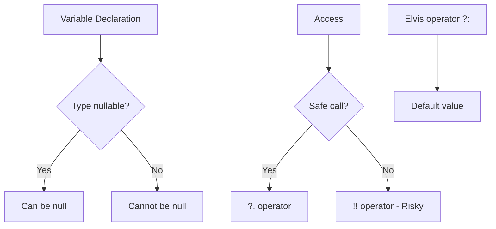
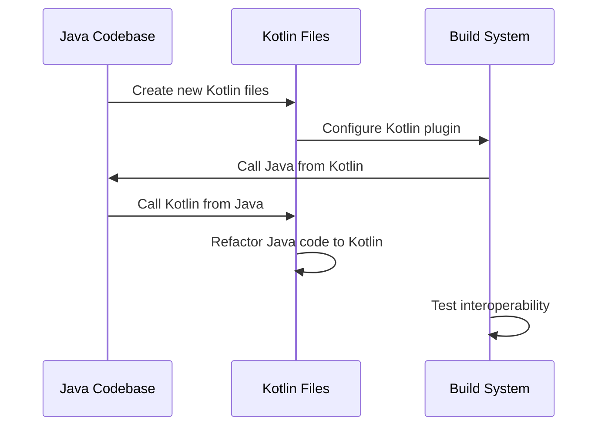

# Kotlin for Java Developers

## Overview

Kotlin is a modern programming language that runs on the JVM and is fully interoperable with Java. It's designed to be more concise and safe than Java, making it a popular choice for Android development and server-side applications.

## Detailed Explanation

Kotlin offers several advantages over Java while maintaining full interoperability. Here's a comparison table:

| Feature | Java | Kotlin |
|---------|------|--------|
| Null Safety | Manual null checks | Built-in nullable types |
| Data Classes | Verbose POJOs | Concise data classes |
| Extension Functions | Utility classes | Direct extension |
| Coroutines | Threads/CompletableFuture | suspend functions |
| Smart Casts | Manual casting | Automatic after checks |
| Type Inference | Limited | Extensive |

### Null Safety Mechanism



Key differences and features:

- **Null Safety**: Kotlin distinguishes between nullable (`String?`) and non-nullable (`String`) types, preventing NullPointerException.
- **Data Classes**: Automatically generate equals, hashCode, toString, and copy methods.
- **Extension Functions**: Add methods to existing classes without inheritance.
- **Coroutines**: Lightweight concurrency with suspend functions.
- **Smart Casts**: Automatic casting after type checks.
- **Inline Functions**: Zero-cost abstractions for higher-order functions.

## Real-world Examples & Use Cases

- **Android Development**: Official language for Android, reducing boilerplate code.
- **Server-Side Applications**: Spring Boot with Kotlin for concise, safe code.
- **DSL Creation**: Domain-specific languages for configuration and APIs.
- **Data Processing**: Functional programming for big data pipelines.
- **Cross-Platform**: Kotlin Multiplatform for shared business logic.

## Code Examples

### Null Safety

```kotlin
var name: String? = null
val length = name?.length ?: 0
```

### Data Class

```kotlin
data class User(val name: String, val age: Int)
val user = User("Alice", 30)
```

### Extension Function

```kotlin
fun String.isEmail(): Boolean = contains("@")
val isValid = "test@example.com".isEmail()
```

### Coroutines

```kotlin
import kotlinx.coroutines.*

suspend fun fetchData(): String {
    delay(1000L) // Simulate network call
    return "Data"
}

fun main() = runBlocking {
    val data = fetchData()
    println(data)
}
```

### Sealed Classes

```kotlin
sealed class Result
data class Success(val data: String) : Result()
data class Error(val message: String) : Result()

fun handleResult(result: Result) = when (result) {
    is Success -> println(result.data)
    is Error -> println(result.message)
}
```

## Journey / Sequence

Migrating from Java to Kotlin can be done incrementally:



## Common Pitfalls & Edge Cases

- Forgetting null safety can lead to runtime exceptions.
- Mutable collections vs immutable by default.
- Platform types when calling Java code.
- Coroutine cancellation requires proper handling.
- Inline functions can increase bytecode size.

## Tools & Libraries

- **Kotlin Compiler**: kotlinc for command-line compilation
- **IDEs**: IntelliJ IDEA (built-in), Android Studio, VS Code with Kotlin plugin
- **Build Tools**: Gradle with Kotlin DSL, Maven
- **Libraries**: Kotlinx.coroutines, Kotlinx.serialization, Exposed for ORM
- **Testing**: KotlinTest, Spek

## References

- [Kotlin Documentation](https://kotlinlang.org/docs/)
- [Kotlin Koans](https://play.kotlinlang.org/koans)
- [Kotlin for Java Developers Guide](https://kotlinlang.org/docs/kotlin-for-java-developers.html)
- [Kotlin Blog](https://blog.jetbrains.com/kotlin/)

## Github-README Links & Related Topics

- [Java Fundamentals](./java-fundamentals/README.md)
- [Java Lambda Expressions](./java-lambda-expressions/README.md)
