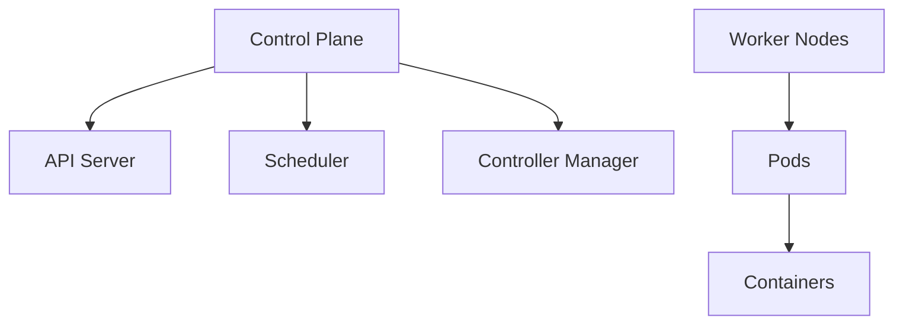

## Overview

Kubernetes (K8s) is an open-source platform for automating deployment, scaling, and management of containerized applications. It provides orchestration for containers across clusters of machines.

## Detailed Explanation

Core concepts:

- **Pods**: Smallest deployable units, containing one or more containers.
- **Services**: Abstractions for pod networking and load balancing.
- **Deployments**: Manage replica sets and updates.
- **Namespaces**: Virtual clusters for resource isolation.

K8s uses a control plane (API server, scheduler, etc.) and worker nodes. It supports self-healing, scaling, and rolling updates.



## Real-world Examples & Use Cases

- **Web Applications**: Deploy scalable web services with auto-scaling.
- **Microservices**: Manage inter-service communication and dependencies.
- **CI/CD Pipelines**: Automate testing and deployment.

## Code Examples

### Basic Pod YAML

```yaml
apiVersion: v1
kind: Pod
metadata:
  name: my-pod
spec:
  containers:
  - name: my-container
    image: nginx
    ports:
    - containerPort: 80
```

### Deployment YAML

```yaml
apiVersion: apps/v1
kind: Deployment
metadata:
  name: my-deployment
spec:
  replicas: 3
  selector:
    matchLabels:
      app: my-app
  template:
    metadata:
      labels:
        app: my-app
    spec:
      containers:
      - name: my-container
        image: nginx
```

## Common Pitfalls & Edge Cases

- **Resource Limits**: Not setting CPU/memory limits can lead to resource starvation.
- **Networking Issues**: Pod-to-pod communication failures due to misconfigured services or network policies.
- **Rolling Updates**: Slow updates or failures if not configured properly, causing downtime.
- **Persistent Volumes**: Data loss if PVs are not properly backed up or configured.
- **Security**: Running containers as root or without RBAC can expose vulnerabilities.

## References

- [Kubernetes Documentation](https://kubernetes.io/docs/)
- [K8s Concepts](https://kubernetes.io/docs/concepts/)

## Github-README Links & Related Topics

- [Container Orchestration K8s](../system-design/container-orchestration-k8s/README.md)
- [DevOps & Infrastructure as Code](../devops-infrastructure-as-code/README.md)
- [Microservices Architecture](../microservices-architecture/README.md)