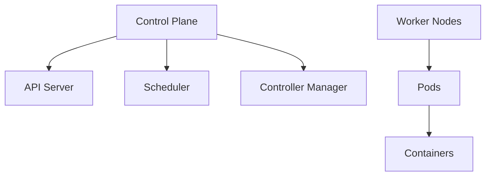

# Overview

Kubernetes (K8s) is an open-source platform for automating deployment, scaling, and management of containerized applications. It provides orchestration for containers across clusters of machines.

## Detailed Explanation

## Core Concepts

| Concept | Description | Purpose |
|---------|-------------|---------|
| Pods | Smallest deployable units, containing one or more containers | Run containers |
| Services | Abstractions for pod networking and load balancing | Expose pods |
| Deployments | Manage replica sets and updates | Deploy and update apps |
| Namespaces | Virtual clusters for resource isolation | Organize resources |

K8s uses a control plane (API server, scheduler, etc.) and worker nodes. It supports self-healing, scaling, and rolling updates.



### Journey / Sequence

1. Containerize your application with Docker.
2. Create Kubernetes manifests (YAML files) for deployments, services, etc.
3. Deploy to a Kubernetes cluster using kubectl.
4. Monitor, scale, and update applications via Kubernetes API.

## Real-world Examples & Use Cases

- **Web Applications**: Deploy scalable web services with auto-scaling.
- **Microservices**: Manage inter-service communication and dependencies.
- **CI/CD Pipelines**: Automate testing and deployment.

## Code Examples

### Basic Pod YAML

```yaml
apiVersion: v1
kind: Pod
metadata:
  name: my-pod
spec:
  containers:
  - name: my-container
    image: nginx
    ports:
    - containerPort: 80
```

### Deployment YAML

```yaml
apiVersion: apps/v1
kind: Deployment
metadata:
  name: my-deployment
spec:
  replicas: 3
  selector:
    matchLabels:
      app: my-app
  template:
    metadata:
      labels:
        app: my-app
    spec:
      containers:
      - name: my-container
        image: nginx
```

## Tools & Libraries

- kubectl: Command-line tool for interacting with clusters
- Helm: Package manager for Kubernetes
- Kustomize: Configuration management
- Lens: GUI for Kubernetes management

## Common Pitfalls & Edge Cases

- **Resource Limits**: Not setting CPU/memory limits can lead to resource starvation.
- **Networking Issues**: Pod-to-pod communication failures due to misconfigured services or network policies.
- **Rolling Updates**: Slow updates or failures if not configured properly, causing downtime.
- **Persistent Volumes**: Data loss if PVs are not properly backed up or configured.
- **Security**: Running containers as root or without RBAC can expose vulnerabilities.

## References

- [Kubernetes Documentation](https://kubernetes.io/docs/)
- [K8s Concepts](https://kubernetes.io/docs/concepts/)

## Github-README Links & Related Topics

- [Container Orchestration K8s](../system-design/container-orchestration-k8s/README.md)
- [DevOps & Infrastructure as Code](../devops-infrastructure-as-code/README.md)
- [Microservices Architecture](../microservices-architecture/README.md)