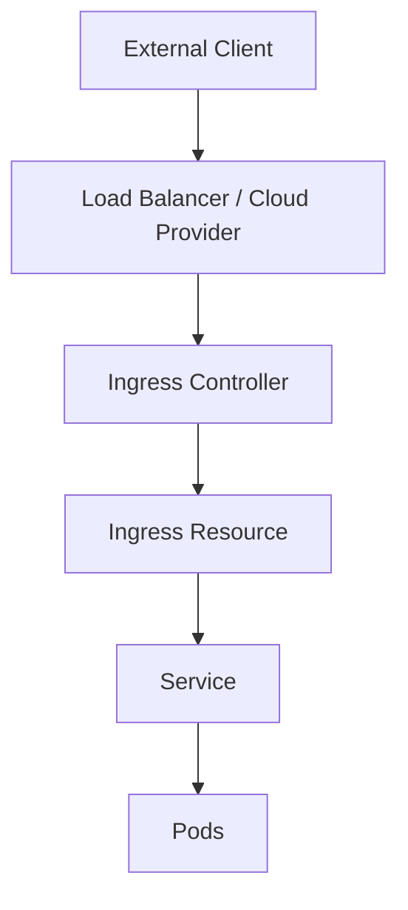

# Overview

Kubernetes Ingress manages external access to services within a cluster, providing HTTP and HTTPS routing. Load balancing in Kubernetes distributes incoming traffic across multiple pods to ensure high availability and scalability.

# Detailed Explanation

Ingress is an API object that defines rules for routing external traffic to services. It requires an Ingress Controller (e.g., NGINX, Traefik) to implement these rules. Load balancing is handled at the Service level (Layer 4) or via Ingress (Layer 7).

Key components:
- **Ingress Resource**: Defines routing rules.
- **Ingress Controller**: Processes the rules and routes traffic.
- **Load Balancer**: Distributes traffic to prevent overload.



# Real-world Examples & Use Cases

- Exposing a web application to the internet with SSL termination.
- Routing traffic based on URL paths (e.g., /api to backend, / to frontend).
- Implementing canary deployments by splitting traffic between versions.

# Code Examples

Basic Ingress YAML:

```yaml
apiVersion: networking.k8s.io/v1
kind: Ingress
metadata:
  name: simple-ingress
  annotations:
    nginx.ingress.kubernetes.io/rewrite-target: /
spec:
  rules:
  - host: example.com
    http:
      paths:
      - path: /
        pathType: Prefix
        backend:
          service:
            name: my-service
            port:
              number: 80
```

Load balancing with Service:

```yaml
apiVersion: v1
kind: Service
metadata:
  name: my-service
spec:
  selector:
    app: my-app
  ports:
  - protocol: TCP
    port: 80
    targetPort: 8080
  type: LoadBalancer
```

# References

- [Kubernetes Ingress Documentation](https://kubernetes.io/docs/concepts/services-networking/ingress/)
- [NGINX Ingress Controller](https://kubernetes.github.io/ingress-nginx/)

# Github-README Links & Related Topics

- [Kubernetes Basics](./kubernetes-basics/README.md)
- [Load Balancing and Strategies](./load-balancing-and-strategies/README.md)
- [Kubernetes Networking](./kubernetes-networking/README.md)