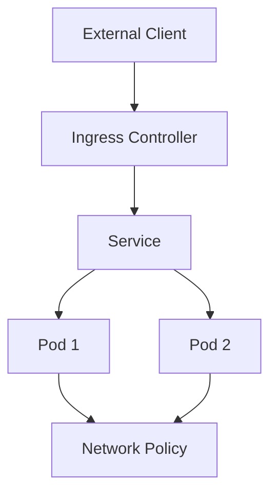

# Kubernetes Networking

## Overview

Kubernetes networking enables communication between pods, services, and external clients in a cluster. It provides a flat network model where every pod gets an IP address and can communicate with any other pod without NAT. Key components include pod networking, services, ingress, network policies, and CNI plugins.

## Detailed Explanation

### Pod Networking
- Each pod has a unique IP address in the cluster's network.
- Pods on the same node communicate via the node's network bridge.
- Cross-node communication uses overlay networks or underlay routing.

### Services
- Abstraction over pods providing load balancing and service discovery.
- Types: ClusterIP (internal), NodePort (expose on node ports), LoadBalancer (cloud provider LB), ExternalName (DNS alias).

### Ingress
- Manages external access to services, typically HTTP/HTTPS.
- Supports load balancing, SSL termination, and name-based virtual hosting.

### Network Policies
- Define rules for pod-to-pod communication.
- Use labels to select pods and define ingress/egress rules.

### CNI Plugins
- Container Network Interface plugins implement networking.
- Popular: Calico, Flannel, Cilium.



## Real-world Examples & Use Cases

- **Microservices Communication**: Services enable inter-service calls in a microservices architecture.
- **Load Balancing**: Ingress distributes traffic across pods.
- **Security**: Network policies isolate sensitive workloads.
- **Multi-tenancy**: Namespaces with network policies for tenant isolation.

## Code Examples

### ClusterIP Service
```yaml
apiVersion: v1
kind: Service
metadata:
  name: my-service
spec:
  selector:
    app: my-app
  ports:
    - protocol: TCP
      port: 80
      targetPort: 8080
  type: ClusterIP
```

### Ingress Resource
```yaml
apiVersion: networking.k8s.io/v1
kind: Ingress
metadata:
  name: my-ingress
spec:
  rules:
  - host: myapp.example.com
    http:
      paths:
      - path: /
        pathType: Prefix
        backend:
          service:
            name: my-service
            port:
              number: 80
```

### Network Policy
```yaml
apiVersion: networking.k8s.io/v1
kind: NetworkPolicy
metadata:
  name: allow-web
spec:
  podSelector:
    matchLabels:
      app: web
  policyTypes:
  - Ingress
  ingress:
  - from:
    - podSelector:
        matchLabels:
          app: api
    ports:
    - protocol: TCP
      port: 80
```

## Data Models / Message Formats

- **Endpoints**: List of pod IPs for a service.
- **Ingress Rules**: Host/path mappings to services.

## Common Pitfalls & Edge Cases

- **IP Exhaustion**: Plan for sufficient IP space.
- **DNS Resolution**: Ensure kube-dns/coredns is running.
- **Network Plugins**: Choose based on requirements (e.g., Calico for policies).
- **Cross-namespace Communication**: Use external services or federation.

## Tools & Libraries

- **kubectl**: CLI for networking resources.
- **Calico**: Networking and security plugin.
- **Istio**: Service mesh for advanced traffic management.

## References

- [Kubernetes Networking Documentation](https://kubernetes.io/docs/concepts/cluster-administration/networking/)
- [CNI Specification](https://github.com/containernetworking/cni)
- [Calico Docs](https://docs.projectcalico.org/)

## Github-README Links & Related Topics

- [kubernetes-basics](../kubernetes-basics/README.md)
- [kubernetes-orchestration](../kubernetes-orchestration/README.md)
- [microservices-architecture](../microservices-architecture/README.md)
- [service-mesh-patterns](../service-mesh-patterns/README.md)