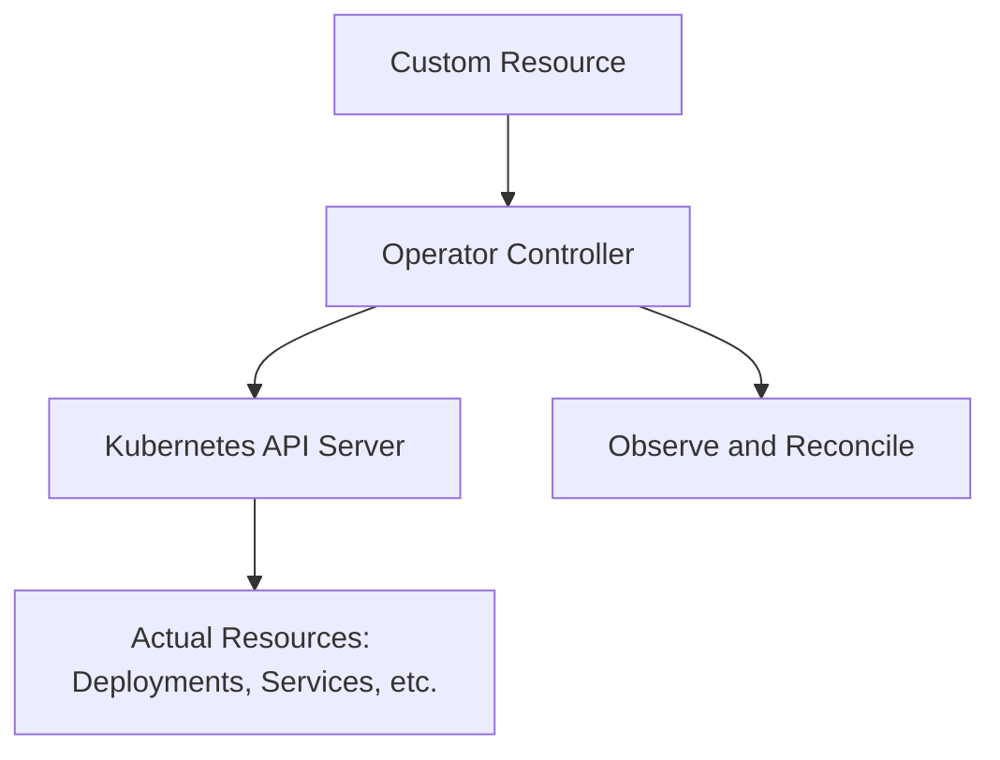
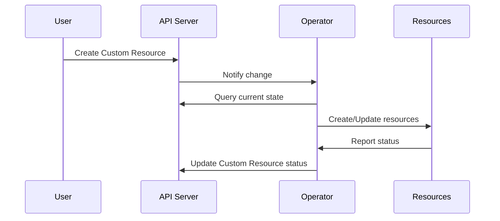

# Kubernetes Operators

## Overview

Kubernetes Operators are software extensions that automate the management of complex applications on Kubernetes. They extend the Kubernetes API to provide custom resources and controllers that manage application lifecycle, configuration, and operational tasks.



## Detailed Explanation

### Core Concepts

1. **Custom Resource Definitions (CRDs)**: Extend Kubernetes API with custom resources
2. **Controllers**: Watch for changes and reconcile desired vs actual state
3. **Operator Pattern**: Encapsulates operational knowledge in code
4. **Reconciliation Loop**: Continuous process of ensuring desired state

### Operator Capabilities

- **Lifecycle Management**: Installation, upgrades, backups
- **Configuration Management**: Dynamic configuration updates
- **Scaling**: Automated horizontal/vertical scaling
- **Self-Healing**: Automatic recovery from failures
- **Backup & Restore**: Automated data protection

### Types of Operators

- **Application Operators**: Manage specific applications (e.g., PostgreSQL, Redis)
- **Infrastructure Operators**: Manage infrastructure components
- **Platform Operators**: Manage entire platforms or stacks

## Journey / Sequence



## Real-world Examples & Use Cases

### Database Operator (PostgreSQL)
```yaml
apiVersion: postgres-operator.crunchydata.com/v1beta1
kind: PostgresCluster
metadata:
  name: hippo
spec:
  postgresVersion: 15
  instances:
    - name: instance1
      replicas: 2
      dataVolumeClaimSpec:
        accessModes:
        - "ReadWriteOnce"
        - "ReadWriteMany"
        storageClassName: fast-ssd
        resources:
          requests:
            storage: 1Gi
  backups:
    pgbackrest:
      repos:
      - name: repo1
        volume:
          volumeClaimSpec:
            accessModes:
            - "ReadWriteOnce"
            storageClassName: standard
            resources:
              requests:
                storage: 1Gi
```

### Monitoring Stack Operator
- Deploys Prometheus, Grafana, AlertManager
- Configures scraping targets
- Manages alerting rules
- Handles upgrades and rollbacks

### Custom Application Operator
- Manages deployment of microservices
- Handles database migrations
- Configures ingress rules
- Manages secrets and configmaps

## Code Examples

### Custom Resource Definition
```yaml
apiVersion: apiextensions.k8s.io/v1
kind: CustomResourceDefinition
metadata:
  name: myapps.example.com
spec:
  group: example.com
  versions:
  - name: v1
    served: true
    storage: true
    schema:
      openAPIV3Schema:
        type: object
        properties:
          spec:
            type: object
            properties:
              replicas:
                type: integer
              image:
                type: string
  scope: Namespaced
  names:
    plural: myapps
    singular: myapp
    kind: MyApp
```

### Operator Controller (Go)
```go
package controller

import (
	"context"
	appsv1 "k8s.io/api/apps/v1"
	"k8s.io/apimachinery/pkg/api/errors"
	"k8s.io/apimachinery/pkg/runtime"
	ctrl "sigs.k8s.io/controller-runtime"
	"sigs.k8s.io/controller-runtime/pkg/client"
	"sigs.k8s.io/controller-runtime/pkg/log"
	
	myappv1 "example.com/api/v1"
)

type MyAppReconciler struct {
	client.Client
	Scheme *runtime.Scheme
}

// Reconcile handles the reconciliation loop
func (r *MyAppReconciler) Reconcile(ctx context.Context, req ctrl.Request) (ctrl.Result, error) {
	logger := log.FromContext(ctx)
	
	// Fetch the MyApp instance
	myApp := &myappv1.MyApp{}
	err := r.Get(ctx, req.NamespacedName, myApp)
	if err != nil {
		if errors.IsNotFound(err) {
			return ctrl.Result{}, nil
		}
		return ctrl.Result{}, err
	}
	
	// Check if Deployment exists
	deployment := &appsv1.Deployment{}
	err = r.Get(ctx, client.ObjectKey{
		Namespace: myApp.Namespace,
		Name:      myApp.Name,
	}, deployment)
	
	if err != nil && errors.IsNotFound(err) {
		// Create Deployment
		dep := r.deploymentForMyApp(myApp)
		logger.Info("Creating Deployment", "Deployment.Namespace", dep.Namespace, "Deployment.Name", dep.Name)
		if err = r.Create(ctx, dep); err != nil {
			return ctrl.Result{}, err
		}
		return ctrl.Result{Requeue: true}, nil
	}
	
	// Update Deployment if spec changed
	if myApp.Spec.Replicas != *deployment.Spec.Replicas {
		deployment.Spec.Replicas = &myApp.Spec.Replicas
		if err = r.Update(ctx, deployment); err != nil {
			return ctrl.Result{}, err
		}
	}
	
	return ctrl.Result{}, nil
}

// deploymentForMyApp returns a Deployment object for the given MyApp
func (r *MyAppReconciler) deploymentForMyApp(m *myappv1.MyApp) *appsv1.Deployment {
	// Implementation details...
}
```

### Operator SDK (Java/Quarkus)
```java
@ApplicationScoped
public class MyAppController {
    
    @Inject
    KubernetesClient client;
    
    @Scheduled(every = "30s")
    public void reconcile() {
        // Watch for MyApp custom resources
        client.customResources(MyApp.class)
            .inAnyNamespace()
            .watch(new Watcher<MyApp>() {
                @Override
                public void eventReceived(Action action, MyApp myApp) {
                    switch (action) {
                        case ADDED:
                            createDeployment(myApp);
                            break;
                        case MODIFIED:
                            updateDeployment(myApp);
                            break;
                        case DELETED:
                            deleteDeployment(myApp);
                            break;
                    }
                }
            });
    }
    
    private void createDeployment(MyApp myApp) {
        // Create Kubernetes Deployment
        Deployment deployment = new DeploymentBuilder()
            .withNewMetadata()
                .withName(myApp.getMetadata().getName())
                .withNamespace(myApp.getMetadata().getNamespace())
            .endMetadata()
            .withNewSpec()
                .withReplicas(myApp.getSpec().getReplicas())
                .withNewTemplate()
                    .withNewSpec()
                        .addNewContainer()
                            .withName("app")
                            .withImage(myApp.getSpec().getImage())
                        .endContainer()
                    .endSpec()
                .endTemplate()
            .endSpec()
            .build();
        
        client.apps().deployments().create(deployment);
    }
}
```

## Common Pitfalls & Edge Cases

- **RBAC Issues**: Ensure proper permissions for the operator service account.
- **Version Conflicts**: Handle CRD version upgrades carefully.
- **Resource Limits**: Operators can consume significant resources; monitor and limit.
- **Idempotency**: Ensure reconcile logic is idempotent to handle retries.
- **Finalizers**: Use for cleanup on deletion to avoid orphaned resources.
- **Race Conditions**: Handle concurrent operations carefully.
- **Testing**: Comprehensive testing of operator behavior under various conditions.

## Tools & Libraries

- **Operator SDK**: Framework for building operators
- **Kubebuilder**: Kubernetes-native operator development
- **Operator Lifecycle Manager (OLM)**: Manages operator installations
- **Helm**: Package manager for Kubernetes
- **Fabric8 Kubernetes Client**: Java client for Kubernetes API

## References

- [Kubernetes Operator Pattern](https://kubernetes.io/docs/concepts/extend-kubernetes/operator/)
- [CNCF Operator White Paper](https://github.com/cncf/tag-app-delivery/blob/main/operator-wg/whitepaper/Operator-WhitePaper_v1-0.md)
- [OperatorHub.io](https://operatorhub.io/)
- [Operator SDK Documentation](https://sdk.operatorframework.io/)
- [Kubebuilder Book](https://book.kubebuilder.io/)

## Github-README Links & Related Topics

- [Kubernetes Basics](../kubernetes-basics/README.md)
- [Kubernetes Orchestration](../kubernetes-orchestration/README.md)
- [Helm Charts for Kubernetes](../helm-charts-for-kubernetes/README.md)
- [Container Orchestration Patterns](../container-orchestration-patterns/README.md)