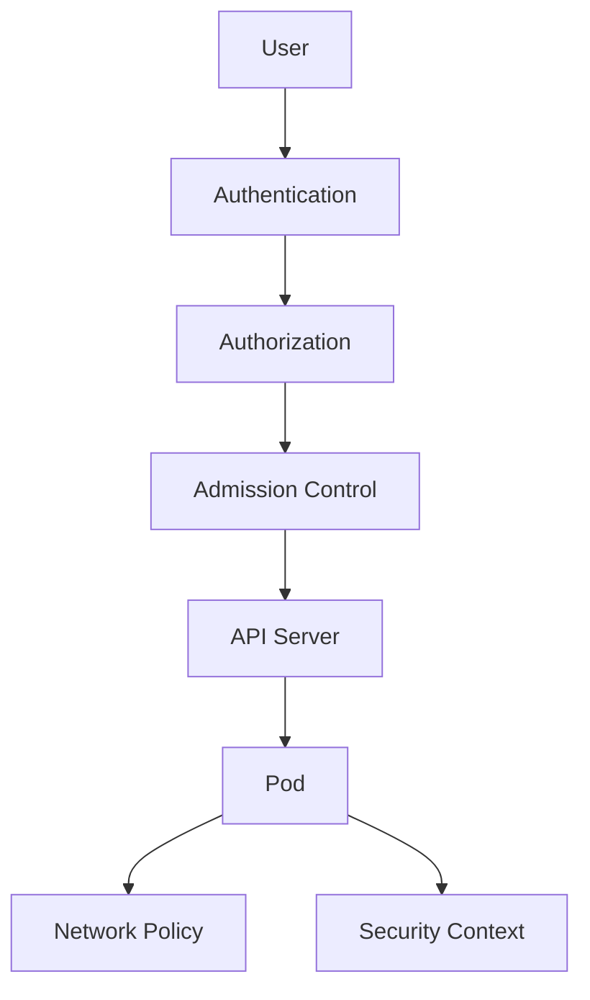

# Kubernetes Security

## Overview

Kubernetes security encompasses protecting the cluster, workloads, and data. It includes authentication, authorization, network isolation, secrets management, and runtime security. Best practices involve least privilege, regular updates, and monitoring.

## Detailed Explanation

### Authentication
- Users and service accounts authenticate via certificates, tokens, or OIDC.
- API server validates credentials.

### Authorization
- RBAC: Role-Based Access Control for fine-grained permissions.
- ABAC, Webhook: Alternative models.

### Admission Controllers
- Validate and mutate requests (e.g., PodSecurity, ResourceQuota).

### Network Security
- Network policies for pod isolation.
- Service mesh for encryption.

### Secrets Management
- Store sensitive data securely.
- Encrypt at rest and in transit.

### Pod Security
- Security contexts for user/group, capabilities.
- AppArmor, SELinux profiles.



## Real-world Examples & Use Cases

- **Multi-tenant Clusters**: RBAC for tenant isolation.
- **CI/CD Pipelines**: Service accounts with limited permissions.
- **Compliance**: Audit logs and encryption for regulated data.
- **Zero Trust**: Network policies and mTLS.

## Code Examples

### RBAC Role and Binding
```yaml
apiVersion: rbac.authorization.k8s.io/v1
kind: Role
metadata:
  name: pod-reader
rules:
- apiGroups: [""]
  resources: ["pods"]
  verbs: ["get", "list"]
---
apiVersion: rbac.authorization.k8s.io/v1
kind: RoleBinding
metadata:
  name: read-pods
subjects:
- kind: User
  name: alice
roleRef:
  kind: Role
  name: pod-reader
  apiGroup: rbac.authorization.k8s.io
```

### Secret
```yaml
apiVersion: v1
kind: Secret
metadata:
  name: db-secret
type: Opaque
data:
  username: dXNlcg==
  password: cGFzcw==
```

### Network Policy
```yaml
apiVersion: networking.k8s.io/v1
kind: NetworkPolicy
metadata:
  name: deny-all
spec:
  podSelector: {}
  policyTypes:
  - Ingress
  - Egress
```

### Pod Security Context
```yaml
apiVersion: v1
kind: Pod
metadata:
  name: secure-pod
spec:
  securityContext:
    runAsUser: 1000
    runAsGroup: 1000
  containers:
  - name: app
    image: myapp
    securityContext:
      allowPrivilegeEscalation: false
```

## Data Models / Message Formats

- **RBAC Objects**: Roles, ClusterRoles, Bindings.
- **AdmissionReview**: JSON for admission webhooks.

## Common Pitfalls & Edge Cases

- **Over-privileged Service Accounts**: Default tokens have broad access.
- **Unencrypted Secrets**: Use encryption providers.
- **Image Vulnerabilities**: Scan images regularly.
- **API Server Exposure**: Secure with firewalls and TLS.

## Tools & Libraries

- **kube-bench**: CIS benchmark checks.
- **Trivy**: Vulnerability scanning.
- **Falco**: Runtime security monitoring.
- **OPA/Gatekeeper**: Policy as code.

## References

- [Kubernetes Security Documentation](https://kubernetes.io/docs/concepts/security/)
- [RBAC](https://kubernetes.io/docs/reference/access-authn-authz/rbac/)
- [CIS Benchmarks](https://www.cisecurity.org/benchmark/kubernetes/)

## Github-README Links & Related Topics

- [kubernetes-basics](../kubernetes-basics/README.md)
- [security-best-practices-in-java](../security-best-practices-in-java/README.md)
- [api-authentication-methods](../api-authentication-methods/README.md)