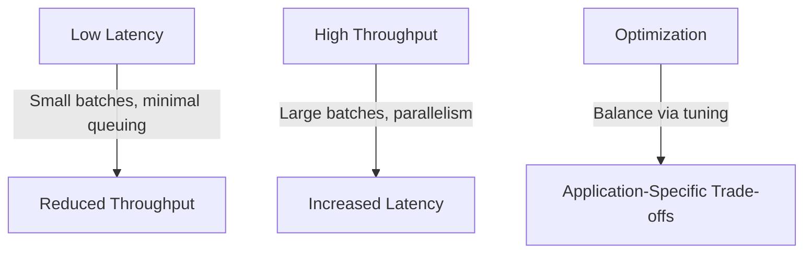
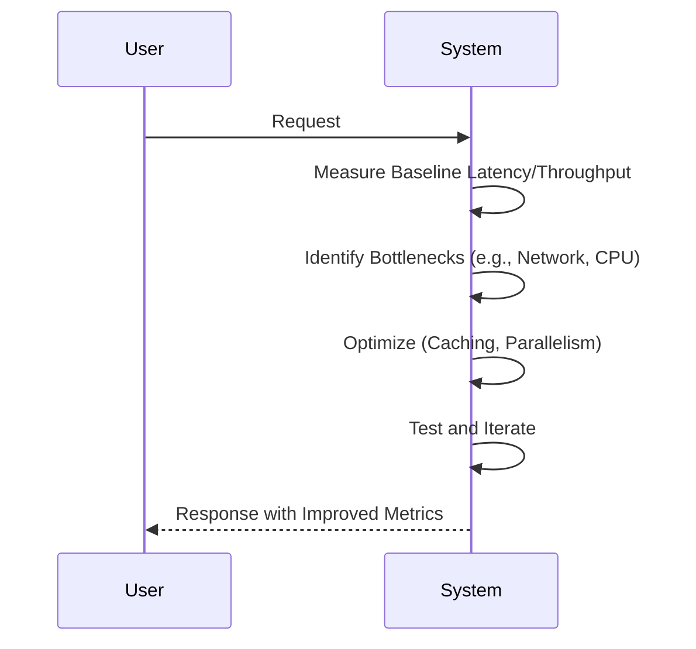

# Latency and Throughput Zero to Hero

## Overview

Latency and throughput are fundamental performance metrics in system design. Latency measures the time delay between a request and response, while throughput quantifies the rate of processing operations. Balancing these metrics is crucial for optimizing systems, whether prioritizing speed for real-time applications or volume for batch processing. This guide provides a comprehensive exploration from basics to advanced concepts, including definitions, trade-offs, measurements, and optimization strategies.

## Detailed Explanation

### Latency
Latency is the time interval between the initiation of a request and the receipt of the response. It encompasses various components:

- **Network Latency**: Propagation delay over physical media, influenced by distance and medium (e.g., fiber optics vs. satellite).
- **Processing Latency**: Time for computation within servers or applications.
- **Queueing Latency**: Delays due to resource contention or buffering.
- **Disk I/O Latency**: Access time for storage operations.

Latency is typically measured in milliseconds (ms) or microseconds (μs). For example, web applications aim for sub-100ms latency for optimal user experience.

### Throughput
Throughput is the rate at which a system processes requests or data, often expressed as operations per second (ops/s), requests per second (req/s), or bits per second (bps). It is constrained by bandwidth, processing power, and concurrency limits.

- **Maximum Theoretical Throughput**: Ideal rate under perfect conditions.
- **Sustained Throughput**: Average rate over extended periods.
- **Peak Throughput**: Highest instantaneous rate.

Throughput scales with parallelism but may introduce latency due to contention.

### Trade-offs and Metrics
Latency and throughput often conflict: optimizing for low latency (e.g., small batches) may reduce throughput, while high throughput (e.g., large batches) can increase latency. The bandwidth-delay product illustrates this, where throughput is limited by latency and available bandwidth.



| Metric | Unit | Description | Example |
|--------|------|-------------|---------|
| Latency | ms | End-to-end response time | 10ms for API call |
| Throughput | req/s | Operations processed per second | 1000 req/s for web server |
| Bandwidth-Delay Product | bits | Maximum in-flight data | 1Mbps * 100ms = 100Kb |
| Jitter | ms | Latency variation | ±5ms in network |

## Real-world Examples & Use Cases

### Web Applications
E-commerce sites require low latency (<100ms) for user interactions to prevent abandonment, while handling high throughput during peak traffic (e.g., Black Friday sales).

### Databases
OLTP systems prioritize low latency for queries, whereas data warehouses focus on high throughput for batch analytics.

### Streaming Services
Video streaming demands low latency for real-time playback, balanced with throughput for concurrent users.

### Gaming
Online multiplayer games need sub-50ms latency for responsiveness, with throughput supporting thousands of concurrent sessions.

### IoT Systems
Sensor networks require high throughput for data ingestion, tolerating higher latency for batch processing.

### Financial Trading
High-frequency trading systems minimize latency to microseconds, with throughput supporting millions of transactions per second.

## Code Examples

### Measuring Latency in Python
```python
import time
import requests

def measure_latency(url, num_requests=10):
    latencies = []
    for _ in range(num_requests):
        start = time.time()
        requests.get(url)
        latency = (time.time() - start) * 1000  # ms
        latencies.append(latency)
    avg_latency = sum(latencies) / len(latencies)
    print(f"Average Latency: {avg_latency:.2f} ms")
    return latencies

# Example usage
measure_latency('https://httpbin.org/delay/0.1')
```

### Measuring Throughput in Java
```java
import java.util.concurrent.*;
import java.util.concurrent.atomic.AtomicInteger;

public class ThroughputMeasurer {
    public static void main(String[] args) throws InterruptedException {
        int numTasks = 1000;
        ExecutorService executor = Executors.newFixedThreadPool(10);
        AtomicInteger completed = new AtomicInteger(0);
        long start = System.nanoTime();

        for (int i = 0; i < numTasks; i++) {
            executor.submit(() -> {
                // Simulate work
                try { Thread.sleep(10); } catch (InterruptedException e) {}
                completed.incrementAndGet();
            });
        }

        executor.shutdown();
        executor.awaitTermination(1, TimeUnit.MINUTES);
        double duration = (System.nanoTime() - start) / 1e9;
        double throughput = completed.get() / duration;
        System.out.println("Throughput: " + throughput + " ops/s");
    }
}
```

### Latency Benchmark in Go
```go
package main

import (
    "fmt"
    "net/http"
    "time"
)

func measureLatency(url string, requests int) {
    client := &http.Client{}
    var total time.Duration

    for i := 0; i < requests; i++ {
        start := time.Now()
        resp, _ := client.Get(url)
        resp.Body.Close()
        total += time.Since(start)
    }

    avg := total / time.Duration(requests)
    fmt.Printf("Average Latency: %v\n", avg)
}

func main() {
    measureLatency("https://httpbin.org/delay/0.05", 10)
}
```

### Throughput Test in Node.js
```javascript
const axios = require('axios');

async function measureThroughput(url, concurrency, totalRequests) {
    const start = Date.now();
    const promises = [];

    for (let i = 0; i < totalRequests; i++) {
        promises.push(axios.get(url));
    }

    await Promise.all(promises);
    const duration = (Date.now() - start) / 1000;
    const throughput = totalRequests / duration;
    console.log(`Throughput: ${throughput.toFixed(2)} req/s`);
}

measureThroughput('https://httpbin.org/get', 10, 100);
```

## STAR Summary
- **Situation**: Systems face performance bottlenecks in latency or throughput.
- **Task**: Optimize for specific requirements (e.g., low latency for real-time apps).
- **Action**: Profile, tune, and balance metrics using tools and patterns.
- **Result**: Improved user experience and system efficiency.

## Journey / Sequence


Steps to optimize:
1. **Profile**: Use tools to measure current latency and throughput.
2. **Identify Bottlenecks**: Analyze components (network, processing, I/O).
3. **Tune**: Apply optimizations like caching, batching, or concurrency.
4. **Test**: Load test under realistic conditions.
5. **Monitor**: Continuously track metrics in production.

## Data Models / Message Formats
Metrics can be represented in JSON for monitoring:

```json
{
  "timestamp": "2025-09-26T12:00:00Z",
  "latency": {
    "p50": 10.5,
    "p95": 25.0,
    "p99": 50.0,
    "unit": "ms"
  },
  "throughput": {
    "rate": 1500.0,
    "unit": "req/s"
  },
  "bottlenecks": ["network", "database"]
}
```

## Common Pitfalls & Edge Cases

| Pitfall | Description | Mitigation |
|---------|-------------|------------|
| Ignoring Jitter | Variable latency causes inconsistent performance | Use buffering and smoothing techniques |
| Over-Optimizing Latency | Sacrificing throughput for minimal gains | Balance based on SLAs |
| Underestimating Concurrency | High throughput without proper scaling | Implement auto-scaling and load balancing |
| Cold Starts in Serverless | Initial latency spikes in FaaS | Pre-warm functions or use persistent services |
| Network Bottlenecks | High latency in distributed systems | Optimize routing and use CDNs |
| Measurement Errors | Inaccurate profiling | Use consistent tools and environments |

Edge Cases:
- **Bursty Traffic**: Sudden spikes requiring elastic scaling.
- **Global Distribution**: Latency variations across regions.
- **Resource Constraints**: Limited CPU/memory affecting throughput.

## Tools & Libraries
- **Monitoring**: Prometheus, Grafana, New Relic for metrics collection.
- **Profiling**: JMeter, Apache Bench for load testing.
- **Optimization**: Redis for caching, Kafka for high-throughput messaging.
- **Libraries**: Apache Commons for Java latency measurement, aiohttp for Python async throughput.

## References
- [Latency (Engineering) - Wikipedia](https://en.wikipedia.org/wiki/Latency_(engineering))
- [Network Throughput - Wikipedia](https://en.wikipedia.org/wiki/Network_throughput)
- [Understanding Availability and Latency - AWS Builders' Library](https://aws.amazon.com/builders-library/understanding-availability-and-latency/)
- [Serverless Architectures - Martin Fowler](https://martinfowler.com/articles/serverless.html)
- [Bandwidth-Delay Product - RFC 7323](https://tools.ietf.org/html/rfc7323)

## Github-README Links & Related Topics
- [Caching](../caching/)
- [Database Performance Tuning](../database-performance-tuning/)
- [API Rate Limiting](../api-rate-limiting/)
- [Distributed Caching with Redis](../distributed-caching-with-redis/)
- [Circuit Breaker Pattern](../circuit-breaker-pattern/)