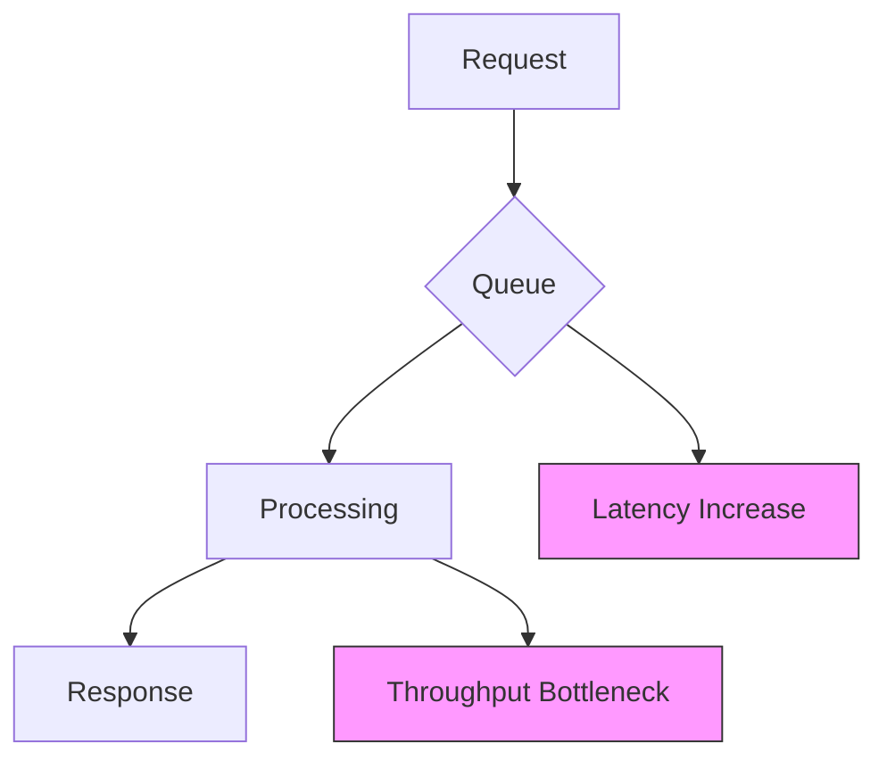
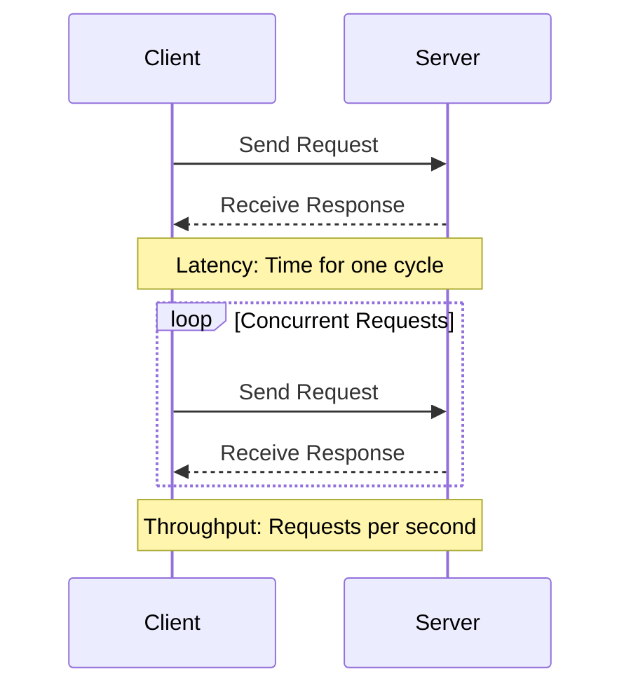

## Overview

Latency and throughput are fundamental metrics in system design and performance engineering. Latency measures the time delay for a system to respond to a request, while throughput quantifies the rate at which a system processes requests. Understanding their interplay is crucial for optimizing applications, from web services to distributed systems. This guide progresses from basic definitions to advanced concepts, tradeoffs, and practical implementations.

## Detailed Explanation

### Definitions

- **Latency**: The time interval between a stimulus and response. In computing, it's often the round-trip time (RTT) for a request-response cycle, measured in milliseconds (ms) or microseconds (μs).
- **Throughput**: The rate of successful message delivery over a communication channel, typically in bits per second (bps), packets per second (pps), or requests per second (RPS).

### Key Differences

Latency focuses on speed for individual operations, while throughput emphasizes volume over time. High latency can bottleneck throughput, but optimizing for one may degrade the other.

| Aspect          | Latency                          | Throughput                      |
|-----------------|----------------------------------|---------------------------------|
| Unit            | Time (ms, μs)                   | Rate (bps, RPS)                |
| Focus           | Delay per operation             | Volume processed               |
| Example Metric  | 50ms response time              | 1000 RPS                       |
| Tradeoff        | Lower latency often reduces throughput due to overhead | Higher throughput may increase latency via queuing |

### Tradeoffs and Concepts

The latency-throughput tradeoff is governed by factors like bandwidth-delay product and queuing theory. Increasing throughput (e.g., via parallelism) can raise latency due to contention, while minimizing latency (e.g., via caching) may limit throughput.



In distributed systems, CAP theorem implies tradeoffs: low latency favors availability, high throughput favors consistency.

### Metrics and Measurement

- **Latency Metrics**: RTT, Time to First Byte (TTFB), 99th percentile latency.
- **Throughput Metrics**: Goodput (useful data rate), channel utilization.
- **Tools**: Ping for RTT, Iperf for throughput testing.

## Journey / Sequence

Understanding latency and throughput progresses through these stages:

1. **Fundamentals**: Grasp definitions and differences.
2. **Measurement**: Learn tools and techniques to quantify metrics.
3. **Tradeoffs**: Analyze how optimizations affect each other.
4. **Real-world Application**: Apply concepts to system design.
5. **Advanced Optimization**: Handle edge cases, monitoring, and scaling.



## Real-world Examples & Use Cases

### Web Servers

In e-commerce, low latency (<100ms) ensures quick page loads, boosting conversions. High-throughput APIs (e.g., 10,000 RPS) handle traffic spikes but may tolerate higher latency during peaks.

### Databases

OLTP systems prioritize low latency for transactions, while data warehouses focus on high throughput for batch processing. Example: Redis for sub-ms latency vs. Cassandra for high-throughput reads.

### Streaming and Gaming

Real-time video streaming requires <50ms latency for smooth playback. Online gaming demands ultra-low latency (<20ms) to prevent lag, while throughput supports multiple concurrent streams.

### IoT and Edge Computing

Sensor networks need high throughput for data ingestion but low latency for real-time alerts, often using edge processing to balance both.

## Common Pitfalls & Edge Cases

- **Misinterpreting Metrics**: Average latency hides outliers; always check percentiles (e.g., P99 latency).
- **Over-optimization**: Reducing latency at the cost of throughput can lead to bottlenecks under load.
- **Network Effects**: WAN latency (e.g., 100ms+ for transatlantic) dwarfs local optimizations.
- **Concurrency Issues**: Parallelism boosts throughput but introduces contention, increasing latency.
- **Edge Cases**: 
  - Cold starts in serverless (high initial latency).
  - Thundering herd: Sudden load spikes cause queueing.
  - Hardware limits: CPU-bound vs. I/O-bound operations.

| Pitfall | Impact | Mitigation |
|---------|--------|------------|
| Ignoring percentiles | Underestimates user experience | Use P95/P99 metrics |
| No load testing | Unpredictable performance | Simulate real traffic |
| Synchronous processing | Low throughput | Implement async patterns |

## Code Examples

### Measuring Latency in Python

```python
import time
import requests

def measure_latency(url, num_requests=10):
    latencies = []
    for _ in range(num_requests):
        start = time.time()
        response = requests.get(url)
        end = time.time()
        latencies.append((end - start) * 1000)  # ms
    avg_latency = sum(latencies) / len(latencies)
    return avg_latency, latencies

# Example usage
avg, all_latencies = measure_latency('https://httpbin.org/delay/1')
print(f"Average Latency: {avg:.2f} ms")
```

### Measuring Throughput in Python

```python
import time
import threading
import requests

def worker(url, results, duration=10):
    start = time.time()
    count = 0
    while time.time() - start < duration:
        requests.get(url)
        count += 1
    results.append(count)

def measure_throughput(url, num_threads=4, duration=10):
    results = []
    threads = []
    for _ in range(num_threads):
        t = threading.Thread(target=worker, args=(url, results, duration))
        threads.append(t)
        t.start()
    for t in threads:
        t.join()
    total_requests = sum(results)
    throughput = total_requests / duration  # RPS
    return throughput

# Example usage
throughput = measure_throughput('https://httpbin.org/get')
print(f"Throughput: {throughput:.2f} RPS")
```

These snippets use `requests` for HTTP calls; install via `pip install requests`. Adjust URLs for real testing.

### Measuring Latency in Java

```java
import java.net.http.HttpClient;
import java.net.http.HttpRequest;
import java.net.http.HttpResponse;
import java.net.URI;
import java.time.Duration;
import java.time.Instant;
import java.util.ArrayList;
import java.util.List;

public class LatencyMeasurer {
    public static void main(String[] args) throws Exception {
        HttpClient client = HttpClient.newHttpClient();
        HttpRequest request = HttpRequest.newBuilder()
                .uri(URI.create("https://httpbin.org/delay/1"))
                .timeout(Duration.ofSeconds(10))
                .build();

        List<Long> latencies = new ArrayList<>();
        for (int i = 0; i < 10; i++) {
            Instant start = Instant.now();
            HttpResponse<String> response = client.send(request, HttpResponse.BodyHandlers.ofString());
            Instant end = Instant.now();
            long latency = Duration.between(start, end).toMillis();
            latencies.add(latency);
        }
        double avg = latencies.stream().mapToLong(Long::longValue).average().orElse(0.0);
        System.out.printf("Average Latency: %.2f ms%n", avg);
    }
}
```

### Measuring Throughput in Java

```java
import java.net.http.HttpClient;
import java.net.http.HttpRequest;
import java.net.http.HttpResponse;
import java.net.URI;
import java.util.concurrent.CompletableFuture;
import java.util.concurrent.atomic.AtomicInteger;
import java.time.Duration;
import java.time.Instant;
import java.util.ArrayList;
import java.util.List;

public class ThroughputMeasurer {
    public static void main(String[] args) throws Exception {
        HttpClient client = HttpClient.newBuilder().build();
        HttpRequest request = HttpRequest.newBuilder()
                .uri(URI.create("https://httpbin.org/get"))
                .timeout(Duration.ofSeconds(5))
                .build();

        AtomicInteger count = new AtomicInteger(0);
        Instant start = Instant.now();
        List<CompletableFuture<Void>> futures = new ArrayList<>();
        for (int i = 0; i < 100; i++) {
            CompletableFuture<Void> future = client.sendAsync(request, HttpResponse.BodyHandlers.ofString())
                    .thenRun(() -> count.incrementAndGet());
            futures.add(future);
        }
        CompletableFuture.allOf(futures.toArray(new CompletableFuture[0])).join();
        Instant end = Instant.now();
        long durationMs = Duration.between(start, end).toMillis();
        double throughput = (double) count.get() / (durationMs / 1000.0);
        System.out.printf("Throughput: %.2f RPS%n", throughput);
    }
}
```

## Tools & Libraries

- **Load Testing**: JMeter, Gatling, Locust for simulating high throughput and measuring latency.
- **Monitoring**: Prometheus with Grafana for real-time metrics visualization.
- **Libraries**:
  - Java: Micrometer for application metrics.
  - Python: aiohttp for asynchronous HTTP clients to improve throughput.
  - Go: fasthttp for low-latency HTTP handling.
- **Profiling**: perf, Valgrind for system-level latency analysis.

## References

- [Latency (engineering) - Wikipedia](https://en.wikipedia.org/wiki/Latency_(engineering))
- [Network throughput - Wikipedia](https://en.wikipedia.org/wiki/Network_throughput)
- [What is Latency? - AWS](https://aws.amazon.com/what-is/latency/)
- [What is Throughput? - Cloudflare](https://www.cloudflare.com/learning/performance/glossary/what-is-throughput/)
- [Understanding Latency vs Throughput - NGINX](https://www.nginx.com/blog/understanding-latency-vs-throughput/)
- [Latency vs Throughput - Martin Fowler](https://martinfowler.com/bliki/LatencyVsThroughput.html)
- [Performance Testing Tools - Guru99](https://www.guru99.com/performance-testing.html)
- [Understanding Latency and Throughput - ACM Queue](https://queue.acm.org/detail.cfm?id=3028685)

## STAR Summary

- **Situation**: Applications must deliver fast responses and handle high loads.
- **Task**: Optimize for both low latency and high throughput.
- **Action**: Measure metrics, identify bottlenecks, apply caching, parallelism, and load balancing.
- **Result**: Enhanced user experience, scalable systems, and efficient resource use.

## Github-README Links & Related Topics

- [Caching](../caching/README.md)
- [CAP Theorem & Distributed Systems](../cap-theorem-and-distributed-systems/README.md)
- [API Design Principles](../api-design-principles/README.md)
- [Database Performance Tuning](../database-performance-tuning/README.md)
- [CDN Architecture](../cdn-architecture/README.md)
- [Load Balancing and Strategies](../load-balancing-and-strategies/README.md)
- [Monitoring and Logging](../monitoring-and-logging/README.md)