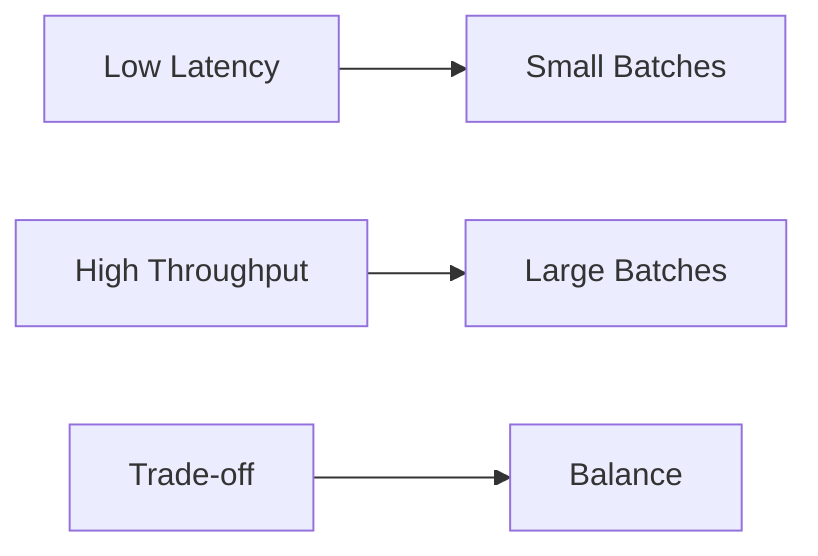

# Latency and Throughput Zero to Hero

## Overview

Latency measures response time, throughput measures processing rate. Balancing them optimizes systems for speed or volume. This guide covers definitions, trade-offs, examples, and optimizations from basics to advanced.

## Detailed Explanation

### Latency
Time from request to response. Types: network, processing, queueing.

### Throughput
Operations per unit time. Limited by bandwidth and processing.

### Trade-offs
Low latency may reduce throughput; high throughput may increase latency.



| Metric | Unit | Example |
|--------|------|---------|
| Latency | ms | 10ms |
| Throughput | req/s | 1000 |

## Real-world Examples & Use Cases

- Web apps: <100ms latency.
- Batch jobs: High throughput.
- Streaming: Low latency for real-time.

## Code Examples

### Measure Latency (Python)

```python
import time
import requests

start = time.time()
requests.get('http://example.com')
latency = time.time() - start
print(f"Latency: {latency}s")
```

### Measure Throughput (Java)

```java
import java.util.concurrent.*;

ExecutorService executor = Executors.newFixedThreadPool(10);
AtomicInteger count = new AtomicInteger();
long start = System.nanoTime();
for (int i = 0; i < 1000; i++) {
    executor.submit(() -> count.incrementAndGet());
}
executor.shutdown();
executor.awaitTermination(1, TimeUnit.MINUTES);
double duration = (System.nanoTime() - start) / 1e9;
double throughput = count.get() / duration;
System.out.println("Throughput: " + throughput + " ops/s");
```

## References

- [Latency](https://en.wikipedia.org/wiki/Latency_(engineering))
- [Throughput](https://en.wikipedia.org/wiki/Network_throughput)
- [AWS Latency](https://aws.amazon.com/builders-library/understanding-availability-and-latency/)

## Github-README Links & Related Topics

- [Caching](../caching/)
- [Database Performance Tuning](../database-performance-tuning/)
- [API Rate Limiting](../api-rate-limiting/)