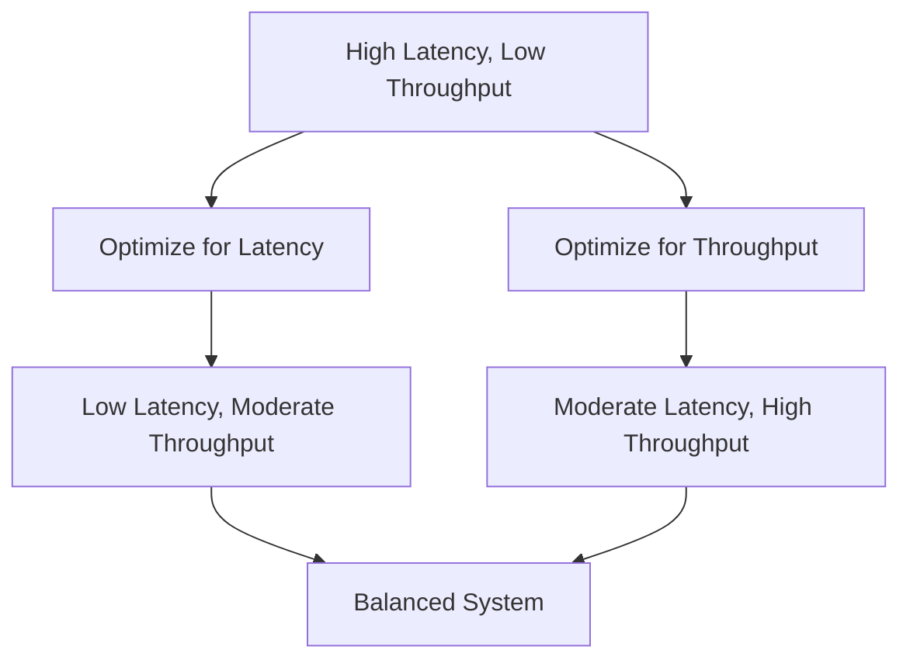

# Overview

Latency and throughput are fundamental performance metrics in computing systems, representing the speed and capacity of operations. Latency measures the time delay between initiating an action and its completion, while throughput quantifies the rate of successful operations over time. This guide progresses from basic concepts to advanced optimization techniques, emphasizing their trade-offs and practical applications in engineering.

# Detailed Explanation

## Definitions and Basics

- **Latency**: The time interval between a stimulus and response. In systems, it's the delay for a single operation (e.g., request-response round-trip). Measured in units like milliseconds (ms), microseconds (μs), or nanoseconds (ns).
- **Throughput**: The rate of processing or data transfer, often in operations per second (ops/s), bits per second (bps), or transactions per second (tps). It reflects system capacity under load.

Key relationship: Latency and throughput often trade off. Optimizing for low latency may reduce throughput (e.g., small batches), while high throughput might increase latency (e.g., batching operations).

## Measurement Techniques

### Latency Measurement
- **One-way Latency**: Time from send to receive.
- **Round-trip Latency**: Includes return path, common in networks (e.g., ping).
- Tools: `ping` for networks, `time` command for processes, profilers for code.

### Throughput Measurement
- **Maximum Theoretical Throughput**: Based on channel capacity (e.g., Shannon-Hartley theorem for analog channels).
- **Sustained Throughput**: Average over time, accounting for overhead.
- Tools: `iperf` for networks, `ab` (Apache Bench) for web servers, custom benchmarks.

Factors affecting metrics:
- **Network**: Propagation delay, queuing, packet loss.
- **Hardware**: CPU cycles, memory access, I/O bottlenecks.
- **Software**: Algorithm efficiency, concurrency, contention.

## Trade-offs and Optimization

Use the USE Method (Utilization, Saturation, Errors) for resource analysis:
- Check each resource (CPU, memory, disk, network) for high utilization, saturation, or errors.

Optimization strategies:
- **Reduce Latency**: Caching, precomputation, parallelization.
- **Increase Throughput**: Batching, pipelining, load balancing.
- **Balancing**: Tune based on workload (e.g., real-time vs. batch processing).

| Scenario | Latency Focus | Throughput Focus | Trade-off Example |
|----------|---------------|------------------|-------------------|
| Real-time chat | Low (<100ms) | Moderate | Buffering increases latency for higher throughput |
| Video streaming | Moderate | High (Mbps) | Buffering reduces latency jitter but adds delay |
| Database queries | Low | High (qps) | Indexing speeds queries (lower latency) but adds write overhead |



## Advanced Concepts

- **Bandwidth-Delay Product**: Throughput limit = bandwidth × round-trip latency. Affects TCP window sizing.
- **Little's Law**: In queuing systems, average queue length = arrival rate × average wait time.
- **Amdahl's Law**: Speedup from parallelization limited by serial portions.
- **99th Percentile Latency**: Focus on tail latencies for user experience, not averages.

# Real-world Examples & Use Cases

- **Web Services**: API gateways prioritize low latency for user-facing endpoints, high throughput for backend processing. Example: Netflix optimizes for <1s latency with global CDN.
- **Databases**: OLTP systems (e.g., PostgreSQL) minimize query latency; OLAP (e.g., Redshift) maximizes data throughput.
- **Networking**: Fiber optics: ~5μs/km latency; Satellite: ~250ms one-way. High-frequency trading demands sub-ms latency.
- **Distributed Systems**: Consensus algorithms (e.g., Paxos) balance latency (round-trips) and throughput (operations/sec).
- **IoT**: Sensors send data with low throughput but strict latency bounds for real-time alerts.

# Code Examples

## Measuring Latency in Python

```python
import time

def measure_latency(func, *args, **kwargs):
    start = time.time()
    result = func(*args, **kwargs)
    end = time.time()
    latency = (end - start) * 1000  # ms
    print(f"Latency: {latency:.2f} ms")
    return result

# Example usage
def dummy_operation():
    time.sleep(0.01)  # Simulate 10ms operation
    return "done"

measure_latency(dummy_operation)
```

## Measuring Throughput in Python

```python
import time
import threading

def throughput_test(operations, duration=1):
    count = 0
    start = time.time()
    while time.time() - start < duration:
        operations()
        count += 1
    throughput = count / duration
    print(f"Throughput: {throughput:.2f} ops/s")
    return throughput

# Example: Simulate operations
def dummy_op():
    pass  # No-op for simplicity

throughput_test(dummy_op, duration=1)
```

## Network Throughput with iperf (Bash)

```bash
# Install iperf if needed
# Server: iperf -s
# Client: iperf -c <server_ip> -t 10
# Output: bandwidth in Mbits/sec
```

# References

- [Latency (engineering) - Wikipedia](https://en.wikipedia.org/wiki/Latency_(engineering))
- [Network Throughput - Wikipedia](https://en.wikipedia.org/wiki/Network_throughput)
- [Understanding Latency vs Throughput - NGINX](https://www.nginx.com/blog/understanding-latency-vs-throughput/)
- [Performance Analysis Methodology - Brendan Gregg](https://brendangregg.com/methodology.html)