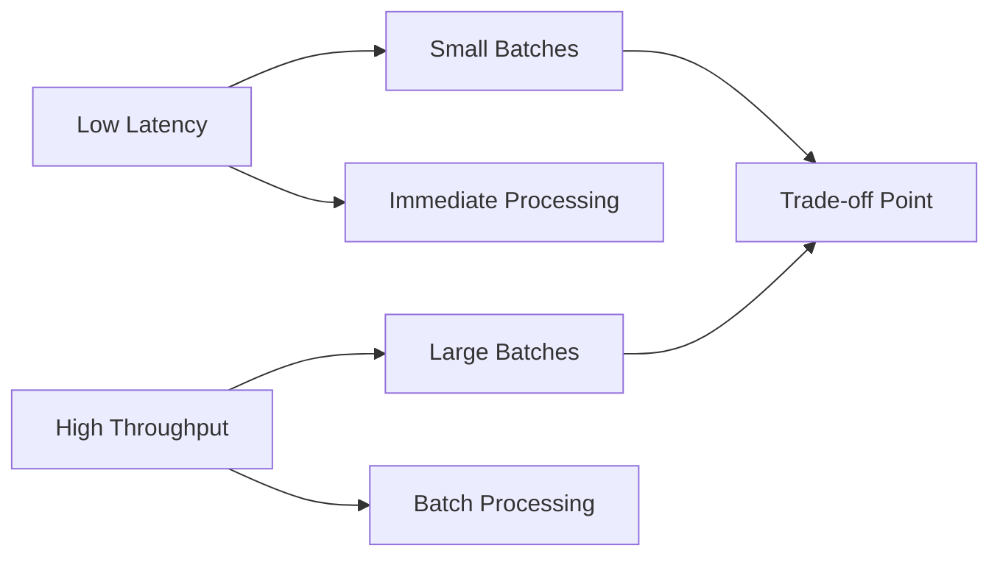

## Overview

Latency and Throughput are fundamental performance metrics in system design. This comprehensive guide covers their definitions, measurement techniques, optimization strategies, and real-world applications, progressing from basic concepts to advanced optimization techniques.

## Detailed Explanation

## Core Concepts

### Latency
Latency is the time delay between a request and its response. It measures how quickly a system can respond to individual requests.

**Types of Latency:**
- Network latency: Time for data to travel across network
- Disk I/O latency: Time to read/write from storage
- Processing latency: Time for CPU to process request
- Queueing latency: Time spent waiting in queues

### Throughput
Throughput is the rate at which a system processes requests or data over time. It measures the system's capacity to handle volume.

**Units:**
- Requests per second (RPS)
- Transactions per second (TPS)
- Bits per second (bps)
- Operations per second (ops/sec)

## The Latency-Throughput Trade-off

There's often an inverse relationship between latency and throughput:
- Optimizing for low latency may reduce throughput (e.g., small batch sizes)
- Optimizing for high throughput may increase latency (e.g., large batch sizes)

| Aspect | Low Latency Focus | High Throughput Focus |
|--------|-------------------|-----------------------|
| Batch Size | Small | Large |
| Processing | Immediate | Batched |
| Trade-off Point | Balance needed | Balance needed |



## Measurement Techniques

### Latency Measurement
- Percentiles: p50, p95, p99, p99.9
- Mean, median, standard deviation
- Tail latency analysis

### Throughput Measurement
- Sustained throughput under load
- Peak throughput
- Throughput degradation under high latency

## Optimization Strategies

### Latency Optimization

1. **Caching**: Store frequently accessed data in memory
2. **CDN**: Reduce network latency for global users
3. **Async Processing**: Non-blocking I/O operations
4. **Connection Pooling**: Reuse connections to reduce setup time
5. **Compression**: Reduce data transfer size
6. **Edge Computing**: Process data closer to users

### Throughput Optimization

1. **Horizontal Scaling**: Add more servers
2. **Load Balancing**: Distribute load evenly
3. **Batching**: Process multiple requests together
4. **Parallel Processing**: Utilize multiple cores/CPUs
5. **Queueing Theory**: Optimize queue management
6. **Database Indexing**: Speed up queries

### Advanced Techniques

- **Circuit Breakers**: Fail fast to prevent cascading failures
- **Rate Limiting**: Control request rates to prevent overload
- **Auto-scaling**: Dynamically adjust resources based on load
- **Micro-batching**: Balance between latency and throughput

## Real-world Examples & Use Cases

- **Financial Trading Systems**: Require ultra-low latency (<1ms) for high-frequency trading
- **Video Streaming**: High throughput for concurrent users, acceptable latency for buffering
- **E-commerce**: Balance low latency for product searches with high throughput during sales
- **IoT Systems**: Handle high throughput of sensor data with varying latency requirements
- **Search Engines**: Optimize for both fast response (latency) and handling millions of queries (throughput)

## Code Examples

## Latency Measurement

```java
import java.time.Instant;
import java.util.concurrent.TimeUnit;

public class LatencyMeasurer {
    public static void measureLatency(Runnable operation) {
        Instant start = Instant.now();
        operation.run();
        Instant end = Instant.now();
        long latency = TimeUnit.NANOSECONDS.toMillis(
            end.toEpochMilli() - start.toEpochMilli()
        );
        System.out.println("Latency: " + latency + " ms");
    }
    
    // Usage
    public static void main(String[] args) {
        measureLatency(() -> {
            // Simulate operation
            try { Thread.sleep(100); } catch (Exception e) {}
        });
    }
}
```

## Throughput Testing

```python
import time
import threading
import queue

def worker(q, results):
    while True:
        item = q.get()
        if item is None:
            break
        # Simulate processing
        time.sleep(0.01)  # 10ms processing time
        results.append(time.time())
        q.task_done()

def measure_throughput(num_workers, num_requests):
    q = queue.Queue()
    results = []
    
    # Start workers
    threads = []
    for i in range(num_workers):
        t = threading.Thread(target=worker, args=(q, results))
        t.start()
        threads.append(t)
    
    start_time = time.time()
    
    # Add requests to queue
    for i in range(num_requests):
        q.put(i)
    
    # Wait for completion
    q.join()
    
    # Stop workers
    for i in range(num_workers):
        q.put(None)
    for t in threads:
        t.join()
    
    end_time = time.time()
    
    total_time = end_time - start_time
    throughput = num_requests / total_time
    
    print(f"Processed {num_requests} requests in {total_time:.2f} seconds")
    print(f"Throughput: {throughput:.2f} requests/second")
    
    return throughput

# Usage
measure_throughput(4, 1000)
```

## Caching for Latency Optimization

```java
import java.util.concurrent.ConcurrentHashMap;
import java.util.function.Function;

public class SimpleCache<K, V> {
    private final ConcurrentHashMap<K, V> cache = new ConcurrentHashMap<>();
    
    public V get(K key, Function<K, V> loader) {
        return cache.computeIfAbsent(key, loader);
    }
    
    public void invalidate(K key) {
        cache.remove(key);
    }
    
    public void clear() {
        cache.clear();
    }
}
```

## Common Pitfalls & Edge Cases

- **Coordinated Omission**: Failing to account for requests that arrive during high load periods
- **Tail Latency Amplification**: Small increases in p99 latency can significantly impact user experience
- **Resource Contention**: CPU, memory, or I/O bottlenecks causing unpredictable latency spikes
- **Measurement Bias**: Using average latency instead of percentiles, hiding performance issues
- **Cold Starts**: Initial requests after idle periods experiencing higher latency

## Tools & Libraries

- **Benchmarking**: JMH (Java Microbenchmark Harness), wrk, Apache Bench
- **Monitoring**: Prometheus, Grafana, New Relic
- **Profiling**: YourKit, VisualVM, async-profiler
- **Load Testing**: JMeter, Gatling, k6
- **Tracing**: Jaeger, Zipkin

## References

- [Latency vs Throughput](https://www.brendangregg.com/usemethod.html)
- [Systems Performance: Enterprise and the Cloud by Brendan Gregg](https://www.amazon.com/Systems-Performance-Enterprise-Brendan-Gregg/dp/0133390098)
- [Designing Data-Intensive Applications by Martin Kleppmann](https://www.amazon.com/Designing-Data-Intensive-Applications-Reliable-Maintainable/dp/1449373321)
- [Google SRE Book](https://sre.google/sre-book/table-of-contents/)
- [Latency (engineering) - Wikipedia](https://en.wikipedia.org/wiki/Latency_(engineering))
- [Network Throughput - Wikipedia](https://en.wikipedia.org/wiki/Network_throughput)

## Github-README Links & Related Topics

- [Latency Measurement](latency-measurement/README.md)
- [Caching](caching/README.md)
- [Load Balancing and Strategies](load-balancing-and-strategies/README.md)
- [High Scalability Patterns](high-scalability-patterns/README.md)