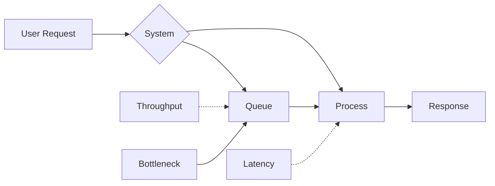

## Overview

Latency and throughput are fundamental performance metrics in system design and performance engineering. Latency refers to the time delay between a stimulus and response, often measured in milliseconds or microseconds, while throughput is the rate at which a system processes requests, typically in operations per second. Understanding their interplay is essential for building scalable, efficient systems where trade-offs must be balanced to meet user expectations and resource constraints.

## Detailed Explanation

### Latency
Latency is the time interval between the cause and effect of a physical change in the system. In computing, it's the delay from request initiation to completion.

- **Types**:
  - **Network Latency**: Propagation delay over communication channels (e.g., fiber optics: ~5 μs/km).
  - **Disk I/O Latency**: Seek time and rotational delay in storage systems.
  - **Processing Latency**: CPU computation time, including queuing and context switching.
  - **End-to-End Latency**: Total time from user action to response.

- **Measurement**:
  - Use percentiles: P50 (median), P95, P99 to account for outliers.
  - Tools: Ping for round-trip time (RTT), tracers for path analysis.

- **Factors Affecting Latency**:
  - Physical distance (speed of light limit).
  - Bandwidth-delay product.
  - Queuing delays, processing overhead.
  - In simulations, latency includes transport delay.

### Throughput
Throughput is the rate of message delivery over a communication channel, measured in bits per second (bps), packets per second (pps), or operations per second.

- **Types**:
  - **Maximum Theoretical Throughput**: Channel capacity (Shannon-Hartley theorem).
  - **Asymptotic Throughput**: Limit as load increases.
  - **Sustained Throughput**: Average over time, excluding bursts.

- **Measurement**:
  - Bits/s, requests/s (QPS), transactions/s (TPS).
  - Goodput: Useful data rate excluding overhead.

- **Factors Affecting Throughput**:
  - Bandwidth limitations (analog: SNR, bandwidth; digital: protocol overhead).
  - Hardware: CPU, memory, I/O bottlenecks.
  - Multi-user: Fair queuing, congestion control (TCP slow start).
  - Overhead: Protocol headers, retransmissions.

### Trade-offs and Optimization
Latency and throughput often conflict: optimizing for one degrades the other. For example, batching increases throughput but adds latency.

| Aspect          | Latency Focus                     | Throughput Focus                  |
|-----------------|-----------------------------------|-----------------------------------|
| **Strategy**   | Minimize individual response time| Maximize aggregate operations     |
| **Techniques** | Caching, async processing        | Parallelism, batching             |
| **Trade-off**  | Fine-grained locking reduces concurrency | Coarse locking increases latency  |
| **Example**    | Real-time gaming (low latency)   | Batch analytics (high throughput) |



In distributed systems, latency limits throughput via bandwidth-delay product. Optimizations include:
- Asynchronous I/O for concurrency.
- Load balancing to distribute load.
- Compression to reduce data transfer time.

## STAR Summary
- **Situation**: High-traffic e-commerce site experiencing slow page loads during peak hours.
- **Task**: Reduce latency while maintaining throughput for 10k concurrent users.
- **Action**: Implemented CDN for static assets, async API calls, and horizontal scaling with auto-load balancing.
- **Result**: Latency dropped from 2s to 200ms P95, throughput increased 3x without downtime.

## Journey / Sequence
1. **Foundation**: Grasp definitions, units (ms for latency, ops/s for throughput), and basic measurement.
2. **Measurement**: Instrument code with timers, use APM for percentiles; benchmark with tools like JMeter.
3. **Analysis**: Profile bottlenecks (CPU via flame graphs, network via Wireshark); monitor with dashboards.
4. **Optimization**: Apply caching, async patterns, sharding; test under load.
5. **Scaling**: In distributed setups, use eventual consistency for throughput; edge computing for latency.
6. **Mastery**: Predict performance with models, automate scaling, ensure fault tolerance.

## Data Models / Message Formats
In high-throughput systems, efficient data models reduce serialization overhead:
- **Protobuf/Avro**: Compact binary formats for low latency in RPC (e.g., gRPC).
- **JSON**: Human-readable but verbose; use for APIs where latency is secondary.
- **Message Queues**: Kafka uses binary logs for high throughput; schema evolution via Avro.

Example Protobuf schema for a request:
```
message Request {
  string id = 1;
  bytes payload = 2;
}
```

## Real-world Examples & Use Cases
- **Web Servers**: Nginx optimizes for low latency via async I/O; throughput via connection pooling.
- **Databases**: Redis (in-memory) for sub-ms latency; Cassandra for high-throughput writes via eventual consistency.
- **Streaming**: Kafka achieves millions of msgs/s throughput with tunable latency.
- **Gaming**: Low latency (<50ms) via dedicated servers; throughput via matchmaking queues.
- **Financial Trading**: Sub-microsecond latency for HFT; regulated throughput via rate limits.
- **CDNs**: Edge locations reduce network latency; global distribution boosts throughput.

## Code Examples
### Measuring Latency in Python
```python
import time

start = time.perf_counter()
# Simulate processing
time.sleep(0.1)
latency = time.perf_counter() - start
print(f"Latency: {latency:.4f} seconds")
```

### Throughput Benchmark in Go
```go
package main

import (
    "fmt"
    "sync"
    "time"
)

func processRequest(id int) {
    // Simulate work
    time.Sleep(10 * time.Millisecond)
}

func main() {
    var wg sync.WaitGroup
    start := time.Now()
    numRequests := 1000
    for i := 0; i < numRequests; i++ {
        wg.Add(1)
        go func(id int) {
            defer wg.Done()
            processRequest(id)
        }(i)
    }
    wg.Wait()
    duration := time.Since(start)
    throughput := float64(numRequests) / duration.Seconds()
    fmt.Printf("Throughput: %.2f req/s\n", throughput)
}
```

### Async Latency Optimization in JavaScript (Node.js)
```javascript
const { performance } = require('perf_hooks');

async function handleRequest() {
    const start = performance.now();
    await Promise.all([
        fetchDataFromDB(),
        fetchDataFromCache()
    ]);
    const latency = performance.now() - start;
    console.log(`Latency: ${latency.toFixed(2)} ms`);
}
```

## Common Pitfalls & Edge Cases
- **Averages vs. Percentiles**: Averages hide tail latency; always monitor P99.
- **Bufferbloat**: Excessive buffering increases latency; use AQM (Active Queue Management).
- **Thundering Herd**: Concurrent requests overload; implement backoff and caching.
- **Edge Case**: DDoS floods increase latency; use rate limiting and WAF.
- **Distributed Pitfall**: Clock skew affects latency measurements; use NTP or PTP.

## Tools & Libraries
- **Monitoring**: Prometheus (metrics), Grafana (visualization), Jaeger (tracing).
- **Benchmarking**: wrk (HTTP load), iperf (network throughput), Vegeta (Go-based).
- **Libraries**: Netty (Java async), Tokio (Rust async), RxJS (reactive streams).
- **Cloud Tools**: AWS X-Ray, GCP Trace, Azure Application Insights.

## References
- [Wikipedia: Latency (engineering)](https://en.wikipedia.org/wiki/Latency_(engineering))
- [Wikipedia: Network Throughput](https://en.wikipedia.org/wiki/Network_throughput)
- [AWS: Understanding Impact of DynamoDB Throughput Defaults](https://aws.amazon.com/builders-library/understanding-impact-of-dynamodb-throughput-defaults/)
- [NGINX: Understanding Latency vs Throughput](https://www.nginx.com/blog/understanding-latency-vs-throughput/)
- [Martin Fowler: Latency vs Throughput](https://martinfowler.com/articles/latency-vs-throughput.html)

## Github-README Links & Related Topics
- [cap-theorem-and-distributed-systems](../cap-theorem-and-distributed-systems/)
- [caching](../caching/)
- [distributed-tracing](../distributed-tracing/)
- [load-balancing](../load-balancing/)
- [api-rate-limiting](../api-rate-limiting/)