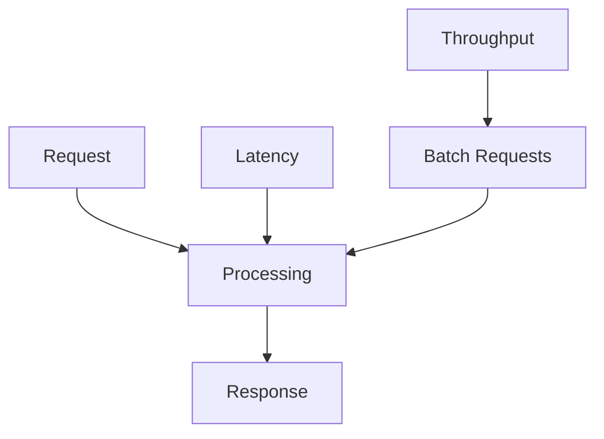

## Overview

Latency and throughput are key performance metrics in system design. Latency measures the time to process a single request, while throughput measures the number of requests processed per unit time. Balancing them is crucial for optimizing user experience and resource utilization in scalable systems.

## Detailed Explanation

### Latency
- **Definition**: Time from request initiation to response completion.
- **Types**: Network latency, disk I/O latency, processing latency.
- **Measurement**: P50, P95, P99 percentiles (e.g., 95% of requests under 100ms).
- **Factors**: Distance, bandwidth, CPU, memory, algorithms.

### Throughput
- **Definition**: Rate of successful operations (e.g., requests/second, transactions/minute).
- **Measurement**: QPS (queries per second), TPS (transactions per second).
- **Factors**: Concurrency, parallelism, bottlenecks (CPU, I/O, network).

### Trade-offs
- High throughput often increases latency (e.g., batching).
- Low latency may reduce throughput (e.g., fine-grained locking).
- Optimization: Asynchronous processing, caching, load balancing.

| Metric       | Latency                          | Throughput                       |
|--------------|----------------------------------|----------------------------------|
| **Unit**    | Time (ms, μs)                   | Rate (req/s, ops/min)           |
| **Focus**   | Individual request speed        | System capacity                 |
| **Example**| API response time               | Database writes per second      |



## Journey / Sequence

1. **Basics**: Define latency (response time) and throughput (requests per second). Understand units and measurement.
2. **Measurement**: Use percentiles (P50, P95, P99) for latency. Track throughput over time.
3. **Analysis**: Identify bottlenecks (CPU, I/O, network). Monitor in production with APM tools.
4. **Optimization**: Implement caching, async processing, load balancing to balance latency and throughput.
5. **Advanced**: In distributed systems, consider CAP trade-offs, eventual consistency for higher throughput.
6. **Hero Level**: Design systems with adaptive scaling, predictive analytics for traffic, and zero-downtime deployments.

## Real-world Examples & Use Cases

- **Web Services**: Low latency for real-time apps (e.g., gaming); high throughput for analytics.
- **Databases**: OLTP prioritizes low latency; OLAP high throughput.
- **Streaming**: Video streaming balances latency (buffering) and throughput (bitrate).
- **E-commerce**: Checkout low latency; inventory updates high throughput.

## Code Examples

### Measuring Latency (Java)
```java
long start = System.nanoTime();
// process request
long latency = System.nanoTime() - start;
System.out.println("Latency: " + latency / 1_000_000 + " ms");
```

### Throughput with ExecutorService
```java
ExecutorService executor = Executors.newFixedThreadPool(10);
for (int i = 0; i < 1000; i++) {
    executor.submit(() -> processRequest());
}
executor.shutdown();
```

### Async for Low Latency
```java
CompletableFuture.supplyAsync(() -> slowOperation())
    .thenApply(result -> process(result))
    .thenAccept(System.out::println);
```

## Tools & Libraries

- **Monitoring**: Prometheus, Grafana, New Relic, Datadog.
- **Benchmarking**: JMeter, Gatling, Apache Bench, wrk.
- **Libraries**: RxJava (reactive), Akka (actors), Netty (async I/O).
- **Cloud**: AWS CloudWatch, GCP Monitoring, Azure Monitor.

## Common Pitfalls & Edge Cases

- **Misleading Averages**: High latency outliers skew averages; always use percentiles.
- **Throughput Over Latency**: Optimizing for throughput may increase latency (e.g., batching); balance based on use case.
- **Measurement Overhead**: Monitoring tools add latency; use sampling.
- **Edge Case**: Flash sales cause throughput spikes, leading to latency degradation; implement rate limiting and auto-scaling.
- **Distributed Latency**: Network hops add latency; use CDNs and edge computing.

## Tools & Libraries

- **Monitoring**: Prometheus, Grafana, New Relic, Datadog.
- **Benchmarking**: JMeter, Gatling, Apache Bench, wrk.
- **Libraries**: RxJava (reactive), Akka (actors), Netty (async I/O).
- **Cloud**: AWS CloudWatch, GCP Monitoring, Azure Monitor.

## Common Pitfalls & Edge Cases

- **Latency Spikes**: GC pauses, network jitter; monitor with APM tools.
- **Throughput Limits**: Bottlenecks in single-threaded components.
- **Edge Case**: Bursty traffic causes queueing, increasing latency.
- **Measurement Error**: Ignoring percentiles leads to optimistic views.

## Tools & Libraries

- **Monitoring**: Prometheus, Grafana, New Relic.
- **Benchmarking**: JMeter, Gatling, wrk.
- **Libraries**: Reactor (reactive), Akka (actors).

## References

- [Google SRE: Latency vs Throughput](https://sre.google/sre-book/handling-overload/)
- [AWS Performance Best Practices](https://aws.amazon.com/architecture/well-architected/)
- [Martin Kleppmann: Designing Data-Intensive Applications](https://dataintensive.net/)

## Github-README Links & Related Topics

- [Latency Measurement](latency-measurement/)
- [Monitoring and Logging](monitoring-and-logging/)
- [Load Balancing](system-design/load-balancing-and-routing/)