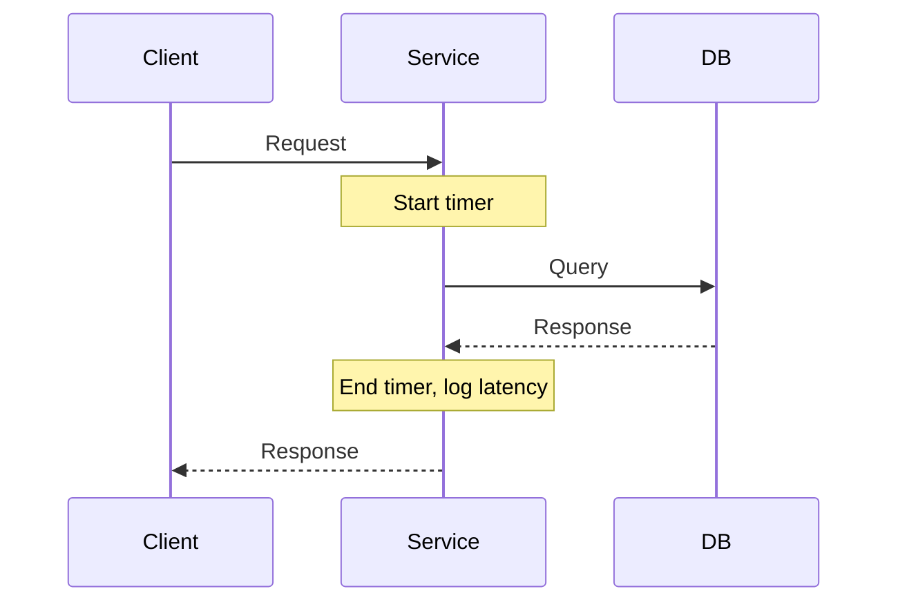

## Overview
Latency measurement involves quantifying the time delays in system operations, from request initiation to response completion. In distributed systems and low-latency applications, accurate measurement is crucial for identifying bottlenecks, optimizing performance, and ensuring SLA compliance. Techniques include instrumentation with timers, profilers, and distributed tracing.

## STAR Summary
**Situation:** In a high-frequency trading platform, we experienced intermittent spikes in order processing latency, impacting trade execution.  
**Task:** Implement comprehensive latency measurement across the order matching pipeline to pinpoint delays.  
**Action:** Integrated JMH microbenchmarks for component-level timing, added Micrometer metrics for end-to-end tracing, and deployed distributed tracing with Jaeger.  
**Result:** Reduced 99th percentile latency by 40% by optimizing a slow database query in the matching engine.

## Detailed Explanation
Latency is the time elapsed between a stimulus and response. Measurement strategies include:
- **Wall-clock timing:** Using System.nanoTime() for simple cases.
- **Microbenchmarks:** JMH for accurate, JVM-optimized measurements.
- **Distributed tracing:** Tools like Zipkin or Jaeger for request flows across services.
- **Percentiles:** Focus on P50, P95, P99 to understand tail latencies.
- **Coordinated omission:** Avoid bias by accounting for queuing delays.

For system design, latency targets are set based on domain (e.g., <10ms for HFT, <100ms for web apps). Capacity calculations involve throughput * latency bounds.

## Real-world Examples & Use Cases
- **Financial Trading:** Measure order-to-execution latency to ensure sub-millisecond performance.
- **Web Services:** API response times for user experience and billing.
- **Databases:** Query execution times for optimization.
- **CDNs:** Edge-to-origin latency for content delivery.

## Code Examples
Runnable Java snippet using JMH for latency measurement:

```java
import org.openjdk.jmh.annotations.*;
import java.util.concurrent.TimeUnit;

@BenchmarkMode(Mode.AverageTime)
@OutputTimeUnit(TimeUnit.MICROSECONDS)
public class LatencyBenchmark {

    @Benchmark
    public void measureOperation() {
        // Simulate operation
        try { Thread.sleep(1); } catch (InterruptedException e) {}
    }
}
```

Run with: `mvn clean install && java -jar target/benchmarks.jar`

Simple timer example:

```java
long start = System.nanoTime();
// operation
long latency = System.nanoTime() - start;
System.out.println("Latency: " + latency / 1_000_000 + " ms");
```

## Data Models / Message Formats
| Metric | Type | Description |
|--------|------|-------------|
| request_start | timestamp | Start of request |
| request_end | timestamp | End of request |
| latency_ms | number | Computed latency |
| service | string | Service name |

Sample trace payload (JSON):
```json
{
  "trace_id": "abc123",
  "spans": [
    {"service": "gateway", "latency": 5},
    {"service": "auth", "latency": 10}
  ]
}
```

## Journey / Sequence


## Common Pitfalls & Edge Cases
- **Coordinated omission:** Ignoring queued requests leads to underestimating latency.
- **GC pauses:** JVM GC can skew measurements; use G1 with tuning.
- **Network jitter:** In distributed systems, account for variability.
- **Edge case:** Zero-latency operations; measure with high precision.

## Tools & Libraries
- **JMH:** For microbenchmarks.
- **Micrometer:** Metrics facade for latency histograms.
- **Jaeger/Zipkin:** Distributed tracing.
- **Prometheus:** Time-series for percentiles.

## Github-README Links & Related Topics
- [Low Latency Systems](low-latency-systems/README.md)
- [Performance Tuning and Profiling](java/performance-tuning-and-profiling/README.md)
- [Distributed Tracing and Observability](system-design/distributed-tracing-and-observability/README.md)
- [Observability Logs Metrics Traces](system-design/observability-logs-metrics-traces/README.md)

## References
- https://openjdk.java.net/projects/code-tools/jmh/
- https://micrometer.io/
- https://www.jaegertracing.io/