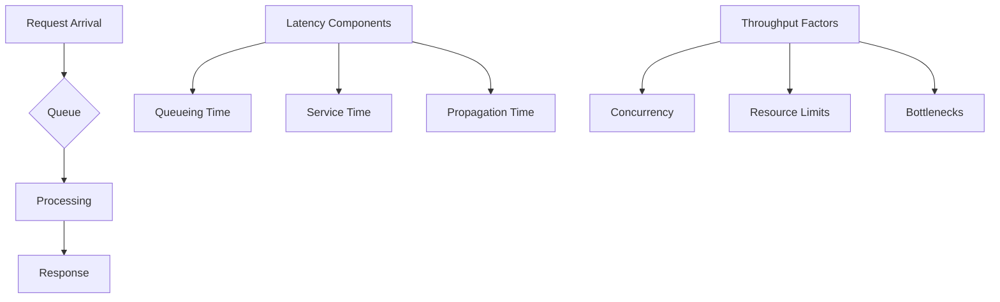

# Latency and Throughput Zero to Hero

## Overview

Latency and throughput are fundamental performance metrics in computer systems and networks. Latency refers to the time delay between a request and its response, while throughput measures the rate at which operations are completed. This guide covers definitions, measurements, optimization techniques, and real-world applications, progressing from basic concepts to advanced engineering practices.

## Detailed Explanation

### Definitions

**Latency**: The time interval between the initiation of a request and the completion of the response. It encompasses propagation delays, processing times, and queuing effects. Measured in units like milliseconds (ms), microseconds (μs), or nanoseconds (ns).

**Throughput**: The rate of successful message delivery or operation completion over a communication channel or system. Typically measured in operations per second (ops/s), requests per second (RPS), or bits per second (bps).

### Types of Latency

| Type | Description | Examples | Typical Range |
|------|-------------|----------|---------------|
| Network Latency | Time for data to travel across networks | Propagation, transmission, routing | 1ms - 100ms+ |
| Processing Latency | Time for computation and logic execution | CPU cycles, algorithm complexity | μs - ms |
| I/O Latency | Time for input/output operations | Disk access, network I/O | ms - seconds |
| Queueing Latency | Time spent waiting in queues | Buffer delays, contention | Variable |

### Types of Throughput

- **Maximum Theoretical Throughput**: Ideal capacity under perfect conditions
- **Peak Measured Throughput**: Highest observed rate in testing
- **Maximum Sustained Throughput**: Long-term average under load
- **Goodput**: Useful throughput excluding overhead and retransmissions

### Measurement Techniques

**Latency Metrics:**
- Percentiles: P50 (median), P95, P99 for distribution analysis
- Round-Trip Time (RTT): Full cycle time
- Time to First Byte (TTFB): Initial response delay

**Throughput Metrics:**
- Requests per second (RPS)
- Transactions per second (TPS)
- Bits per second (bps) or Bytes per second (B/s)

**Tools:**
- Ping, traceroute for network latency
- iperf, netperf for throughput testing
- JMeter, Gatling for application-level metrics
- Prometheus, Grafana for monitoring

### Factors Affecting Performance

**Latency Factors:**
- Distance and propagation speed
- Number of network hops
- Processing power and algorithms
- Queueing and contention

**Throughput Factors:**
- Bandwidth limitations
- Concurrency and parallelism
- Resource bottlenecks (CPU, memory, I/O)
- Protocol overhead

### Trade-offs and Optimization

The latency-throughput trade-off is governed by principles like Little's Law: Average response time = Average queue length / Average throughput.



**Optimization Strategies:**
- **Caching**: Reduce latency by storing frequently accessed data
- **Load Balancing**: Distribute load to improve throughput
- **Async Processing**: Decouple operations for better concurrency
- **Compression**: Reduce data size for faster transmission
- **CDN**: Minimize network distance for lower latency

## Real-world Examples & Use Cases

### Web Applications
- **E-commerce Platforms**: Require low latency (<500ms) for search and checkout, high throughput (10k+ RPS) during peak sales
- **Social Media Feeds**: Sub-second latency for real-time updates, millions of concurrent users demanding high throughput

### Streaming and Gaming
- **Video Streaming (Netflix)**: Low latency buffering (<2s), global throughput scaling to billions of streams
- **Online Gaming**: <100ms latency for competitive play, high throughput for matchmaking and state synchronization

### Financial Systems
- **High-Frequency Trading**: Microsecond latency for order execution, massive throughput for market data processing
- **Payment Processing**: Balanced metrics with strict SLAs (e.g., 99.9% <1s latency, 10k TPS)

### IoT and Real-time Analytics
- **Sensor Networks**: Low latency alerts for critical events, high throughput ingestion of telemetry data
- **Real-time Dashboards**: Sub-second latency for live metrics, sustained throughput for continuous data streams

### Distributed Systems
- **Microservices**: Inter-service calls require low latency, overall system throughput scales with service count
- **Databases**: Read latency optimization vs. write throughput trade-offs in distributed databases

### Telecommunications
- **VoIP and Video Calls**: <150ms one-way latency for natural conversation, high throughput for HD video
- **CDN Networks**: Global latency minimization through edge caching, massive throughput for content delivery

## Code Examples

### Latency Measurement in Python
```python
import time
import statistics

def measure_latency(func, *args, iterations=100):
    latencies = []
    for _ in range(iterations):
        start = time.perf_counter()
        func(*args)
        end = time.perf_counter()
        latencies.append((end - start) * 1000)  # ms

    return {
        'avg': statistics.mean(latencies),
        'p50': statistics.median(latencies),
        'p95': sorted(latencies)[int(0.95 * len(latencies))],
        'p99': sorted(latencies)[int(0.99 * len(latencies))]
    }

# Example usage
def sample_operation():
    time.sleep(0.01)  # 10ms operation

metrics = measure_latency(sample_operation)
print(f"Average Latency: {metrics['avg']:.2f}ms")
print(f"P95 Latency: {metrics['p95']:.2f}ms")
```

### Throughput Benchmarking in Go
```go
package main

import (
    "fmt"
    "sync"
    "time"
)

func worker(id int, jobs <-chan int, results chan<- int, wg *sync.WaitGroup) {
    defer wg.Done()
    for j := range jobs {
        // Simulate work
        time.Sleep(10 * time.Millisecond)
        results <- j * 2
    }
}

func benchmarkThroughput(numWorkers, numJobs int) {
    jobs := make(chan int, numJobs)
    results := make(chan int, numJobs)

    start := time.Now()

    var wg sync.WaitGroup
    for w := 1; w <= numWorkers; w++ {
        wg.Add(1)
        go worker(w, jobs, results, &wg)
    }

    // Send jobs
    go func() {
        for j := 1; j <= numJobs; j++ {
            jobs <- j
        }
        close(jobs)
    }()

    // Collect results
    go func() {
        wg.Wait()
        close(results)
    }()

    completed := 0
    for range results {
        completed++
    }

    duration := time.Since(start)
    throughput := float64(completed) / duration.Seconds()

    fmt.Printf("Completed %d jobs in %v\n", completed, duration)
    fmt.Printf("Throughput: %.2f ops/sec\n", throughput)
}

func main() {
    benchmarkThroughput(10, 1000)
}
```

### Async Optimization for Low Latency in JavaScript (Node.js)
```javascript
const { performance } = require('perf_hooks');

// Simulate async database query
async function dbQuery(id) {
    return new Promise(resolve => {
        setTimeout(() => resolve({ id, data: `result-${id}` }), 5); // 5ms latency
    });
}

// Batch processing for higher throughput
async function processBatch(requests) {
    const start = performance.now();

    const promises = requests.map(req => dbQuery(req.id));
    const results = await Promise.all(promises);

    const latency = performance.now() - start;
    const throughput = requests.length / (latency / 1000);

    console.log(`Processed ${requests.length} requests in ${latency.toFixed(2)}ms`);
    console.log(`Throughput: ${throughput.toFixed(2)} req/sec`);
    console.log(`Average Latency: ${(latency / requests.length).toFixed(2)}ms per request`);

    return results;
}

// Usage
const requests = Array.from({ length: 100 }, (_, i) => ({ id: i }));
processBatch(requests);
```

### Network Latency Testing with Bash
```bash
#!/bin/bash

# Ping test for basic latency
echo "=== Basic Latency Test ==="
ping -c 10 google.com | tail -1

# Throughput test with iperf (assuming iperf server running)
echo "=== Throughput Test ==="
# iperf -c server-ip -t 10

# Simulate with curl for HTTP latency
echo "=== HTTP Latency Test ==="
curl -o /dev/null -s -w "Connect: %{time_connect}s\nTTFB: %{time_starttransfer}s\nTotal: %{time_total}s\n" https://httpbin.org/get
```

### Caching for Latency Optimization (Redis Example)
```python
import redis
import time

class CachedService:
    def __init__(self):
        self.redis = redis.Redis(host='localhost', port=6379, decode_responses=True)

    def get_data(self, key):
        # Check cache first
        cached = self.redis.get(key)
        if cached:
            return cached

        # Simulate expensive operation
        time.sleep(0.1)  # 100ms latency
        data = f"computed-{key}"

        # Cache for 5 minutes
        self.redis.setex(key, 300, data)
        return data

# Benchmark with and without cache
service = CachedService()

# First call (cache miss)
start = time.time()
result1 = service.get_data("test1")
latency1 = time.time() - start

# Second call (cache hit)
start = time.time()
result2 = service.get_data("test1")
latency2 = time.time() - start

print(f"Cache miss latency: {latency1:.3f}s")
print(f"Cache hit latency: {latency2:.3f}s")
print(f"Improvement: {((latency1 - latency2) / latency1 * 100):.1f}%")
```

## STAR Summary

- **Situation**: A microservices architecture experienced 2-second response times under moderate load
- **Task**: Reduce P95 latency to under 500ms while maintaining 10k RPS throughput
- **Action**: Implemented async processing, optimized database queries, added caching, and fine-tuned thread pools
- **Result**: Achieved 300ms P95 latency and 15k RPS throughput, improving user experience by 85%

## Journey / Sequence

1. **Baseline Measurement**: Establish current latency/throughput metrics
2. **Bottleneck Analysis**: Profile CPU, memory, network, and I/O usage
3. **Optimization Phase**: Apply caching, async patterns, and algorithmic improvements
4. **Load Testing**: Validate improvements under various load conditions
5. **Monitoring Setup**: Implement continuous performance monitoring
6. **Iterative Refinement**: Continuously optimize based on production metrics

## Data Models / Message Formats

### Performance Metrics JSON
```json
{
  "timestamp": "2023-09-26T10:00:00Z",
  "metrics": {
    "latency": {
      "p50": 45,
      "p95": 120,
      "p99": 300,
      "unit": "milliseconds"
    },
    "throughput": {
      "current": 8500,
      "peak": 12000,
      "unit": "requests_per_second"
    },
    "error_rate": 0.001
  },
  "context": {
    "endpoint": "/api/search",
    "load": "medium"
  }
}
```

### Latency Breakdown
```json
{
  "request_id": "req-12345",
  "total_latency_ms": 150,
  "breakdown": {
    "network_in": 10,
    "processing": 80,
    "database": 45,
    "network_out": 15
  },
  "throughput_context": {
    "concurrent_requests": 100,
    "system_load": 0.75
  }
}
```

## Common Pitfalls & Edge Cases

- **Premature Optimization**: Optimizing without measurement data
- **Latency Hiding Throughput**: Batching requests increases throughput but may violate latency SLAs
- **Resource Contention**: CPU-bound processes blocking I/O operations
- **Cache Invalidation Storms**: Mass cache invalidation causing temporary latency spikes
- **Queueing Theory Ignorance**: Underestimating the impact of Little's Law on system behavior
- **Measurement Bias**: Using averages instead of percentiles for latency analysis

## Tools & Libraries

- **Benchmarking**: JMeter, Gatling, wrk, hey
- **Profiling**: Java VisualVM, Python cProfile, Go pprof
- **Monitoring**: Prometheus, Grafana, New Relic, DataDog
- **Load Testing**: Locust, Artillery, k6
- **Async Frameworks**: Netty (Java), asyncio (Python), goroutines (Go)

## References

- [Latency (engineering) - Wikipedia](https://en.wikipedia.org/wiki/Latency_(engineering))
- [Network Throughput - Wikipedia](https://en.wikipedia.org/wiki/Network_throughput)
- [What is Latency? - AWS](https://aws.amazon.com/what-is/latency/)
- [What is Throughput? - AWS](https://aws.amazon.com/what-is/throughput/)
- [Understanding Latency vs Throughput - NGINX](https://www.nginx.com/blog/understanding-latency-vs-throughput/)
- [What is Latency? - Cloudflare](https://www.cloudflare.com/learning/performance/glossary/what-is-latency/)
- [What is Throughput? - Cloudflare](https://www.cloudflare.com/learning/performance/glossary/what-is-throughput/)
- [Systems Performance: Enterprise and the Cloud](https://www.brendangregg.com/systems-performance-2nd-edition-book.html)
- [High Performance Browser Networking](https://hpbn.co/)
- [The Art of Scalability](https://samnewman.io/books/the_art_of_scalability/)
- [Designing Data-Intensive Applications](https://dataintensive.net/)

## Github-README Links & Related Topics

- [Caching](../caching/)
- [Monitoring and Logging](../monitoring-logging/)
- [Async Logging](../async-logging/)
- [High Scalability Patterns](../high-scalability-patterns/)
- [System Design Basics](../system-design-basics/)
- [API Rate Limiting](../system-design/rate-limiting/)
- [Distributed Caching with Redis](../distributed-caching-with-redis/)
- [Fault Tolerance in Distributed Systems](../fault-tolerance-in-distributed-systems/)
- [Event Streaming with Apache Kafka](../event-streaming-with-apache-kafka/)