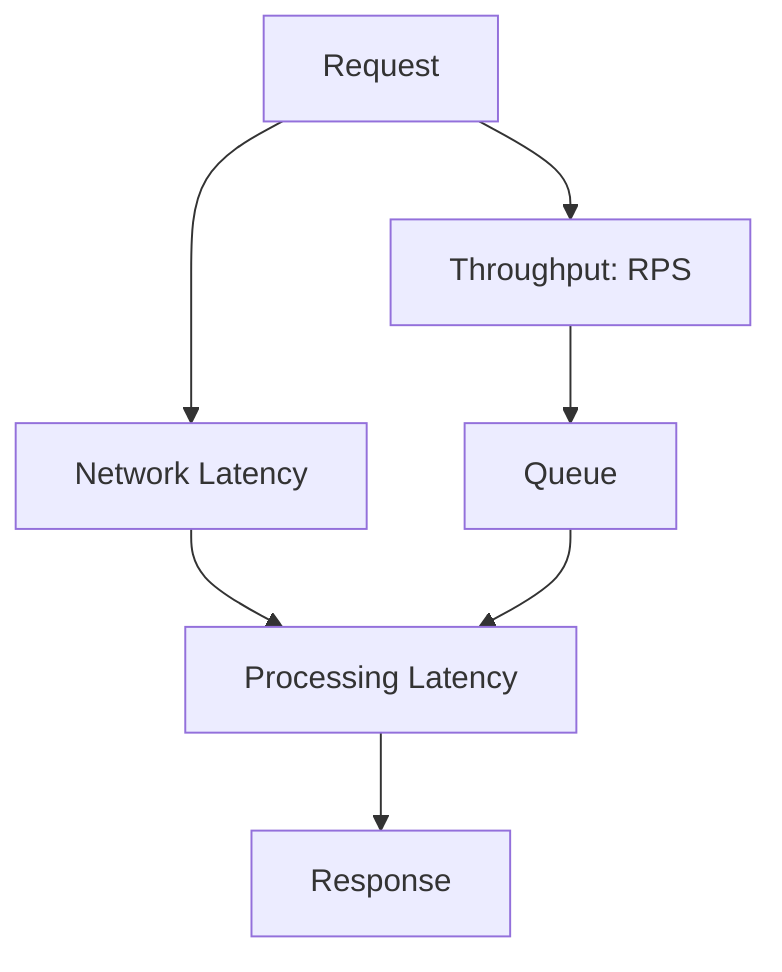

# Overview

Latency and throughput are fundamental performance metrics in system design. Latency measures the time to complete a single operation, while throughput measures the number of operations completed per unit time. Optimizing for one often requires trade-offs with the other. This guide covers definitions, measurement, influencing factors, and strategies to balance and optimize both for scalable systems.

# Detailed Explanation

## Definitions
- **Latency**: The delay between a request and response. Measured in milliseconds (ms), microseconds (μs), or nanoseconds (ns).
- **Throughput**: The rate of processing requests. Measured in requests per second (RPS), transactions per second (TPS), or bits per second (bps).

## Measurement
- Latency: Use tools like ping, curl, or application metrics (e.g., Prometheus).
- Throughput: Load testing with JMeter, Gatling, or ab (Apache Bench).

## Factors Affecting Latency and Throughput
- **Network**: Bandwidth, latency (propagation delay), packet loss.
- **CPU**: Processing speed, concurrency.
- **Memory**: Cache misses, garbage collection.
- **Disk I/O**: Seek time, read/write speeds.
- **Software**: Algorithms, database queries, serialization.

## Trade-offs
- High throughput often increases latency (e.g., batching requests).
- Low latency may reduce throughput (e.g., real-time processing).

## Optimization Strategies
- **Caching**: Reduce latency by storing frequent data in memory (Redis).
- **Async Processing**: Improve throughput with queues (Kafka).
- **Load Balancing**: Distribute load for better throughput.
- **Compression**: Reduce data size for faster transmission.
- **CDNs**: Minimize network latency.



## Zero to Hero Journey
1. **Measure**: Baseline current metrics.
2. **Identify Bottlenecks**: Use profiling tools.
3. **Optimize**: Apply caching, async, etc.
4. **Scale**: Horizontal/vertical scaling.
5. **Monitor**: Continuous improvement.

# Real-world Examples & Use Cases
- **Web Servers**: Nginx optimizes for low latency with event-driven architecture, achieving high throughput via concurrency.
- **Databases**: PostgreSQL uses indexing for low query latency; sharding for high throughput.
- **Streaming**: Netflix prioritizes low latency for video playback while handling millions of concurrent streams.
- **E-commerce**: During sales, prioritize throughput to process orders, accepting slightly higher latency.

# Code Examples

## Measuring Latency in Java
```java
import java.time.Duration;
import java.time.Instant;

public class LatencyExample {
    public static void main(String[] args) {
        Instant start = Instant.now();
        // Simulate operation
        try {
            Thread.sleep(100); // 100ms operation
        } catch (InterruptedException e) {
            e.printStackTrace();
        }
        Instant end = Instant.now();
        long latency = Duration.between(start, end).toMillis();
        System.out.println("Latency: " + latency + " ms");
    }
}
```

## Measuring Throughput in Python
```python
import time
import threading

def worker():
    # Simulate work
    time.sleep(0.01)  # 10ms per request

def measure_throughput(num_requests, num_threads):
    start_time = time.time()
    threads = []
    for _ in range(num_threads):
        t = threading.Thread(target=lambda: [worker() for _ in range(num_requests // num_threads)])
        threads.append(t)
        t.start()
    for t in threads:
        t.join()
    end_time = time.time()
    total_time = end_time - start_time
    throughput = num_requests / total_time
    print(f"Throughput: {throughput:.2f} RPS")

measure_throughput(1000, 10)
```

## Optimizing with Caching (Java)
```java
import java.util.HashMap;
import java.util.Map;

class Cache {
    private Map<String, String> map = new HashMap<>();

    public String get(String key) {
        return map.get(key);
    }

    public void put(String key, String value) {
        map.put(key, value);
    }
}

public class OptimizedService {
    private Cache cache = new Cache();

    public String fetchData(String key) {
        String data = cache.get(key);
        if (data == null) {
            // Simulate DB fetch
            data = "Fetched from DB for " + key;
            cache.put(key, data);
        }
        return data;
    }
}
```

# References
- [Latency vs Throughput - Wikipedia](https://en.wikipedia.org/wiki/Latency_(engineering))
- [System Performance: Enterprise and the Cloud - Brendan Gregg](https://www.brendangregg.com/systems-performance-2nd-edition-book.html)
- [High Performance Browser Networking](https://hpbn.co/)

# Github-README Links & Related Topics
- [Caching](../caching/README.md)
- [Load Balancing and Strategies](../load-balancing-and-strategies/README.md)
- [Monitoring and Logging](../monitoring-logging/README.md)
- [Scalability Patterns](../high-scalability-patterns/README.md)