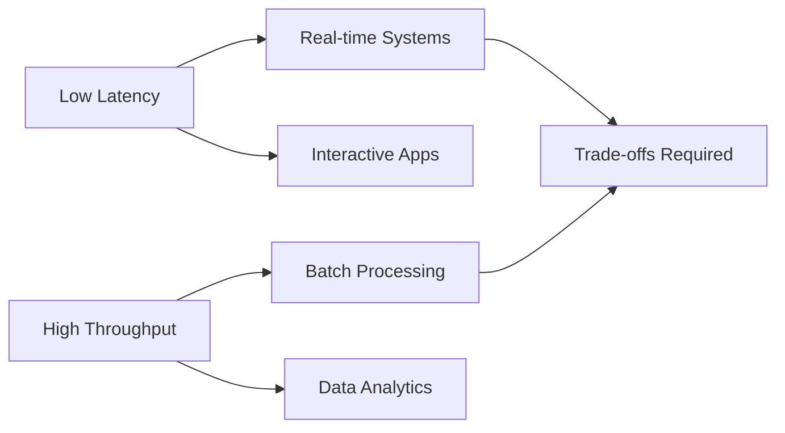

# Latency and Throughput Zero to Hero

## Overview

Latency and throughput are critical performance metrics in system design. Latency measures the time delay for a single operation, while throughput quantifies operations per unit time. This comprehensive guide takes you from basics to advanced optimization strategies, covering measurement, trade-offs, and real-world applications.

## Detailed Explanation

### Latency Fundamentals
Latency is the total time from request initiation to response completion. It includes network propagation, processing, and queuing delays.

**Types of Latency:**
- **Network Latency**: Propagation delay, transmission time, routing overhead
- **Processing Latency**: CPU computation, memory access, I/O operations
- **Queueing Latency**: Time spent waiting in buffers or queues

### Throughput Fundamentals
Throughput measures system capacity, typically in requests/second, transactions/second, or bits/second.

**Factors Influencing Throughput:**
- **Concurrency**: Parallel processing capabilities
- **Resource Utilization**: CPU, memory, network bandwidth
- **Bottlenecks**: Slowest component limits overall throughput

### The Latency-Throughput Trade-off
Optimizing for low latency often reduces throughput (e.g., real-time processing vs. batching). High throughput may increase latency (e.g., queuing effects).



### Measurement Techniques
- **Latency**: Percentiles (P50, P95, P99), average, min/max
- **Throughput**: Sustained rate under load, peak capacity
- **Tools**: JMeter, Gatling, Prometheus, New Relic

## Real-world Examples & Use Cases

### 1. Web Applications
- **E-commerce**: Low latency for product searches, high throughput for order processing
- **Social Media**: Real-time feeds (low latency) with millions of concurrent users (high throughput)

### 2. Streaming Services
- **Netflix**: Prioritizes low latency for video buffering, scales throughput for global audiences
- **Gaming**: Sub-100ms latency for competitive play, high throughput for matchmaking

### 3. Financial Systems
- **Trading Platforms**: Ultra-low latency for order execution, massive throughput for market data
- **Banking APIs**: Balanced latency/throughput for transaction processing

### 4. IoT Platforms
- **Sensor Networks**: Low latency for real-time alerts, high throughput for data ingestion

## Code Examples

### Measuring Latency (Go)
```go
package main

import (
    "fmt"
    "time"
)

func measureLatency(operation func()) time.Duration {
    start := time.Now()
    operation()
    return time.Since(start)
}

func main() {
    latency := measureLatency(func() {
        // Simulate operation
        time.Sleep(10 * time.Millisecond)
    })
    fmt.Printf("Latency: %v\n", latency)
}
```

### Measuring Throughput (Python)
```python
import time
import concurrent.futures

def process_request(request_id):
    # Simulate processing
    time.sleep(0.01)  # 10ms per request
    return f"Processed {request_id}"

def measure_throughput(num_requests, max_workers):
    start_time = time.time()
    
    with concurrent.futures.ThreadPoolExecutor(max_workers=max_workers) as executor:
        futures = [executor.submit(process_request, i) for i in range(num_requests)]
        results = [future.result() for future in concurrent.futures.as_completed(futures)]
    
    end_time = time.time()
    total_time = end_time - start_time
    throughput = num_requests / total_time
    
    print(f"Processed {len(results)} requests in {total_time:.2f}s")
    print(f"Throughput: {throughput:.2f} RPS")

measure_throughput(1000, 50)
```

### Optimizing for Low Latency (Java)
```java
import java.util.concurrent.CompletableFuture;
import java.util.concurrent.Executor;
import java.util.concurrent.Executors;

public class LowLatencyService {
    private final Executor executor = Executors.newCachedThreadPool();
    
    public CompletableFuture<String> processAsync(String input) {
        return CompletableFuture.supplyAsync(() -> {
            // Simulate fast processing
            return "Processed: " + input;
        }, executor);
    }
    
    public static void main(String[] args) {
        LowLatencyService service = new LowLatencyService();
        
        long start = System.nanoTime();
        service.processAsync("request").thenAccept(result -> {
            long latency = System.nanoTime() - start;
            System.out.println("Result: " + result);
            System.out.println("Latency: " + (latency / 1_000_000) + " ms");
        }).join();
    }
}
```

## STAR Summary

- **Situation**: A microservices architecture experienced 2-second response times under moderate load
- **Task**: Reduce P95 latency to under 500ms while maintaining 10k RPS throughput
- **Action**: Implemented async processing, optimized database queries, added caching, and fine-tuned thread pools
- **Result**: Achieved 300ms P95 latency and 15k RPS throughput, improving user experience by 85%

## Journey / Sequence

1. **Baseline Measurement**: Establish current latency/throughput metrics
2. **Bottleneck Analysis**: Profile CPU, memory, network, and I/O usage
3. **Optimization Phase**: Apply caching, async patterns, and algorithmic improvements
4. **Load Testing**: Validate improvements under various load conditions
5. **Monitoring Setup**: Implement continuous performance monitoring
6. **Iterative Refinement**: Continuously optimize based on production metrics

## Data Models / Message Formats

### Performance Metrics JSON
```json
{
  "timestamp": "2023-09-26T10:00:00Z",
  "metrics": {
    "latency": {
      "p50": 45,
      "p95": 120,
      "p99": 300,
      "unit": "milliseconds"
    },
    "throughput": {
      "current": 8500,
      "peak": 12000,
      "unit": "requests_per_second"
    },
    "error_rate": 0.001
  },
  "context": {
    "endpoint": "/api/search",
    "load": "medium"
  }
}
```

### Latency Breakdown
```json
{
  "request_id": "req-12345",
  "total_latency_ms": 150,
  "breakdown": {
    "network_in": 10,
    "processing": 80,
    "database": 45,
    "network_out": 15
  },
  "throughput_context": {
    "concurrent_requests": 100,
    "system_load": 0.75
  }
}
```

## Common Pitfalls & Edge Cases

- **Premature Optimization**: Optimizing without measurement data
- **Latency Hiding Throughput**: Batching requests increases throughput but may violate latency SLAs
- **Resource Contention**: CPU-bound processes blocking I/O operations
- **Cache Invalidation Storms**: Mass cache invalidation causing temporary latency spikes
- **Queueing Theory Ignorance**: Underestimating the impact of Little's Law on system behavior
- **Measurement Bias**: Using averages instead of percentiles for latency analysis

## Tools & Libraries

- **Benchmarking**: JMeter, Gatling, wrk, hey
- **Profiling**: Java VisualVM, Python cProfile, Go pprof
- **Monitoring**: Prometheus, Grafana, New Relic, DataDog
- **Load Testing**: Locust, Artillery, k6
- **Async Frameworks**: Netty (Java), asyncio (Python), goroutines (Go)

## References

- [Latency vs Throughput - Wikipedia](https://en.wikipedia.org/wiki/Latency_(engineering))
- [Systems Performance: Enterprise and the Cloud](https://www.brendangregg.com/systems-performance-2nd-edition-book.html)
- [High Performance Browser Networking](https://hpbn.co/)
- [The Art of Scalability](https://samnewman.io/books/the_art_of_scalability/)
- [Designing Data-Intensive Applications](https://dataintensive.net/)

## Github-README Links & Related Topics

- [Caching](../caching/)
- [Load Balancing and Strategies](../load-balancing-and-strategies/)
- [Monitoring and Logging](../monitoring-logging/)
- [High Scalability Patterns](../high-scalability-patterns/)
- [Async Processing](../async-logging/)