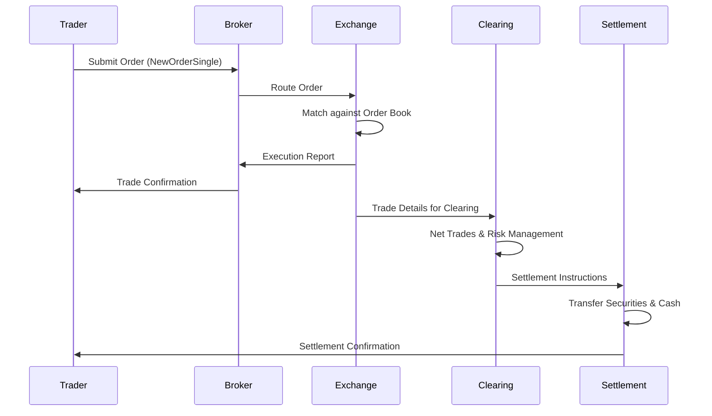

## Overview

The journey of a trade encompasses the complete lifecycle of a financial transaction, from the initial order placement by a trader to the final settlement and transfer of assets. This process involves multiple parties including traders, brokers, exchanges, clearing houses, and settlement systems. Understanding this end-to-end flow is essential for developers building trading systems, as it highlights critical points for latency optimization, error handling, and compliance.

## STAR Summary

**SITUATION:** In electronic trading systems, trades must be executed reliably and efficiently across distributed systems involving multiple intermediaries.

**TASK:** Document the step-by-step journey of a trade, identifying all key stages, message exchanges, and potential failure points.

**ACTION:** Researched industry standards like FIX protocol, analyzed exchange workflows, and incorporated real-world examples from major markets.

**RESULT:** Produced a comprehensive guide that enables engineers to design robust trading pipelines and troubleshoot issues in production environments.

## Detailed Explanation

The trade lifecycle can be broken down into several key stages:

1. **Order Initiation:** A trader submits an order through a trading application or API. The order specifies details like symbol, quantity, price, and order type (e.g., market, limit).

2. **Order Routing:** The broker or trading system routes the order to the appropriate exchange or venue. This may involve smart order routing algorithms to find the best execution venue.

3. **Order Matching:** The exchange matches the incoming order against existing orders in the order book. For market orders, immediate execution occurs; for limit orders, they may rest in the book until matched.

4. **Execution and Confirmation:** Once matched, the exchange generates execution reports. These are sent back to the broker, who forwards confirmations to the trader.

5. **Trade Reporting:** Details of the executed trade are reported to regulatory bodies and disseminated as market data.

6. **Clearing:** The clearing house acts as the central counterparty, guaranteeing the trade and managing risk. It nets trades and calculates obligations.

7. **Settlement:** Assets (securities and cash) are transferred between parties. In modern systems, this often occurs on a T+2 basis (trade date plus two business days).

Each stage involves specific protocols and message types, primarily FIX for order management and execution reporting.

## Real-world Examples & Use Cases

**Example: Buying Stocks on a Retail Platform**
- A retail investor uses a mobile app to place a market order for 100 shares of AAPL.
- The order is routed through the broker's system to NASDAQ.
- NASDAQ matches the order against available sell orders, executing at the best available price.
- The investor receives a confirmation email, and settlement occurs two days later with shares credited to their account.

**High-Frequency Trading Use Case:**
- An HFT firm submits thousands of orders per second using co-located servers.
- Orders are routed based on real-time market data and latency measurements.
- Executions are processed in microseconds, with immediate risk checks and position updates.

## Message Formats / Data Models

**FIX NewOrderSingle Message Example:**
```
8=FIX.4.4|9=123|35=D|49=TRADER|56=BROKER|34=1|52=20230926-12:00:00|11=ORDER123|21=1|55=AAPL|54=1|60=20230926-12:00:00|38=100|40=1|10=123|
```

**ExecutionReport Message Example:**
```
8=FIX.4.4|9=145|35=8|49=EXCHANGE|56=BROKER|34=2|52=20230926-12:00:01|11=ORDER123|17=EXEC123|39=2|55=AAPL|54=1|38=100|32=100|31=150.00|10=124|
```

| Field | Tag | Description |
|-------|-----|-------------|
| MsgType | 35 | Message type (D for NewOrderSingle, 8 for ExecutionReport) |
| ClOrdID | 11 | Client order ID |
| Symbol | 55 | Security symbol |
| Side | 54 | Buy (1) or Sell (2) |
| OrderQty | 38 | Quantity |
| Price | 44 | Limit price (for limit orders) |
| ExecType | 150 | Execution type (0=New, 2=Fill) |

## Journey of a Trade



## Common Pitfalls & Edge Cases

- **Latency-Induced Slippage:** Orders may execute at worse prices due to delays in routing or matching.
- **Order Rejection:** Insufficient funds, invalid symbols, or market closures can cause rejections.
- **Race Conditions:** In HFT, simultaneous orders from multiple parties can lead to unexpected executions.
- **Settlement Failures:** Delivery vs. payment mismatches or counterparty defaults.
- **Regulatory Non-Compliance:** Missing trade reporting can result in fines.

## Tools & Libraries

- **FIX Engines:** QuickFIX (Java/C++), FIX Antenna (C++), OnixS FIX Engine.
- **Trading Simulators:** Matching engines for testing, e.g., open-source projects on GitHub.
- **Monitoring Tools:** Latency trackers, order management systems like Bloomberg Terminal.

```python
# Example: Simple FIX message parser (pseudocode)
import fix_parser

def parse_fix_message(raw_message):
    fields = raw_message.split('|')
    msg = {}
    for field in fields:
        if '=' in field:
            tag, value = field.split('=')
            msg[tag] = value
    return msg

# Usage
msg = parse_fix_message("8=FIX.4.4|35=D|55=AAPL|...")
print(msg['55'])  # AAPL
```

## Github-README Links & Related Topics

- [FIX Protocol](/fix-protocol)
- [Execution Report](/execution-report)
- [Trade Capture Report](/trade-capture-report)
- [Order Types](/order-types)
- [Market Data](/market-data-overview-dissemination)

## References

- [FIX Protocol Specification](https://www.fixtrading.org/standards/)
- [Trade Lifecycle Overview - Investopedia](https://www.investopedia.com/terms/t/trade-lifecycle.asp)
- [Clearing and Settlement - DTCC](https://www.dtcc.com/clearing-and-settlement)