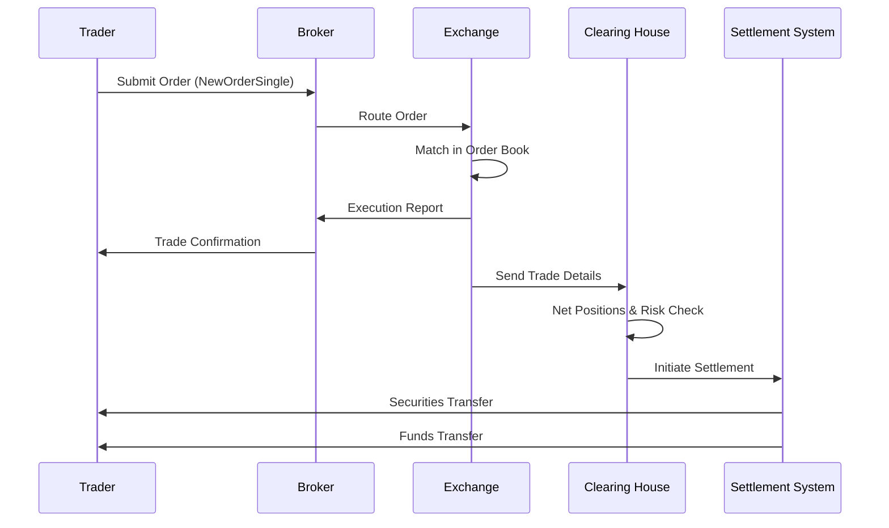

# Overview

The journey of a trade encompasses the complete end-to-end process of executing a financial transaction, from the initial order placement by a trader to the final settlement of securities and funds. This lifecycle involves coordination between traders, brokers, exchanges, clearing houses, and custodians, utilizing standardized protocols like FIX to ensure reliability, speed, and compliance in high-stakes environments.

# STAR Summary

**S**ituation: Financial markets require rapid, accurate execution of buy/sell orders across global exchanges.

**T**ask: Establish a robust pipeline for order routing, matching, execution, confirmation, clearing, and settlement.

**A**ction: Integrate electronic trading platforms with protocols such as FIX, implement order books for price-time priority matching, and enforce regulatory checks at each stage.

**R**esult: Achieved sub-millisecond execution times, reduced errors, and ensured market integrity, enabling trillions in daily trade volume.

# Detailed Explanation

The trade lifecycle is divided into several key phases:

1. **Order Initiation**: A trader submits an order (buy/sell) through a broker or trading platform, specifying details like quantity, price, and type (e.g., market or limit).

2. **Order Routing**: The broker validates the order and routes it to an appropriate venue, such as a stock exchange, dark pool, or alternative trading system, based on factors like liquidity and cost.

3. **Order Matching**: At the exchange, the order enters the order book. The matching engine pairs buy and sell orders based on price and time priority, executing trades when conditions are met.

4. **Execution and Confirmation**: Upon match, an execution report is generated and sent to all parties. This includes trade details like price, quantity, and timestamp.

5. **Clearing**: The clearing house acts as intermediary, netting positions, managing risk, and ensuring both parties can fulfill obligations.

6. **Settlement**: Securities are transferred from seller to buyer, and funds from buyer to seller, typically T+2 days for equities.

Throughout, protocols like FIX handle message exchange, while systems monitor for compliance, latency, and anomalies.

# Real-world Examples & Use Cases

- **High-Frequency Trading (HFT)**: Algorithms place thousands of orders per second, routing to multiple exchanges for best execution. Example: An HFT firm buying 1000 shares of TSLA at $250, routed via FIX to NYSE, executed in 10ms.

- **Retail Trading**: A user on Robinhood buys 10 shares of AAPL. The app sends a FIX NewOrderSingle to a broker, who routes to NASDAQ, with settlement via DTCC.

- **Institutional Block Trade**: A pension fund sells $10M in bonds via RFQ, matched off-exchange, cleared through Euroclear.

Case Study: During the 2020 market volatility, rapid trade lifecycles prevented cascading failures by enforcing circuit breakers.

# Message Formats / Data Models

Key FIX messages in the lifecycle:

| Message Type | FIX Tag | Description | Example Fields |
|--------------|---------|-------------|---------------|
| NewOrderSingle | D | Initiates order | ClOrdID(11), Symbol(55), Side(54), Qty(38), Price(44) |
| ExecutionReport | 8 | Confirms execution | ExecType(150), LastQty(32), LastPx(31), CumQty(14) |
| TradeCaptureReport | AE | Records trade details | TradeReportID(571), Symbol(55), Qty(32), Price(31) |

Sample NewOrderSingle message:

```
8=FIX.4.4|9=123|35=D|49=SENDER|56=TARGET|34=1|52=20230926-12:00:00|11=12345|55=AAPL|54=1|38=100|44=150.00|10=123|
```

# Journey of a Trade



# Common Pitfalls & Edge Cases

- **Latency-Induced Slippage**: Orders routed slowly may execute at worse prices; mitigated by co-location and low-latency networks.

- **Order Rejection**: Insufficient margin or invalid parameters; systems must handle rejections gracefully.

- **Race Conditions**: Multiple orders hitting simultaneously; atomic matching prevents double-counting.

- **Regulatory Failures**: Non-compliant trades (e.g., spoofing) trigger halts; real-time monitoring is critical.

- **Settlement Failures**: Defaults or holidays delay T+2; backup processes ensure continuity.

# Tools & Libraries

- **QuickFIX/J**: Open-source Java FIX engine for message handling.

  ```java
  import quickfix.Application;
  import quickfix.Message;
  import quickfix.SessionID;

  public class TradeApp implements Application {
      public void onMessage(Message message, SessionID sessionID) {
          // Handle ExecutionReport
          if (message.getHeader().getString(35).equals("8")) {
              // Process execution
          }
      }
  }
  ```

- **FIXimulator**: Testing tool for simulating FIX sessions.

- **Kafka**: For event-driven trade processing in distributed systems.

# Github-README Links & Related Topics

- [FIX Protocol](../fix-protocol/README.md)
- [Order Types](../order-types/README.md)
- [Execution Report](../execution-report/README.md)
- [Trade Capture Report](../trade-capture-report/README.md)

# References

- https://www.investopedia.com/articles/investing/082515/how-stock-trade-works.asp
- FIX Protocol Specification: https://www.fixtrading.org/online-documents/fix-protocol-specification/