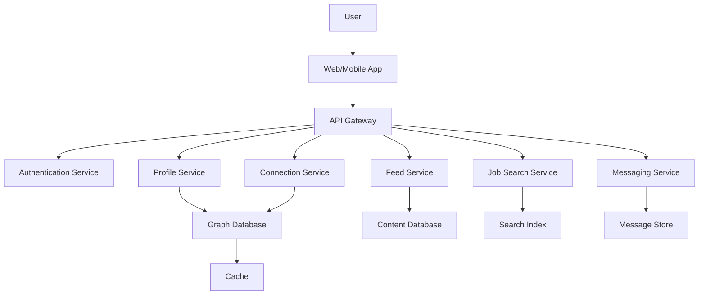

# LinkedIn Social Network System Design

## Overview

LinkedIn is a professional networking platform connecting over 700 million users for career development, job searching, and business networking. This design covers user profiles, connections, feed generation, and job matching in a large-scale social graph.

## Detailed Explanation

### Architecture



### Components

| Component | Description | Technology |
|-----------|-------------|------------|
| API Gateway | Request routing, throttling | AWS API Gateway |
| Authentication | OAuth, SSO | Auth0, JWT |
| Profile Service | User profiles, skills | Neo4j, PostgreSQL |
| Connection Service | Network connections, degrees | Graph database |
| Feed Service | Personalized content feed | ML ranking, Cassandra |
| Job Search Service | Job matching, recommendations | Elasticsearch |
| Messaging Service | InMail, conversations | Kafka, Redis |
| Graph Database | Social graph, relationships | Neo4j |
| Content Database | Posts, articles | Cassandra |
| Search Index | Full-text search | Elasticsearch |
| Message Store | Chat history | DynamoDB |
| Cache | Profile data, connections | Redis |

### Data Models

#### User Profile
```json
{
  "userId": "12345",
  "name": "John Doe",
  "headline": "Software Engineer at Tech Corp",
  "experience": [
    {
      "company": "Tech Corp",
      "title": "Senior Engineer",
      "startDate": "2020-01-01",
      "endDate": null
    }
  ],
  "skills": ["Java", "System Design", "Leadership"],
  "connections": ["user678", "user999"]
}
```

#### Connection
```json
{
  "fromUser": "12345",
  "toUser": "67890",
  "status": "accepted",
  "connectedAt": "2023-05-15T10:00:00Z",
  "mutualConnections": 5
}
```

## Real-world Examples & Use Cases

- **Professional Networking**: Connect with colleagues, alumni.
- **Job Search**: Apply to positions, get recommendations.
- **Content Sharing**: Publish articles, engage with posts.
- **Recruiting**: Find candidates, post job openings.
- **Learning**: Courses, certifications.

## Code Examples

### Graph Traversal for Connections

```java
// Neo4j example
public class ConnectionService {
    private Driver driver;
    
    public List<String> getConnections(String userId, int depth) {
        try (Session session = driver.session()) {
            return session.readTransaction(tx -> {
                Result result = tx.run(
                    "MATCH (u:User {userId: $userId})-[:CONNECTED*1.." + depth + "]-(friend) " +
                    "RETURN friend.userId",
                    parameters("userId", userId)
                );
                return result.list(r -> r.get("friend.userId").asString());
            });
        }
    }
}
```

### Feed Ranking Algorithm

```python
import heapq

def rank_feed_items(user_id, candidate_items):
    scored_items = []
    for item in candidate_items:
        score = calculate_score(user_id, item)  # ML model prediction
        heapq.heappush(scored_items, (-score, item))  # Max heap
    
    # Return top 20
    top_items = []
    for _ in range(min(20, len(scored_items))):
        score, item = heapq.heappop(scored_items)
        top_items.append(item)
    return top_items

def calculate_score(user_id, item):
    # Simplified scoring: recency + engagement + relevance
    recency_score = 1 / (1 + days_since_posted(item))
    engagement_score = item.likes + item.comments * 2
    relevance_score = cosine_similarity(user_interests(user_id), item.tags)
    return recency_score * 0.3 + engagement_score * 0.4 + relevance_score * 0.3
```

## Journey / Sequence

1. **Onboarding**: Profile creation, skill assessment.
2. **Networking**: Send connection requests, build network.
3. **Engagement**: Post updates, comment on content.
4. **Career Growth**: Job applications, endorsements.
5. **Monetization**: Premium features, ads.

## Common Pitfalls & Edge Cases

- **Graph Scalability**: Billion-edge graphs, efficient traversals.
- **Spam Prevention**: Fake profiles, connection spam.
- **Privacy**: Data sharing controls.
- **Real-time Updates**: Feed freshness, notifications.
- **Internationalization**: Multi-language support.

## Tools & Libraries

- **Neo4j**: Graph database for relationships.
- **Elasticsearch**: Search and analytics.
- **Kafka**: Event streaming for feeds.
- **TensorFlow**: ML for recommendations.

## References

- [LinkedIn Engineering Blog](https://engineering.linkedin.com/blog)
- [Graph Databases](https://neo4j.com/developer/graph-database/)
- [Social Network Analysis](https://en.wikipedia.org/wiki/Social_network_analysis)

## Github-README Links & Related Topics

- [Graph Databases](system-design/graph-databases/README.md)
- [Recommendation Systems](system-design/recommendation-systems/README.md)
- [Search Engines](system-design/search-engines/README.md)
- [Real-time Feeds](system-design/real-time-feeds/README.md)
- [User Authentication](system-design/user-authentication/README.md)