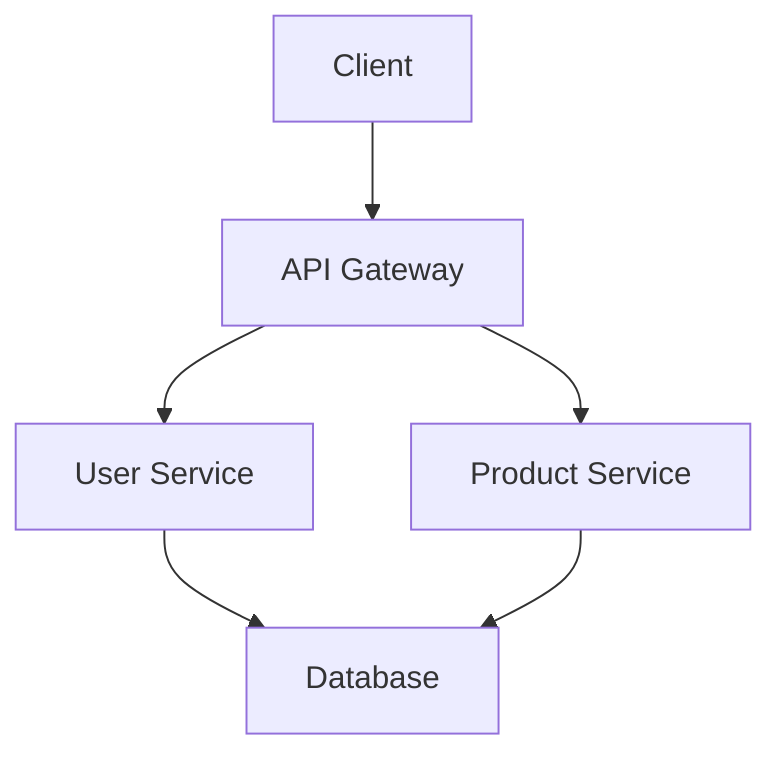
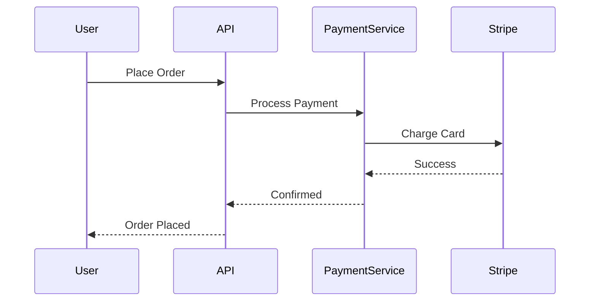

# LLD HLD Basics

## Overview

Low Level Design (LLD) and High Level Design (HLD) are phases in software system design. HLD provides a bird's-eye view of the system architecture, while LLD delves into detailed component designs, data structures, and algorithms.

## Detailed Explanation

### High Level Design (HLD)
- Focuses on system architecture, modules, and interactions.
- Includes diagrams like system context, component diagrams.
- Defines technologies, databases, and high-level data flow.
- Used in initial planning and stakeholder discussions.

### Low Level Design (LLD)
- Detailed design of individual components.
- Class diagrams, sequence diagrams, database schemas.
- Algorithms, data structures, error handling.
- Basis for coding and implementation.

### When to Use
- HLD: Early design phase, system interviews.
- LLD: After HLD, for coding interviews or detailed specs.

### Journey / Sequence
1. Requirements gathering.
2. HLD: Architecture design.
3. LLD: Component design.
4. Implementation, testing.

### Data Models / Message Formats
- HLD: High-level entities (e.g., User, Order).
- LLD: Detailed schemas (e.g., SQL tables with constraints).

### Common Pitfalls & Edge Cases
- Skipping HLD leads to poor architecture.
- Over-designing LLD without constraints.
- Not considering scalability in HLD.

## Real-world Examples & Use Cases

- **E-commerce Platform**: HLD shows microservices for user, product, order; LLD details user service classes.
- **URL Shortener**: HLD architecture; LLD URL shortening algorithm.

Use cases: System design interviews, software development lifecycle.

## Code Examples

### HLD Diagram (Mermaid)



### LLD Class Diagram (Java)

```java
// High Level: Interfaces
interface PaymentService {
    boolean processPayment(Order order);
}

// Low Level: Implementation
@Service
public class StripePaymentService implements PaymentService {
    @Override
    public boolean processPayment(Order order) {
        // Stripe API call
        return true;
    }
}

@Entity
public class Order {
    @Id
    private Long id;
    private String userId;
    private List<Item> items;
    private BigDecimal total;
}
```

### Sequence Diagram for Payment



## References

- [Low Level Design vs High Level Design](https://www.geeksforgeeks.org/difference-between-high-level-design-and-low-level-design/)
- [System Design Interview Guide](https://github.com/donnemartin/system-design-primer)

## Github-README Links & Related Topics

- [System Design Basics](system-design-basics/)
- [Design Patterns in Java](design-patterns-in-java/)
- [Database Design Principles](database-design-principles/)
- [Microservices Architecture](microservices-architecture/)
