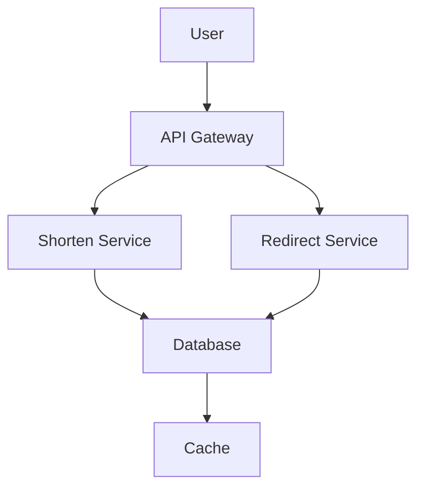
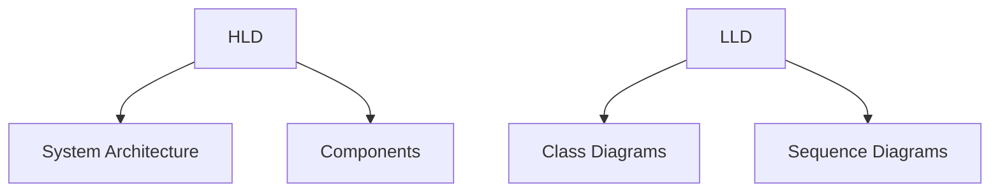
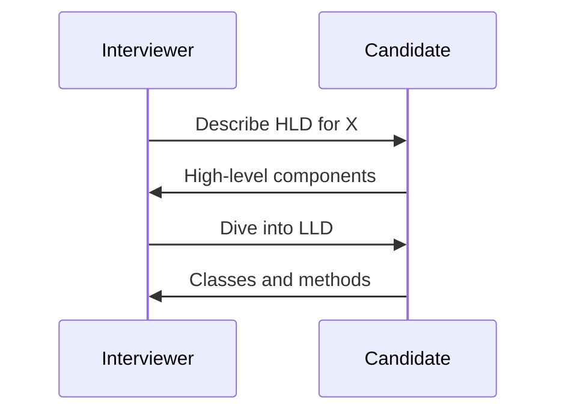

# Overview
Low Level Design (LLD) focuses on detailed class diagrams, interfaces, and algorithms. High Level Design (HLD) covers system architecture, components, and interactions. Both are crucial for software design interviews.

# Detailed Explanation
- **HLD:** System overview, modules, data flow, technology stack.
- **LLD:** Class structures, methods, relationships, design patterns.
- **Principles:** SOLID, DRY, separation of concerns.

# Real-world Examples & Use Cases
- **HLD:** Designing a microservices architecture for an e-commerce site, including API gateways, service discovery, and data partitioning.
- **LLD:** Implementing a parking lot system with classes for vehicles, spots, and payment strategies using design patterns like Strategy and Factory.
- **HLD:** High-level design for a URL shortener service, outlining components like load balancers, databases, and caching layers.
- **LLD:** Low-level design for a chess game, with classes for Board, Piece, Player, and move validation logic.

# Code Examples
### LLD: Parking Lot Class Diagram
```java
class ParkingLot {
    List<ParkingSpot> spots;
    // methods
}

class ParkingSpot {
    Vehicle vehicle;
    boolean isOccupied;
}

class Vehicle {
    String licensePlate;
}
```

### HLD: URL Shortener Architecture Diagram


# Data Models / Message Formats


# Journey / Sequence


# Common Pitfalls & Edge Cases
- Skipping HLD before LLD.
- Over-engineering simple problems.

# Tools & Libraries
- UML tools like PlantUML.
- Design patterns libraries.

# Github-README Links & Related Topics
- [Design Patterns](../java/design-patterns/README.md)
- [System Design Basics](../system-design-basics/README.md)
- [URL Shortener System Design](../url-shortener-system-design/README.md)

# References
- "Design Patterns" by Gang of Four
- https://github.com/iluwatar/java-design-patterns