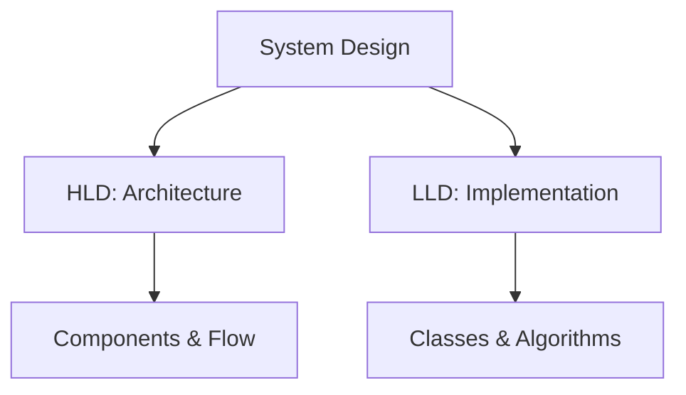

## Overview

Low Level Design (LLD) and High Level Design (HLD) are fundamental concepts in system design interviews. HLD provides a bird's-eye view of the system's architecture, focusing on components, data flow, and scalability. LLD dives into the implementation details, including class diagrams, data structures, algorithms, and APIs. Mastering both is essential for designing robust, scalable systems.

## Detailed Explanation

### High Level Design (HLD)

HLD outlines the overall system architecture without delving into code specifics. It includes:

- **Components**: Services, databases, caches, load balancers.
- **Data Flow**: How data moves between components.
- **Scalability**: Horizontal/vertical scaling, partitioning.
- **Reliability**: Fault tolerance, redundancy.
- **Security**: Authentication, encryption.

HLD answers "what" and "why" at a high level.

### Low Level Design (LLD)

LLD focuses on the internals of components identified in HLD. It includes:

- **Class Diagrams**: Relationships between classes, interfaces.
- **Data Structures**: Choices for storage and retrieval (e.g., hash maps, trees).
- **Algorithms**: Sorting, searching, optimization.
- **APIs**: Endpoints, request/response formats.
- **Database Schemas**: Tables, relationships, indexes.

LLD answers "how" with implementation details.

### Key Differences

| Aspect          | HLD                          | LLD                          |
|-----------------|------------------------------|------------------------------|
| **Scope**      | System-wide architecture    | Component internals         |
| **Detail Level**| High-level components       | Code-level design           |
| **Audience**   | Architects, stakeholders    | Developers, engineers       |
| **Tools**      | Diagrams, flowcharts        | UML, pseudocode             |
| **Focus**      | Scalability, reliability    | Efficiency, correctness     |



## Real-world Examples & Use Cases

- **HLD Example**: Designing a URL shortener with API gateway, service layer, and database.
- **LLD Example**: Implementing the shortening algorithm using base62 encoding and hash maps.
- **Use Case**: In interviews, start with HLD to show big-picture thinking, then LLD to demonstrate technical depth.

## Code Examples

### LLD: URL Shortener Class Diagram (Conceptual)

```java
public class UrlShortener {
    private Map<String, String> urlToShort;
    private Map<String, String> shortToUrl;
    private static final String BASE_URL = "http://short.ly/";

    public String shorten(String longUrl) {
        if (urlToShort.containsKey(longUrl)) {
            return urlToShort.get(longUrl);
        }
        String shortKey = generateKey(longUrl);
        String shortUrl = BASE_URL + shortKey;
        urlToShort.put(longUrl, shortUrl);
        shortToUrl.put(shortUrl, longUrl);
        return shortUrl;
    }

    public String expand(String shortUrl) {
        return shortToUrl.get(shortUrl);
    }

    private String generateKey(String url) {
        return Integer.toString(url.hashCode(), 36); // Base36 encoding
    }
}
```

### HLD Diagram (Conceptual)

```
Client -> Load Balancer -> API Gateway -> Shortener Service -> Database
                                      -> Cache
```

## Common Pitfalls & Edge Cases

- **Over-Designing LLD**: Focus on core functionality; avoid premature optimization.
- **Neglecting HLD**: Poor architecture leads to unscalable systems.
- **Edge Case**: Handling collisions in URL shortener; use longer keys or databases for uniqueness.

## Tools & Libraries

- **Diagramming**: Draw.io, Lucidchart for HLD diagrams.
- **UML**: PlantUML, StarUML for LLD class diagrams.
- **Prototyping**: Figma for UI/UX in design.

## References

- [System Design Interview Guide](https://github.com/donnemartin/system-design-primer)
- [Grokking the System Design Interview](https://www.educative.io/courses/grokking-the-system-design-interview)
- [Martin Kleppmann: Designing Data-Intensive Applications](https://dataintensive.net/)

## Github-README Links & Related Topics

- [Popular System Designs LLD and HLD](popular-system-designs-lld-and-hld/)
- [System Design Basics](system-design-basics/)
- [URL Shortener System Design](url-shortener-system-design/)
- [LLD HLD Basics](lld-hld-basics/)</content>
</xai:function_call ><xai:function_call name="edit">
<parameter name="filePath">/home/umbrel/WORKSPACE/interview-matters/PENDING_TOPICS.md