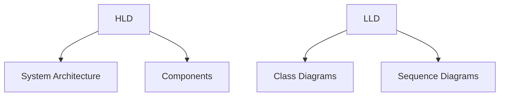
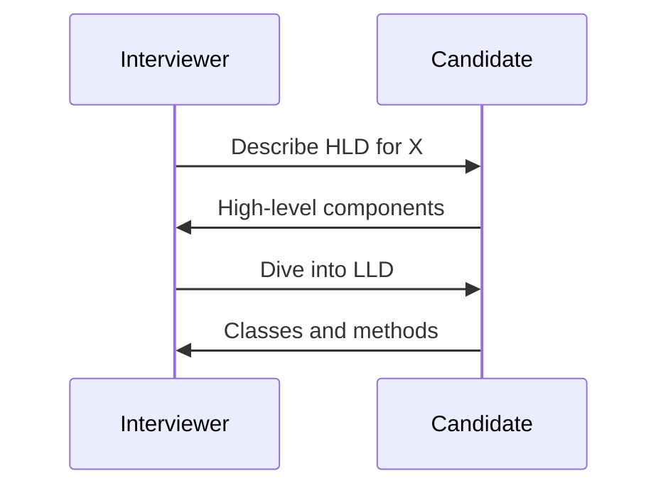

## Overview
Low Level Design (LLD) focuses on detailed class diagrams, interfaces, and algorithms. High Level Design (HLD) covers system architecture, components, and interactions. Both are crucial for software design interviews.

## Detailed Explanation
- **HLD:** System overview, modules, data flow, technology stack.
- **LLD:** Class structures, methods, relationships, design patterns.
- **Principles:** SOLID, DRY, separation of concerns.

## Real-world Examples & Use Cases
- **HLD:** Designing a microservices architecture for an e-commerce site.
- **LLD:** Implementing a parking lot system with classes for vehicles, spots.

## Code Examples
### LLD: Parking Lot Class Diagram
```java
class ParkingLot {
    List<ParkingSpot> spots;
    // methods
}

class ParkingSpot {
    Vehicle vehicle;
    boolean isOccupied;
}

class Vehicle {
    String licensePlate;
}
```

## Data Models / Message Formats


## Journey / Sequence


## Common Pitfalls & Edge Cases
- Skipping HLD before LLD.
- Over-engineering simple problems.

## Tools & Libraries
- UML tools like PlantUML.
- Design patterns libraries.

## Github-README Links & Related Topics
Related: [design-patterns](../java/design-patterns/), [system-design-basics](../system-design/system-design-basics/)

## References
- "Design Patterns" by Gang of Four
- https://github.com/iluwatar/java-design-patterns