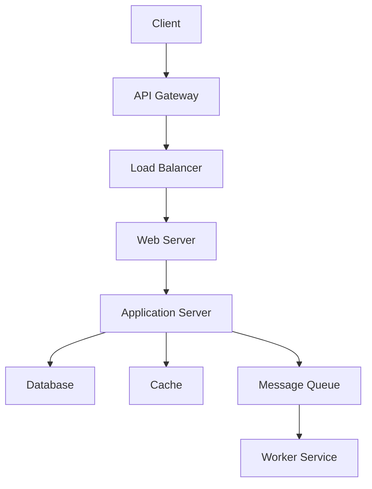
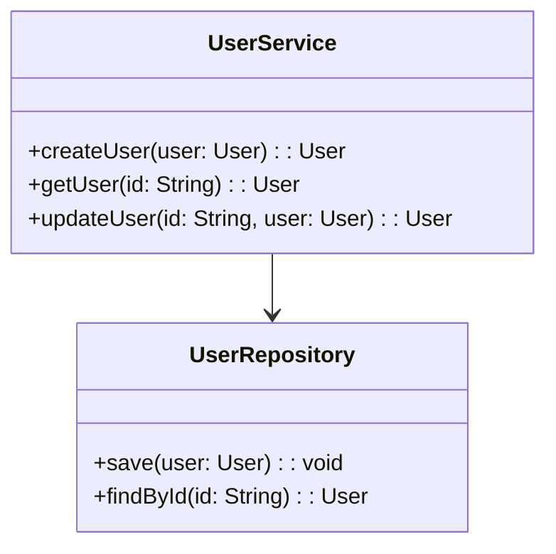

# LLD HLD Basics

## Overview

Low-Level Design (LLD) and High-Level Design (HLD) are fundamental phases in system design. HLD provides a high-level view of the system's architecture, components, and interactions, while LLD delves into the detailed implementation, including algorithms, data structures, and interfaces. Together, they ensure a structured approach from conceptualization to coding, crucial for scalable and maintainable software systems.

## Detailed Explanation

### High-Level Design (HLD)

HLD focuses on the overall system architecture without diving into implementation details. It includes:

- **System Architecture**: Overview of components like servers, databases, and networks.
- **Database Design**: High-level schema, relationships, and storage strategies.
- **Component Interactions**: How modules communicate (e.g., APIs, message queues).
- **Technology Stack**: Choices for frameworks, languages, and infrastructure.

HLD is typically created by solution architects and serves as a blueprint for stakeholders.

#### HLD Architecture Diagram



### Low-Level Design (LLD)

LLD provides detailed specifications for each component identified in HLD. It includes:

- **Class Diagrams**: Detailed classes, attributes, methods, and relationships.
- **Sequence Diagrams**: Interaction flows between objects.
- **Algorithms and Data Structures**: Specific logic for operations.
- **Interface Definitions**: API contracts, error handling, and edge cases.

LLD is created by designers and developers, guiding the coding phase.

#### LLD Class Diagram Example



### Key Differences

| Aspect          | High-Level Design (HLD)                  | Low-Level Design (LLD)                  |
|-----------------|------------------------------------------|------------------------------------------|
| Focus           | Overall system architecture              | Detailed component implementation        |
| Created By      | Solution Architects                      | Designers and Developers                 |
| Level           | Macro-level                              | Micro-level                              |
| Output          | Architecture diagrams, tech stack        | Class diagrams, pseudo-code, interfaces |
| Input           | Requirements (SRS)                       | Reviewed HLD                            |
| Purpose         | High-level planning and stakeholder alignment | Coding guidelines and implementation details |

## Journey / Sequence

The design process typically follows:

1. **Requirements Gathering**: Understand functional and non-functional requirements.
2. **High-Level Design**: Create HLD based on requirements.
3. **Review and Feedback**: Iterate on HLD with stakeholders.
4. **Low-Level Design**: Develop LLD from approved HLD.
5. **Implementation**: Code based on LLD.
6. **Testing and Iteration**: Validate against requirements.

## Real-world Examples & Use Cases

### Example: Designing a URL Shortener Service

- **HLD**: Define components like a web server for shortening URLs, a database for storage, and a cache for quick lookups. Use microservices architecture with load balancing.
- **LLD**: Specify classes for URL encoding/decoding, database schemas for URLs, and API endpoints with request/response formats.

### Use Cases

- **E-commerce Platforms**: HLD for order processing flow; LLD for payment gateway integration.
- **Social Media Apps**: HLD for user feeds and notifications; LLD for recommendation algorithms.
- **IoT Systems**: HLD for device communication; LLD for data processing pipelines.

## Data Models / Message Formats

### Database Schema (HLD Level)

For a user management system:

- **Users Table**: id (PK), name, email, created_at
- **Sessions Table**: id (PK), user_id (FK), token, expires_at

### Message Formats (LLD Level)

API Request/Response:

```json
// POST /users
{
  "name": "John Doe",
  "email": "john@example.com"
}

// Response
{
  "id": "123",
  "name": "John Doe",
  "email": "john@example.com",
  "created_at": "2025-09-26T00:00:00Z"
}
```

## Code Examples

### HLD Pseudo-Code (Architecture Outline)

```python
# High-level flow for URL Shortener
def shorten_url(long_url):
    # Validate URL
    # Generate short code
    # Store in database
    # Return short URL
    pass

def redirect(short_code):
    # Lookup in cache/database
    # Redirect to long URL
    pass
```

### LLD Class Implementation (Java)

```java
public class UrlShortenerService {
    private UrlRepository repository;
    private Cache cache;

    public String shortenUrl(String longUrl) {
        String shortCode = generateShortCode(longUrl);
        Url url = new Url(shortCode, longUrl);
        repository.save(url);
        cache.put(shortCode, longUrl);
        return "http://short.ly/" + shortCode;
    }

    public String getLongUrl(String shortCode) {
        String longUrl = cache.get(shortCode);
        if (longUrl == null) {
            Url url = repository.findByShortCode(shortCode);
            if (url != null) {
                longUrl = url.getLongUrl();
                cache.put(shortCode, longUrl);
            }
        }
        return longUrl;
    }

    private String generateShortCode(String longUrl) {
        // Base62 encoding logic
        return Base62.encode(longUrl.hashCode());
    }
}

class Url {
    private String shortCode;
    private String longUrl;

    // Constructors, getters, setters
}
```

## Common Pitfalls & Edge Cases

- **Over-Designing HLD**: Including too many details, making it hard to change.
- **Under-Designing LLD**: Missing edge cases like concurrent access or error handling.
- **Ignoring Scalability in HLD**: Failing to plan for growth.
- **Tight Coupling in LLD**: Classes that are hard to test or modify.
- **Edge Cases**: Handling invalid URLs, expired sessions, high concurrency, or database failures.

## Tools & Libraries

- **Diagramming**: Lucidchart, Draw.io, Mermaid for diagrams.
- **UML Tools**: PlantUML, StarUML for class and sequence diagrams.
- **Prototyping**: Figma for UI mocks in HLD.
- **Code Generation**: Tools like Swagger for API specs from LLD.
- **Version Control**: Git for tracking design documents.

## References

- [Difference between High Level Design(HLD) and Low Level Design(LLD) - GeeksforGeeks](https://www.geeksforgeeks.org/difference-between-high-level-design-and-low-level-design/)
- [High-Level Design vs Low-Level Design - InterviewBit](https://www.interviewbit.com/blog/high-level-design-vs-low-level-design/)
- [System Design Primer - GitHub](https://github.com/donnemartin/system-design-primer)
- [Designing Data-Intensive Applications](https://www.amazon.com/Designing-Data-Intensive-Applications-Reliable-Maintainable/dp/1449373321)

## Github-README Links & Related Topics

- [System Design Basics](../system-design-basics/)
- [API Design Principles](../api-design-principles/)
- [Database Design Patterns](../database-design-patterns/)
- [Design Patterns](../design-patterns/)
