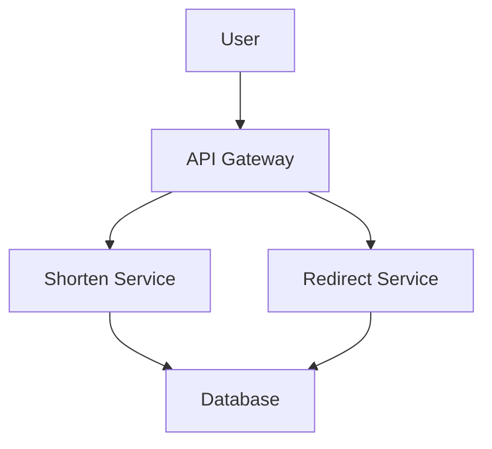
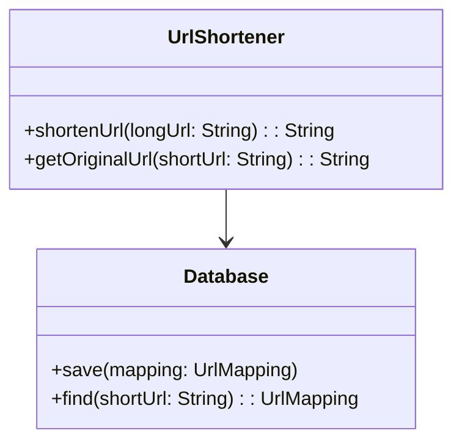

# LLD HLD Basics

## Overview

Low Level Design (LLD) and High Level Design (HLD) are fundamental concepts in software engineering and system design, particularly in interviews and architecture discussions. HLD provides a bird's-eye view of the system, focusing on overall architecture, while LLD delves into the detailed implementation, including data structures, algorithms, and component interactions. Together, they bridge the gap between requirements and code.

## Detailed Explanation

### High Level Design (HLD)

HLD outlines the system's architecture at a high level, identifying major components, their interactions, and technologies. It answers "what" the system does and "how" at a macro level.

- **Components**: System boundaries, modules, databases, APIs.
- **Diagrams**: Architecture diagrams, data flow diagrams.
- **Focus**: Scalability, reliability, technology stack.

### Low Level Design (LLD)

LLD specifies the internal workings of each component from HLD, including classes, interfaces, data models, and algorithms. It answers "how" at a micro level.

- **Components**: Class diagrams, sequence diagrams, database schemas.
- **Focus**: Code structure, error handling, performance optimizations.

### Key Differences

| Aspect | HLD | LLD |
|--------|-----|-----|
| Scope | System-wide | Component-specific |
| Detail Level | High-level | Detailed |
| Audience | Architects, stakeholders | Developers |
| Output | Diagrams, tech choices | Code blueprints |
| Example | Microservices architecture | REST API endpoints |

### When to Use

- **HLD**: Early design phase, requirement analysis.
- **LLD**: After HLD, before coding.

## Real-world Examples & Use Cases

### URL Shortener System

#### HLD Example



- Components: API Gateway, Shorten/Redirect services, Database.

#### LLD Example

For Shorten Service:



- Classes: UrlShortener, Database interface.

### E-commerce Platform

- **HLD**: User auth, product catalog, order processing, payment gateway.
- **LLD**: Detailed user session management, product search algorithms.

## Code Examples

### Java LLD Example: URL Shortener Class

```java
public class UrlShortener {
    private Map<String, String> urlMap = new HashMap<>();
    private Map<String, String> reverseMap = new HashMap<>();
    private static final String BASE_URL = "http://short.ly/";

    public String shortenUrl(String longUrl) {
        if (reverseMap.containsKey(longUrl)) {
            return BASE_URL + reverseMap.get(longUrl);
        }
        String shortCode = generateShortCode();
        urlMap.put(shortCode, longUrl);
        reverseMap.put(longUrl, shortCode);
        return BASE_URL + shortCode;
    }

    public String getOriginalUrl(String shortCode) {
        return urlMap.get(shortCode);
    }

    private String generateShortCode() {
        // Simple random generation
        return UUID.randomUUID().toString().substring(0, 8);
    }
}
```

This is a basic LLD implementation; in production, use databases and hash functions.

## Journey / Sequence

1. **Requirements Gathering**: Understand functional/non-functional requirements.
2. **HLD Creation**: Design high-level architecture.
3. **LLD Creation**: Detail each component.
4. **Implementation**: Code based on LLD.
5. **Testing & Iteration**: Validate and refine.

## Common Pitfalls & Edge Cases

- **Over-designing HLD**: Too many components complicate LLD.
- **Ignoring Scalability in HLD**: Leads to LLD rework.
- **LLD without HLD**: Misses big picture.
- **Edge Case**: Handling collisions in URL shortener.

## Tools & Libraries

- **Diagramming**: Draw.io, Lucidchart for HLD diagrams.
- **Modeling**: UML tools like PlantUML for LLD.
- **Frameworks**: Spring Boot for Java LLD.

## References

- [System Design Interview Guide](https://github.com/donnemartin/system-design-primer)
- [Low Level Design vs High Level Design](https://www.geeksforgeeks.org/difference-between-high-level-design-and-low-level-design/)

## Github-README Links & Related Topics

- [System Design Basics](../system-design-basics/)
- [Popular Systems Design LLD HLD](../popular-systems-design-lld-hld/)
- [Design Patterns](../design-patterns/)
