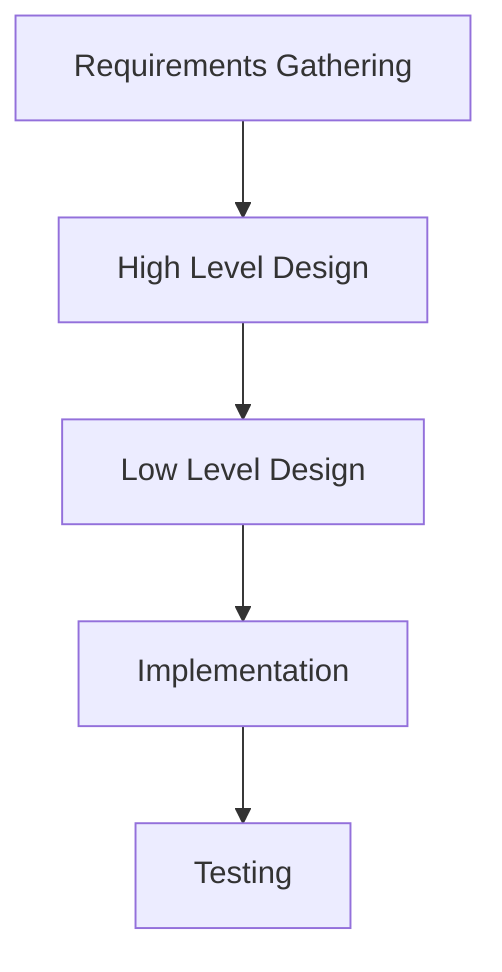
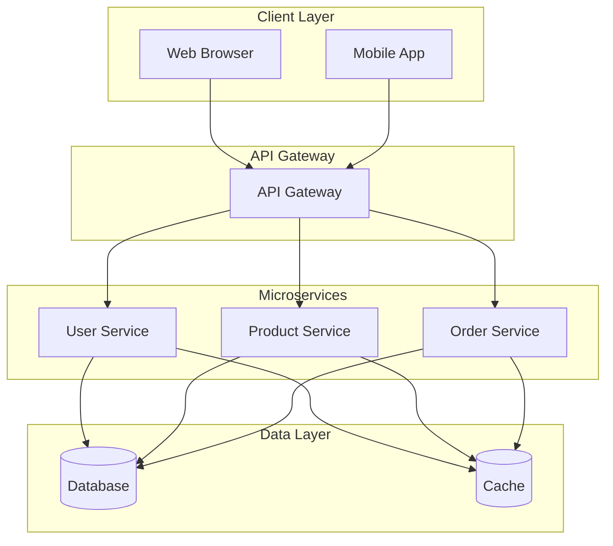

# LLD HLD Basics

## Overview

Low Level Design (LLD) and High Level Design (HLD) are fundamental phases in software system design. HLD provides a high-level view of the system architecture, while LLD delves into detailed component specifications. Together, they ensure a structured approach to building scalable, maintainable software systems.

## Detailed Explanation

### High Level Design (HLD)

HLD, also known as macro-level design, outlines the overall system architecture. It includes:

- System architecture diagrams
- Database design
- Descriptions of systems, services, platforms, and module relationships
- Hardware and software interfaces
- User interfaces
- Performance specifications

HLD is typically created by solution architects and serves as a blueprint for the entire system.

### Low Level Design (LLD)

LLD, or micro-level design, provides detailed specifications for each module. It encompasses:

- Detailed logic for system components
- Algorithms and data structures
- Interface definitions
- Unit test plans
- Program specifications

LLD is developed by designers and developers to guide implementation.

### Key Differences

| Aspect | High Level Design (HLD) | Low Level Design (LLD) |
|--------|-------------------------|-------------------------|
| Scope | Overall system design | Component-level details |
| Also Known As | Macro level/system design | Micro level/detailed design |
| Description | Brief architecture and functionality | Detailed logic and specifications |
| Created By | Solution architect | Designers and developers |
| Input | Software Requirement Specification (SRS) | Reviewed HLD |
| Output | Database design, functional design | Program specs, unit test plans |
| Participants | Design team, review team, client | Design team, operations, implementers |

### Process Flow



## Real-world Examples & Use Cases

### Example 1: E-commerce Platform

**HLD Use Case:** For an e-commerce platform, HLD would define the overall architecture including web servers, application servers, databases, and load balancers. It might specify microservices for user management, product catalog, and order processing.

**LLD Use Case:** For the user authentication module, LLD would detail the classes, methods, database schemas, and API endpoints. It would specify algorithms for password hashing, session management, and error handling.

### Example 2: Social Media Application

**HLD Use Case:** HLD outlines the system with components like user feeds, messaging, notifications, and data storage. It includes decisions on scalability, such as using CDNs for media and distributed databases.

**LLD Use Case:** For the feed generation algorithm, LLD provides detailed pseudocode for ranking posts, caching strategies, and database queries.

### Example 3: Banking System

**HLD Use Case:** Defines secure architecture with firewalls, encryption layers, and compliance modules.

**LLD Use Case:** Details transaction processing logic, including concurrency controls and audit trails.

## Code Examples

### HLD Example: System Architecture Diagram



### LLD Example: User Authentication Class (Pseudocode)

```java
class UserAuthentication {
    private Database db;
    private Cache cache;
    
    public boolean authenticate(String username, String password) {
        // Check cache first
        User user = cache.get(username);
        if (user != null) {
            return verifyPassword(password, user.getHashedPassword());
        }
        
        // Fetch from database
        user = db.getUser(username);
        if (user == null) {
            return false;
        }
        
        boolean isValid = verifyPassword(password, user.getHashedPassword());
        if (isValid) {
            cache.put(username, user);
        }
        return isValid;
    }
    
    private boolean verifyPassword(String input, String hashed) {
        // Use bcrypt or similar for verification
        return BCrypt.checkpw(input, hashed);
    }
}
```

### LLD Example: Database Schema

```sql
CREATE TABLE users (
    id INT PRIMARY KEY AUTO_INCREMENT,
    username VARCHAR(50) UNIQUE NOT NULL,
    hashed_password VARCHAR(255) NOT NULL,
    email VARCHAR(100) UNIQUE NOT NULL,
    created_at TIMESTAMP DEFAULT CURRENT_TIMESTAMP
);

CREATE TABLE sessions (
    id INT PRIMARY KEY AUTO_INCREMENT,
    user_id INT,
    session_token VARCHAR(255) UNIQUE NOT NULL,
    expires_at TIMESTAMP,
    FOREIGN KEY (user_id) REFERENCES users(id)
);
```

## References

- [Difference between High Level Design(HLD) and Low Level Design(LLD) - GeeksforGeeks](https://www.geeksforgeeks.org/difference-between-high-level-design-and-low-level-design/)
- [Software Design - Tutorialspoint](https://www.tutorialspoint.com/software_engineering/software_design.htm)
- [What is High Level Design? - GeeksforGeeks](https://www.geeksforgeeks.org/system-design/what-is-high-level-design-learn-system-design/)
- [What is Low Level Design or LLD? - GeeksforGeeks](https://www.geeksforgeeks.org/system-design/what-is-low-level-design-or-lld-learn-system-design/)

## Github-README Links & Related Topics

- [Design Patterns](../design-patterns/)
- [API Design Principles](../api-design-principles/)
- [Database Design Principles](../database-design-principles/)
- [Interview Cases](../interview-cases/)