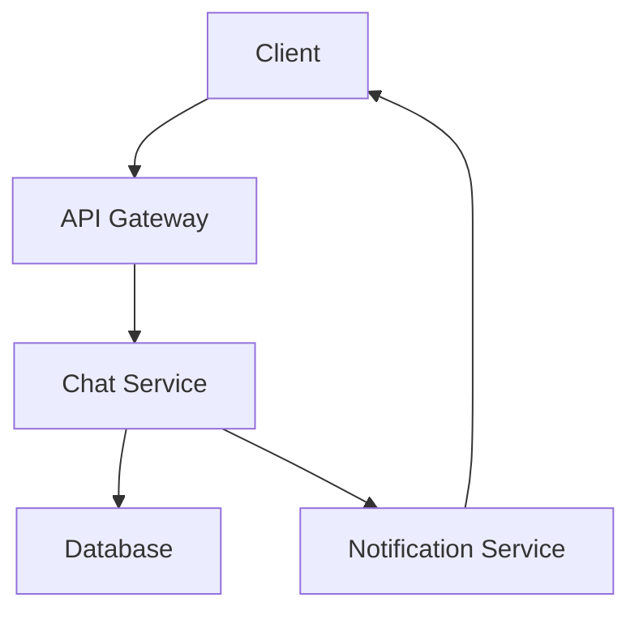
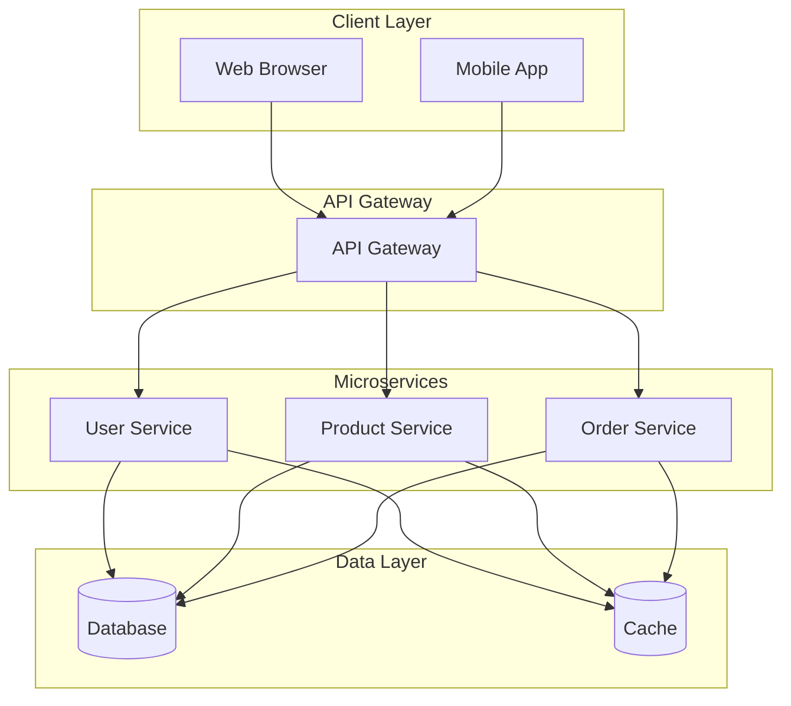

# LLD HLD Basics

## Overview

Low-Level Design (LLD) and High-Level Design (HLD) are essential phases in software engineering for translating requirements into implementable solutions. HLD focuses on the system's overall architecture, while LLD delves into detailed implementation, such as class diagrams, APIs, and database schemas. Understanding these concepts is crucial for system design interviews, ensuring scalable, maintainable, and efficient systems.

## Detailed Explanation

### High-Level Design (HLD)

HLD provides a bird's-eye view of the system, outlining how components interact without diving into code specifics. It addresses scalability, security, and performance at a macro level.

**Key Elements:**
- **Architecture Diagram:** Visual representation of components (e.g., microservices, databases).
- **Technology Stack:** Choices like cloud providers, databases, and frameworks.
- **Data Flow:** How data moves between components.
- **Scalability Considerations:** Load balancing, sharding, and redundancy.

**Example HLD for a Chat Application:**
- Components: Client, API Gateway, Chat Service, Database, Notification Service.
- Data Flow: Messages routed via WebSocket through the gateway to the service, stored in DB, and pushed to recipients.



### Low-Level Design (LLD)

LLD translates HLD into actionable details, focusing on implementation. It includes class structures, algorithms, and interfaces, ensuring the design is feasible and optimized.

**Key Elements:**
- **Class Diagrams:** Relationships between classes (e.g., inheritance, composition).
- **API Specifications:** Endpoints, request/response formats.
- **Database Schemas:** Tables, relationships, indexes.
- **Algorithms and Data Structures:** Efficient solutions for operations.

**Example LLD for Chat Application:**
- Classes: User, Message, ChatRoom with methods like sendMessage().
- API: POST /messages with JSON payload.
- Schema: users(id, name), messages(id, sender_id, content, timestamp).

```mermaid
classDiagram
    class User {
        +int id
        +String name
        +sendMessage(Message)
    }
    class Message {
        +int id
        +int senderId
        +String content
        +Date timestamp
    }
    class ChatRoom {
        +List<User> users
        +List<Message> messages
        +addUser(User)
        +broadcast(Message)
    }
    User ||--o ChatRoom : participates
    Message ||--o ChatRoom : belongs
```

### Differences and When to Use

| Aspect | HLD | LLD |
|--------|-----|-----|
| Scope | System-wide | Component-specific |
| Detail Level | High-level | Detailed |
| Output | Diagrams, tech stack | Code structures, schemas |
| Stakeholders | Architects, PMs | Developers, Testers |
| Time | Early design phase | Implementation phase |

HLD is used for feasibility and planning, while LLD for coding and testing.

## Real-world Examples & Use Cases

### Example 1: E-commerce Platform

**HLD Use Case:** For an e-commerce platform, HLD would define the overall architecture including web servers, application servers, databases, and load balancers. It might specify microservices for user management, product catalog, and order processing.

**LLD Use Case:** For the user authentication module, LLD would detail the classes, methods, database schemas, and API endpoints. It would specify algorithms for password hashing, session management, and error handling.

### Example 2: Social Media Application

**HLD Use Case:** HLD outlines the system with components like user feeds, messaging, notifications, and data storage. It includes decisions on scalability, such as using CDNs for media and distributed databases.

**LLD Use Case:** For the feed generation algorithm, LLD provides detailed pseudocode for ranking posts, caching strategies, and database queries.

### Example 3: Banking System

**HLD Use Case:** Defines secure architecture with firewalls, encryption layers, and compliance modules.

**LLD Use Case:** Details transaction processing logic, including concurrency controls and audit trails.

In interviews, HLD assesses architectural thinking, LLD evaluates coding skills.

## Code Examples

### HLD Example: System Architecture Diagram



### LLD Example: User Authentication Class (Pseudocode)

```java
class UserAuthentication {
    private Database db;
    private Cache cache;
    
    public boolean authenticate(String username, String password) {
        // Check cache first
        User user = cache.get(username);
        if (user != null) {
            return verifyPassword(password, user.getHashedPassword());
        }
        
        // Fetch from database
        user = db.getUser(username);
        if (user == null) {
            return false;
        }
        
        boolean isValid = verifyPassword(password, user.getHashedPassword());
        if (isValid) {
            cache.put(username, user);
        }
        return isValid;
    }
    
    private boolean verifyPassword(String input, String hashed) {
        // Use bcrypt or similar for verification
        return BCrypt.checkpw(input, hashed);
    }
}
```

### LLD Example: Database Schema

```sql
CREATE TABLE users (
    id INT PRIMARY KEY AUTO_INCREMENT,
    username VARCHAR(50) UNIQUE NOT NULL,
    hashed_password VARCHAR(255) NOT NULL,
    email VARCHAR(100) UNIQUE NOT NULL,
    created_at TIMESTAMP DEFAULT CURRENT_TIMESTAMP
);

CREATE TABLE sessions (
    id INT PRIMARY KEY AUTO_INCREMENT,
    user_id INT,
    session_token VARCHAR(255) UNIQUE NOT NULL,
    expires_at TIMESTAMP,
    FOREIGN KEY (user_id) REFERENCES users(id)
);
```

## References

- [Difference between High Level Design(HLD) and Low Level Design(LLD) - GeeksforGeeks](https://www.geeksforgeeks.org/difference-between-high-level-design-and-low-level-design/)
- [Software Design - Tutorialspoint](https://www.tutorialspoint.com/software_engineering/software_design.htm)
- [What is High Level Design? - GeeksforGeeks](https://www.geeksforgeeks.org/what-is-high-level-design-learn-system-design/)
- [What is Low Level Design or LLD? - GeeksforGeeks](https://www.geeksforgeeks.org/what-is-low-level-design-or-lld-learn-system-design/)

## Github-README Links & Related Topics

- [Design Patterns](../design-patterns/)
- [API Design Principles](../api-design-principles/)
- [Database Design Principles](../database-design-principles/)
- [Interview Cases](../interview-cases/)