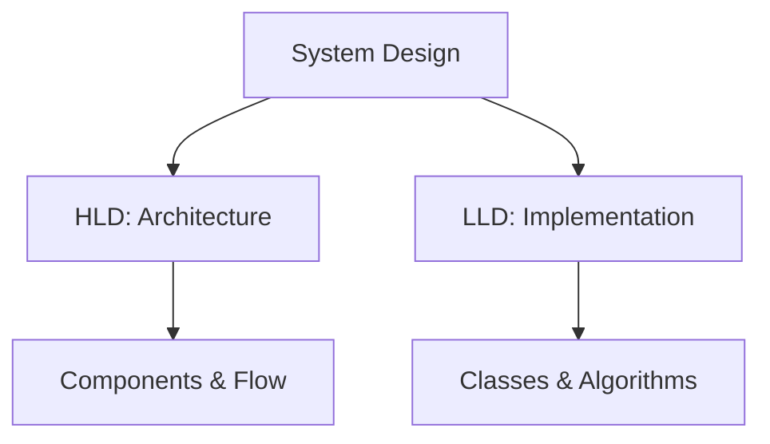
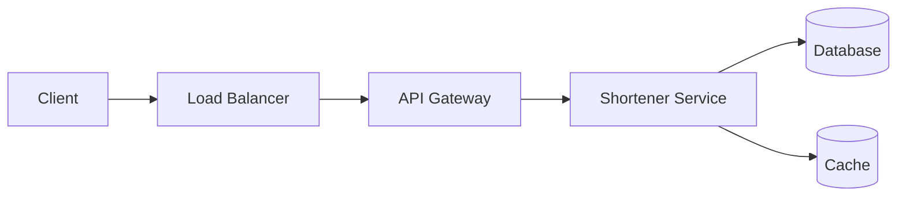
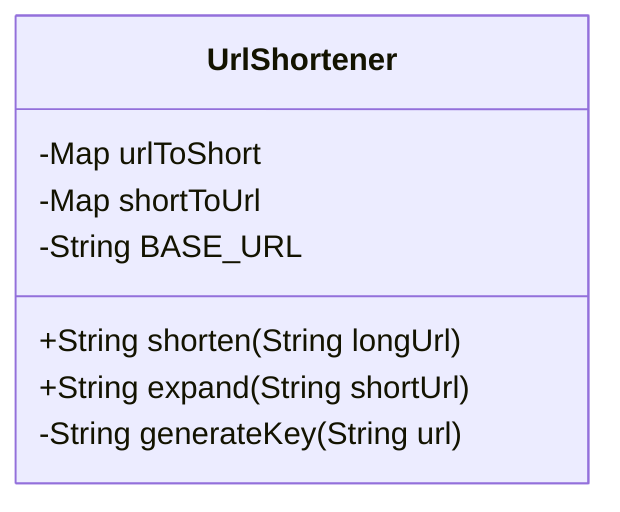

## Overview

Low Level Design (LLD) and High Level Design (HLD) are fundamental concepts in system design interviews. HLD provides a bird's-eye view of the system's architecture, focusing on components, data flow, and scalability. LLD dives into the implementation details, including class diagrams, data structures, algorithms, and APIs. Mastering both is essential for designing robust, scalable systems.

## Detailed Explanation

### High Level Design (HLD)

HLD outlines the overall system architecture without delving into code specifics. It includes:

- **System Architecture**: Description of hardware, software interfaces, and user interfaces.
- **Database Design**: High-level database schema and relationships.
- **Components**: Services, databases, caches, load balancers.
- **Data Flow**: How data moves between components.
- **Scalability**: Horizontal/vertical scaling, partitioning.
- **Reliability**: Fault tolerance, redundancy.
- **Security**: Authentication, encryption.

HLD answers "what" and "why" at a high level. It is created by solution architects based on Software Requirement Specification (SRS).

### Low Level Design (LLD)

LLD focuses on the internals of components identified in HLD. It includes:

- **Class Diagrams**: Relationships between classes, interfaces.
- **Data Structures**: Choices for storage and retrieval (e.g., hash maps, trees).
- **Algorithms**: Sorting, searching, optimization.
- **APIs**: Endpoints, request/response formats.
- **Database Schemas**: Detailed tables, relationships, indexes.
- **Program Specifications**: Detailed logic for each module.

LLD answers "how" with implementation details. It is created by designers and developers based on reviewed HLD.

### Key Differences

| Aspect          | HLD (High-Level Design)     | LLD (Low-Level Design)     |
|-----------------|-----------------------------|-----------------------------|
| **Scope**      | System-wide architecture    | Component internals         |
| **Detail Level**| High-level components       | Code-level design           |
| **Audience**   | Architects, stakeholders    | Developers, engineers       |
| **Tools**      | Diagrams, flowcharts        | UML, pseudocode             |
| **Focus**      | Scalability, reliability    | Efficiency, correctness     |
| **Input**      | SRS (Software Requirement Specification) | Reviewed HLD               |
| **Output**     | Database design, functional design, review record | Program specification, unit test plan |
| **Created By** | Solution Architect           | Designers and Developers    |



### HLD Diagram Example



### LLD Class Diagram Example



## Real-world Examples & Use Cases

### URL Shortener System
- **HLD Example**: Designing a URL shortener with API gateway, service layer, database, and cache for high availability and scalability.
- **LLD Example**: Implementing the shortening algorithm using base62 encoding, hash maps for storage, and handling collisions.

### E-commerce Platform
- **HLD Example**: Microservices architecture with user service, product catalog, order management, payment gateway, and notification service.
- **LLD Example**: Detailed class diagrams for user authentication, database schemas for products, and algorithms for recommendation engines.

### Social Media Feed
- **HLD Example**: Fan-out on write for timeline generation, sharded databases, and CDN for media delivery.
- **LLD Example**: Data structures like priority queues for ranking posts, graph algorithms for friend suggestions.

- **Use Case**: In system design interviews, start with HLD to outline the system architecture, then dive into LLD for specific components to show technical depth.
- **Industry Application**: HLD for cloud-native applications on AWS/Azure; LLD for optimizing database queries and API endpoints in fintech systems.

## Code Examples

### LLD: URL Shortener Implementation

```java
import java.util.HashMap;
import java.util.Map;

public class UrlShortener {
    private Map<String, String> urlToShort = new HashMap<>();
    private Map<String, String> shortToUrl = new HashMap<>();
    private static final String BASE_URL = "http://short.ly/";
    private int counter = 0;

    public String shorten(String longUrl) {
        if (urlToShort.containsKey(longUrl)) {
            return urlToShort.get(longUrl);
        }
        String shortKey = generateKey();
        String shortUrl = BASE_URL + shortKey;
        urlToShort.put(longUrl, shortUrl);
        shortToUrl.put(shortUrl, longUrl);
        return shortUrl;
    }

    public String expand(String shortUrl) {
        return shortToUrl.get(shortUrl);
    }

    private String generateKey() {
        return Integer.toString(counter++, 36); // Base36 encoding
    }
}
```

### HLD: Conceptual Architecture

```
Client -> Load Balancer -> API Gateway -> Shortener Service -> Database
                                       -> Cache
```

### LLD: Simple Cache Implementation

```java
import java.util.LinkedHashMap;
import java.util.Map;

public class LRUCache<K, V> extends LinkedHashMap<K, V> {
    private final int capacity;

    public LRUCache(int capacity) {
        super(capacity, 0.75f, true);
        this.capacity = capacity;
    }

    @Override
    protected boolean removeEldestEntry(Map.Entry<K, V> eldest) {
        return size() > capacity;
    }
}
```

## Best Practices

- **Start with HLD**: Always begin with high-level design to ensure scalability and reliability before diving into details.
- **Iterate on LLD**: Refine low-level designs based on code reviews and performance testing.
- **Use Standard Notations**: Employ UML for class diagrams, ER diagrams for databases, and flowcharts for data flow.
- **Consider Trade-offs**: Balance between simplicity, performance, and maintainability in design choices.
- **Document Assumptions**: Clearly state assumptions in HLD and validate them in LLD.

## References

- [Difference between High Level Design(HLD) and Low Level Design(LLD)](https://www.geeksforgeeks.org/difference-between-high-level-design-and-low-level-design/)
- [System Design Interview Guide](https://github.com/donnemartin/system-design-primer)
- [Grokking the System Design Interview](https://www.educative.io/courses/grokking-the-system-design-interview)
- [Martin Kleppmann: Designing Data-Intensive Applications](https://dataintensive.net/)

## Github-README Links & Related Topics

- [Design Patterns](design-patterns/)
- [Microservices Architecture](microservices-architecture/)
- [Database Design Principles](database-design-principles/)
- [API Design Principles](api-design-principles/)
- [System Design Basics](system-design-basics/)