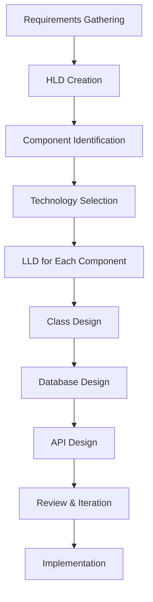
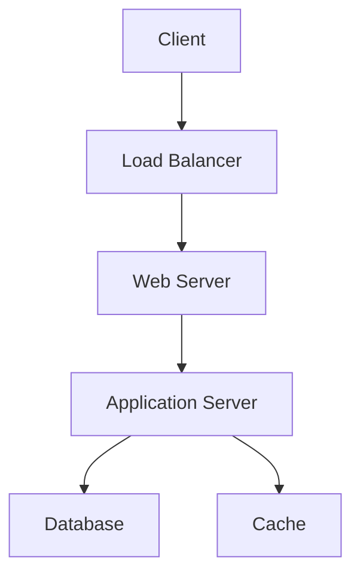
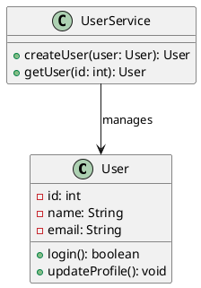

# LLD HLD Basics

## Overview

Low Level Design (LLD) and High Level Design (HLD) are critical phases in software system design, bridging requirements and implementation. HLD provides a bird's-eye view of the system architecture, focusing on components, data flow, and technology choices. LLD delves into detailed specifications, including class diagrams, database schemas, and algorithms. Together, they ensure scalable, maintainable solutions. HLD is typically created first, followed by LLD for each component.

Key differences:
- **HLD**: Macro-level, non-technical stakeholders, focuses on "what" and "why".
- **LLD**: Micro-level, developers, focuses on "how".

These designs are essential for interviews, where candidates demonstrate problem-solving from architecture to code.

## Detailed Explanation

### High Level Design (HLD)

HLD outlines the system's overall structure without implementation details. It includes:
- **System Architecture**: Components like web servers, databases, load balancers.
- **Data Flow**: How data moves between components (e.g., via APIs, queues).
- **Technology Stack**: Choices like cloud providers, databases (SQL/NoSQL).
- **Scalability & Security**: High-level strategies for handling load and threats.
- **Interfaces**: External integrations (e.g., payment gateways).

HLD uses diagrams like system architecture diagrams to communicate with non-technical teams.

### Low Level Design (LLD)

LLD provides implementation blueprints for HLD components. It includes:
- **Class Diagrams**: Relationships, attributes, methods using UML.
- **Database Schemas**: Tables, relationships, indexes.
- **API Specifications**: Endpoints, request/response formats.
- **Algorithms & Data Structures**: For performance-critical parts.
- **Error Handling & Edge Cases**: Detailed exception flows.

LLD ensures code is modular, testable, and adheres to design patterns.

### Process Flow



This sequence ensures designs evolve from abstract to concrete.

## Real-world Examples & Use Cases

- **E-commerce Platform**: HLD defines microservices (user, product, order); LLD specifies REST APIs, database tables for orders.
- **Social Media App**: HLD outlines feed generation, user auth; LLD details caching strategies, notification algorithms.
- **Banking System**: HLD covers security layers, compliance; LLD includes encryption methods, transaction flows.
- **IoT Dashboard**: HLD defines data ingestion pipelines; LLD specifies sensor data schemas, real-time processing logic.

In interviews, candidates design URL shorteners (HLD: DB, API; LLD: hash functions, redirects) or chat apps.

## Code Examples

### HLD Example: System Architecture Diagram (Mermaid)


### LLD Example: Class Diagram for User Management (PlantUML)


### Database Schema (SQL)
```sql
CREATE TABLE users (
    id INT PRIMARY KEY AUTO_INCREMENT,
    name VARCHAR(255) NOT NULL,
    email VARCHAR(255) UNIQUE NOT NULL,
    created_at TIMESTAMP DEFAULT CURRENT_TIMESTAMP
);

CREATE TABLE orders (
    id INT PRIMARY KEY AUTO_INCREMENT,
    user_id INT,
    amount DECIMAL(10,2),
    FOREIGN KEY (user_id) REFERENCES users(id)
);
```

### API Specification (OpenAPI Snippet)
```yaml
paths:
  /users:
    post:
      summary: Create a new user
      requestBody:
        content:
          application/json:
            schema:
              type: object
              properties:
                name: { type: string }
                email: { type: string }
```

## References

- [GeeksforGeeks: HLD vs LLD](https://www.geeksforgeeks.org/difference-between-high-level-design-and-low-level-design/)
- [InterviewBit: System Design Basics](https://www.interviewbit.com/blog/system-design-basics/)
- [Medium: HLD and LLD Explained](https://medium.com/@saurav.aggarwal/high-level-design-vs-low-level-design-4b3b5b3b3b3b)

## Github-README Links & Related Topics

- [System Design Primer](https://github.com/donnemartin/system-design-primer)
- [Awesome System Design](https://github.com/madd86/awesome-system-design)

Related Topics:
- [System Design Basics](system-design-basics/)
- [Design Patterns](design-patterns/)
- [Database Design](database-design-principles/)