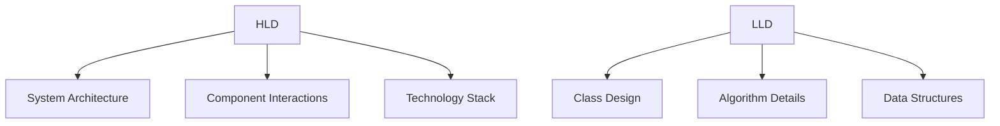

# LLD HLD Basics

## Overview

Low Level Design (LLD) and High Level Design (HLD) are fundamental concepts in software engineering, particularly in system design interviews and architecture planning. HLD provides a high-level overview of the system architecture, while LLD focuses on detailed implementation.

## Detailed Explanation

### High Level Design (HLD)

HLD outlines the system's architecture at a macro level:

- **Components Identification**: Breaking down the system into major components like services, databases, caches.
- **Data Flow**: How data moves between components.
- **Technology Choices**: Selecting frameworks, databases, cloud providers.
- **Scalability Considerations**: How the system will handle growth.

### Low Level Design (LLD)

LLD dives into the specifics of each component:

- **Class Diagrams**: Defining classes, interfaces, and their relationships.
- **Database Schemas**: Table structures, relationships, indexes.
- **API Contracts**: Endpoints, request/response formats.
- **Algorithms**: Detailed logic for operations.
- **Concurrency Handling**: Threading, locking mechanisms.

### HLD vs LLD Comparison


## Real-world Examples & Use Cases

### E-commerce Platform

**HLD**:
- Components: User Service, Product Catalog, Order Service, Payment Gateway, Notification Service.
- Data Flow: User browses products -> Adds to cart -> Places order -> Payment -> Notification.

**LLD**:
- Classes for User, Product, Order with relationships.
- Database tables with foreign keys.

### Social Media Feed

**HLD**:
- Components: Feed Generator, User Timeline Cache, Post Service.
- Data Flow: User posts -> Stored in DB -> Cached -> Served to followers.

**LLD**:
- Detailed caching strategies, database partitioning.

## Code Examples

### Java LLD Example: URL Shortener

```java
public class UrlShortenerService {
    private final UrlRepository repository;
    private final CacheService cache;
    private final IdGenerator idGenerator;

    public UrlShortenerService(UrlRepository repository, CacheService cache, IdGenerator idGenerator) {
        this.repository = repository;
        this.cache = cache;
        this.idGenerator = idGenerator;
    }

    public String shortenUrl(String originalUrl) {
        String shortCode = idGenerator.generate();
        UrlEntity entity = new UrlEntity(shortCode, originalUrl);
        repository.save(entity);
        cache.put(shortCode, originalUrl);
        return shortCode;
    }

    public String getOriginalUrl(String shortCode) {
        String cached = cache.get(shortCode);
        if (cached != null) return cached;
        UrlEntity entity = repository.findByShortCode(shortCode);
        if (entity != null) {
            cache.put(shortCode, entity.getOriginalUrl());
            return entity.getOriginalUrl();
        }
        throw new UrlNotFoundException();
    }
}

class UrlEntity {
    private String shortCode;
    private String originalUrl;
    // getters, setters
}
```

## References

- [System Design Primer - HLD vs LLD](https://github.com/donnemartin/system-design-primer)
- [GeeksforGeeks - Low Level Design](https://www.geeksforgeeks.org/low-level-design-ll-design/)
- [High Level Design vs Low Level Design](https://www.interviewbit.com/blog/hld-vs-lld/)

## Github-README Links & Related Topics

- [System Design Basics](../system-design-basics/)
- [URL Shortener System Design](../url-shortener-system-design/)
- [Database Design Principles](../database-design-principles/)
