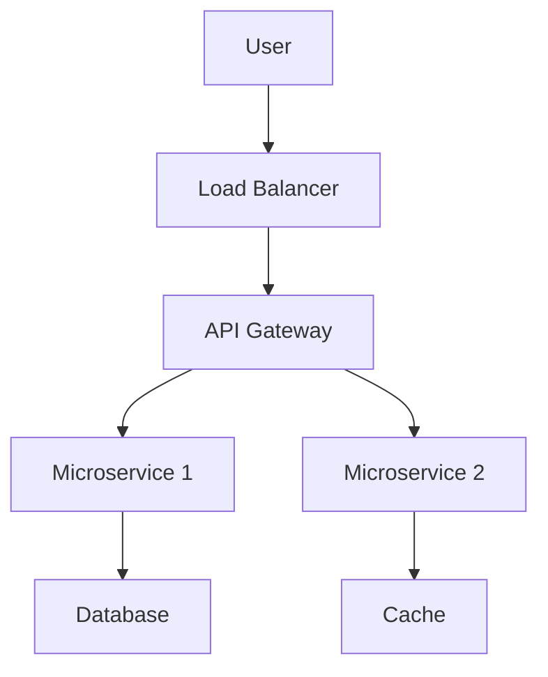
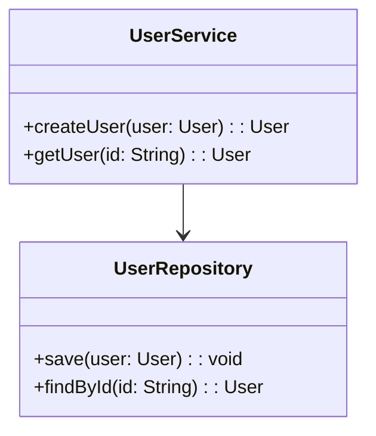
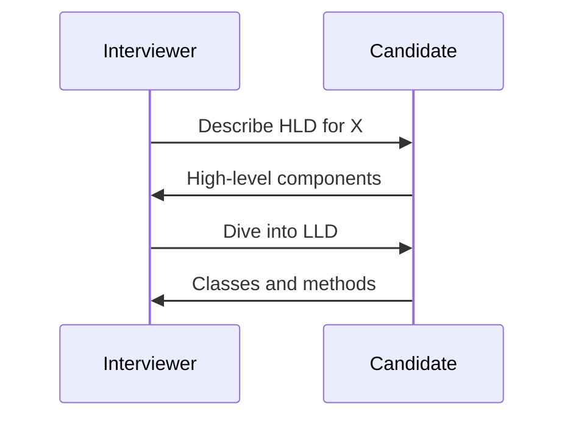

## Overview

Low Level Design (LLD) and High Level Design (HLD) are essential phases in software system design. HLD provides a bird's-eye view of the system architecture, outlining major components and their interactions. LLD focuses on the detailed design of individual components, including data structures, algorithms, and interfaces. Together, they ensure scalable, maintainable, and efficient systems.

## Detailed Explanation

### High Level Design (HLD)

HLD defines the overall system architecture without delving into implementation details.

- **Components**: Identify key modules (e.g., frontend, backend, database, cache).
- **Interactions**: Data flow, APIs, protocols.
- **Technologies**: Tech stack choices (e.g., microservices, monolithic).
- **Scalability**: Load balancing, replication strategies.
- **Security**: Authentication, authorization layers.



### Low Level Design (LLD)

LLD provides granular details for each component.

- **Class Diagrams**: Object-oriented design, relationships.
- **Sequence Diagrams**: Interaction flows between objects.
- **Data Models**: Schemas, entities, relationships.
- **Algorithms**: Logic for operations (e.g., sorting, searching).
- **APIs**: Endpoints, request/response formats.
- **Error Handling**: Exception flows, logging.



### Key Differences

| Aspect          | HLD                          | LLD                          |
|-----------------|------------------------------|------------------------------|
| **Scope**      | System-wide                 | Component-specific          |
| **Detail**     | High-level                  | Implementation details      |
| **Audience**   | Architects, stakeholders    | Developers                  |
| **Artifacts**  | Architecture diagrams       | Class/sequence diagrams     |

## Real-world Examples & Use Cases

- **E-commerce Platform**: HLD for order processing microservices; LLD for cart management class with add/remove methods.
- **Social Media App**: HLD for user feed generation; LLD for recommendation algorithm using graph traversal.
- **Banking System**: HLD for transaction processing; LLD for account balance updates with concurrency controls.
- **Ride-Sharing App**: HLD for location matching; LLD for geohashing data structure.

## Code Examples

### HLD Example: System Architecture (Conceptual)

```
Frontend (React) -> API Gateway -> Services (User, Payment) -> Database (PostgreSQL)
```

### LLD Example: User Service Class (Java)

```java
public class UserService {
    private UserRepository repository;

    public User createUser(String name, String email) {
        User user = new User(name, email);
        return repository.save(user);
    }

    public User getUser(Long id) {
        return repository.findById(id).orElseThrow(() -> new UserNotFoundException(id));
    }
}

interface UserRepository {
    User save(User user);
    Optional<User> findById(Long id);
}
```

### Sequence Diagram Example (Pseudo-code)

```
Client -> UserService: createUser(name, email)
UserService -> UserRepository: save(user)
UserRepository --> UserService: user
UserService --> Client: user
```

## Data Models / Message Formats

```json
{
  "user": {
    "id": "string",
    "name": "string",
    "email": "string"
  }
}
```

## Journey / Sequence



## Common Pitfalls & Edge Cases

- **Over-Designing HLD**: Too many components increase complexity; start simple.
- **Under-Designing LLD**: Missing edge cases in algorithms; thorough testing needed.
- **Inconsistent Naming**: Use consistent conventions across diagrams.
- **Ignoring Scalability in HLD**: Plan for growth from the start.
- **Edge Case**: Distributed systems require HLD for consensus; LLD for lock management.

## Tools & Libraries

- **Diagrams**: Draw.io, Lucidchart, Mermaid.
- **Modeling**: UML tools like PlantUML, StarUML.
- **Documentation**: Confluence, Notion.
- **Code**: IDEs with UML plugins (e.g., IntelliJ IDEA).

## References

- [System Design Interview Guide](https://github.com/donnemartin/system-design-primer)
- [Designing Data-Intensive Applications](https://dataintensive.net/)
- [AWS Architecture Best Practices](https://aws.amazon.com/architecture/well-architected/)
- [Martin Fowler: Microservices](https://martinfowler.com/articles/microservices.html)

## Github-README Links & Related Topics

- [System Design Basics](system-design-basics/)
- [Microservices Architecture](system-design/microservices-architecture/)
- [API Design REST gRPC OpenAPI](system-design/api-design-rest-grpc-openapi/)
- [Database Design and Indexing](system-design/database-design-and-indexing/)