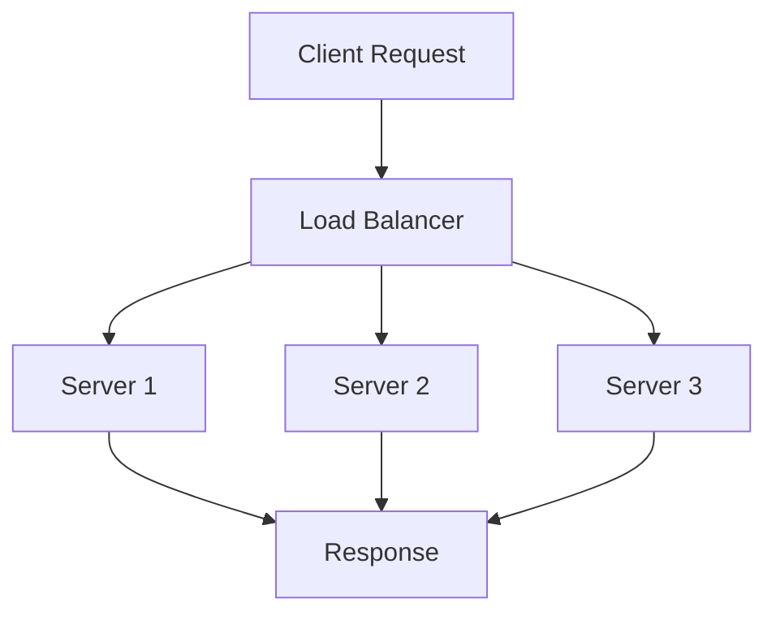
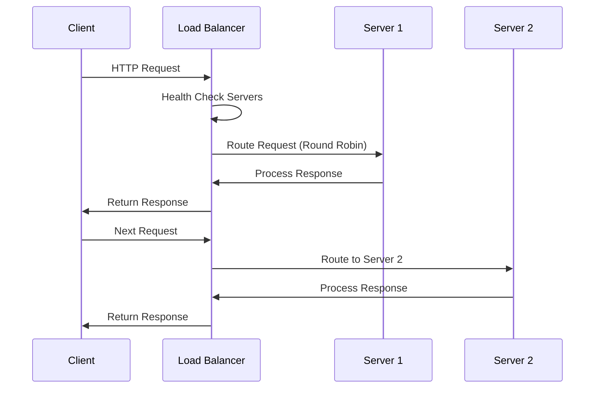

# Load Balancing and Strategies

## Overview

Load balancing distributes incoming network traffic across multiple servers to ensure no single server becomes overwhelmed, improving reliability, performance, and scalability.

## STAR Summary

**Situation:** E-commerce platform experiencing downtime during peak traffic due to single server overload.  
**Task:** Implement load balancing to handle increased traffic and improve availability.  
**Action:** Deployed HAProxy with round-robin algorithm and health checks across 3 web servers.  
**Result:** Achieved 99.9% uptime, reduced response time by 40%, and supported 3x traffic increase.

## Detailed Explanation

### Types of Load Balancing

- **Layer 4 (Transport Layer)**: Routes based on IP and port. Fast, but less intelligent.
- **Layer 7 (Application Layer)**: Routes based on content, cookies, headers. More flexible.

### Load Balancing Algorithms

| Algorithm | Description | Pros | Cons | Use Case |
|-----------|-------------|------|------|----------|
| Round Robin | Cycles through servers sequentially | Simple, fair distribution | Ignores server load/capacity | Equal capacity servers |
| Least Connections | Routes to server with fewest active connections | Considers current load | Requires connection tracking | Variable request times |
| IP Hash | Routes based on client IP hash | Session persistence | Uneven distribution if IP ranges vary | Session stickiness needed |
| Weighted Round Robin | Assigns weights to servers | Handles different capacities | Manual weight management | Mixed server capacities |
| Least Response Time | Routes to fastest responding server | Optimizes performance | Complex to implement | Performance-critical apps |
| Random | Random server selection | Very simple | Unpredictable distribution | Testing/development |

### Components

- **Load Balancer**: Hardware (F5) or software (Nginx, HAProxy).
- **Health Checks**: Monitors server health to avoid routing to failed servers.



## Journey / Sequence



## Real-world Examples & Use Cases

### Web Application Scaling
```nginx
upstream backend {
    least_conn;
    server backend1.example.com:8080 weight=3;
    server backend2.example.com:8080 weight=2;
    server backend3.example.com:8080 weight=1;
}

server {
    listen 80;
    location / {
        proxy_pass http://backend;
    }
}
```

### Kubernetes Service Load Balancing
```yaml
apiVersion: v1
kind: Service
metadata:
  name: my-service
spec:
  selector:
    app: my-app
  ports:
    - protocol: TCP
      port: 80
      targetPort: 8080
  type: LoadBalancer
```

### Database Read Replicas
```java
// JDBC URL for MySQL read replicas
String jdbcUrl = "jdbc:mysql:loadbalance://master,slave1,slave2/db?loadBalanceStrategy=random";
```

## Code Examples

### Nginx Load Balancing

```nginx
upstream backend {
    server backend1.example.com;
    server backend2.example.com;
    server backend3.example.com;
}

server {
    listen 80;
    location / {
        proxy_pass http://backend;
        proxy_set_header Host $host;
    }
}
```

### HAProxy Configuration

```haproxy
frontend http_front
    bind *:80
    default_backend http_back

backend http_back
    balance roundrobin
    server server1 192.168.1.1:80 check
    server server2 192.168.1.2:80 check
```

### AWS Application Load Balancer

```hcl
resource "aws_lb" "app_lb" {
  name               = "app-lb"
  internal           = false
  load_balancer_type = "application"
  subnets            = [aws_subnet.public.id]
}

resource "aws_lb_target_group" "app_tg" {
  name     = "app-tg"
  port     = 80
  protocol = "HTTP"
  vpc_id   = aws_vpc.main.id
}

resource "aws_lb_listener" "app_listener" {
  load_balancer_arn = aws_lb.app_lb.arn
  port              = "80"
  protocol          = "HTTP"
  default_action {
    type             = "forward"
    target_group_arn = aws_lb_target_group.app_tg.arn
  }
}
```

## Common Pitfalls & Edge Cases

- **Session Stickiness**: Ensuring user sessions stay on same server.
- **Health Check Failures**: False positives/negatives.
- **Overload**: Load balancer itself becoming bottleneck.
- **SSL Termination**: Handling encrypted traffic.

## Tools & Libraries

- Nginx
- HAProxy
- AWS ELB
- Google Cloud Load Balancing

## References

- [Nginx Load Balancing](https://nginx.org/en/docs/http/load_balancing.html)
- [HAProxy Documentation](https://www.haproxy.org/)
- [AWS Load Balancing](https://aws.amazon.com/elasticloadbalancing/)
- [Load Balancing Algorithms](https://www.nginx.com/resources/glossary/load-balancing/)

## Github-README Links & Related Topics

- [Proxy Forward and Reverse](../proxy-forward-and-reverse/)
- [API Gateway vs Load Balancer](../api-gateway-vs-load-balancer/)
- [High Scalability Patterns](../high-scalability-patterns/)
- [Fault Tolerance in Distributed Systems](../fault-tolerance-in-distributed-systems/)
